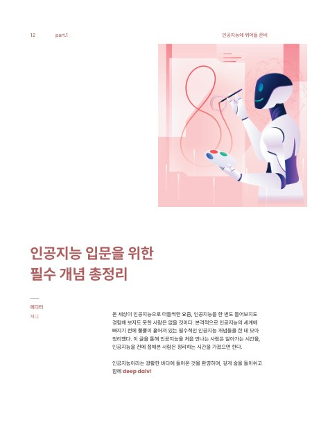
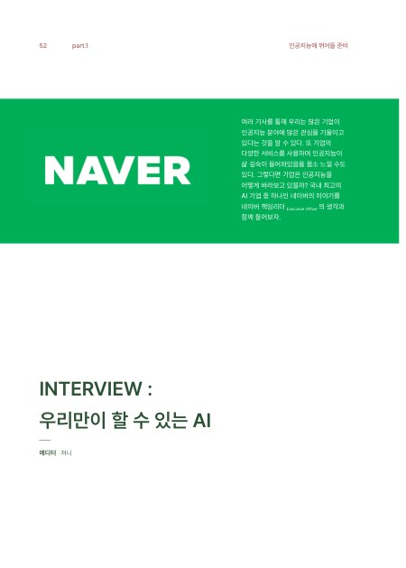
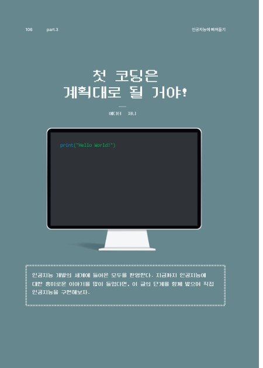
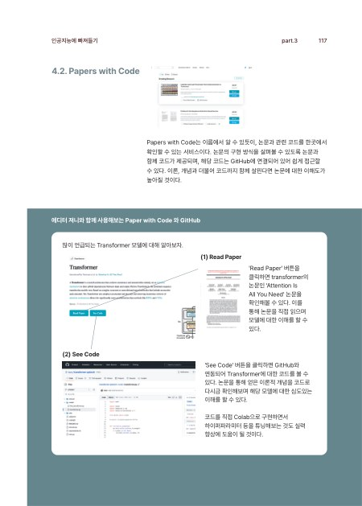

<sub>[🏠 Portfolio](https://github.com/heoneyzi) › [🤿 DeepDaiv.](../../README.md) › [Contents](../README.md) › **Magazine**</sub>

<div align="center">

# 📖 deep daiv. Magazine vol.0 — an on-ramp to AI

**A printed first issue that walks a newcomer from "what is AI?" to writing their first model — three pieces by 에디터 져니.**

   

[📄 Excerpt PDF (43 pages, 7.4 MB)](deep-daiv-magazine-vol0.pdf)

</div>

> [!TIP]
> **TL;DR** — *deep daiv. vol.0* (first edition 10 Dec 2024) is the club's AI magazine for newcomers, in three parts: getting ready to dive in, swimming in the world of AI, and diving deeper. Jiheon worked on it as an **AI Magazine Editor (Aug – Dec 2024)** and is credited among its six writers; the excerpt here holds his three pieces — a concept primer (pp. 12–25), an interview with a NAVER search executive (pp. 52–57) and a first-coding guide (pp. 106–119).

| | |
|---|---|
| **Period** | Aug – Dec 2024 (first edition printed 10 Dec 2024) |
| **Team** | 편집인 이성배 · 기획총괄 최목원, 김나영 · 글 **강지헌**, 김정환, 김하늘, 이성배, 장한나, 조유림 · 디자인 최목원, 이성배 (colophon) |
| **My role** | **AI Magazine Editor** — *edited and reviewed articles on AI* (CV); author of three pieces bylined "에디터 져니" |
| **Format** | Print magazine designed in InDesign; this repository holds a 43-page excerpt |
| **Status** | ✅ Published |

<p align="center"></p>
<p align="center"><sub>Figure: the vol.0 contents spread — three parts, fourteen pieces (excerpt PDF, pp. 1–2).</sub></p>

## ✍️ Jiheon's pieces

<table><tr>
<td align="center" width="25%"><br><sub>Part 1 · p.12</sub></td>
<td align="center" width="25%"><br><sub>Part 1 · p.52</sub></td>
<td align="center" width="25%"><br><sub>Part 3 · p.106</sub></td>
<td align="center" width="25%"><br><sub>Part 3 · p.117</sub></td>
</tr></table>

| Piece | Magazine pages | What it covers |
|---|---|---|
| **인공지능 입문을 위한 필수 개념 총정리**<br><sub>Essential concepts for starting AI</sub> | Part 1 · pp. 12–25 | Programming languages and why Python; AI ⊃ machine learning ⊃ deep learning; data types, preprocessing and train/validation/test splits; supervised, unsupervised and reinforcement learning with examples; perceptron to DNN, RNN and CNN; Transformer and YOLO as later models |
| **INTERVIEW: 우리만이 할 수 있는 AI**<br><sub>Interview: the AI only we can build</sub> | Part 1 · pp. 52–57 | Conversation with 강인호, a NAVER executive officer who has worked on search since 2008: how AI shortened development cycles, what a local company can offer that a global leader cannot, agents and small teams, and advice to readers to use AI "passionately but carefully" |
| **첫 코딩은 계획대로 될 거야!**<br><sub>Your first coding will go as planned!</sub> | Part 3 · pp. 106–119 | AI development as cooking: choose a kitchen (Jupyter, VS Code, PyCharm, Colab), gather ingredients (AI Hub, Kaggle, Google Dataset Search), pick tools (PyTorch vs TensorFlow), and learn from recipes (GitHub, Papers with Code, Hugging Face) — with a hands-on Papers with Code → GitHub walk-through |

The excerpt also includes the reference pages (pp. 152–157) and the colophon.

## 🗂️ Folder map

```text
Magazine/
├── README.md                      ← you are here
├── deep-daiv-magazine-vol0.pdf    ← 43-page excerpt: contents spread, Jiheon's three pieces, references, colophon
└── assets/                        ← page thumbnails rendered from the PDF (≤ 900 px)
```

> [!IMPORTANT]
> **Rights** — The colophon states that the copyright of the magazine belongs to deep daiv. ("다이브") and prohibits unauthorised reproduction and redistribution. The excerpt is shared here as Jiheon's portfolio record of his own pieces; remove the PDF (keeping the thumbnails) if the club asks. The interview reflects the interviewee's personal views, not an official NAVER position (as he notes himself).

---
<sub>[← Prev: NewsLetter](../NewsLetter/README.md) · [🏠 Portfolio](https://github.com/heoneyzi)</sub>
