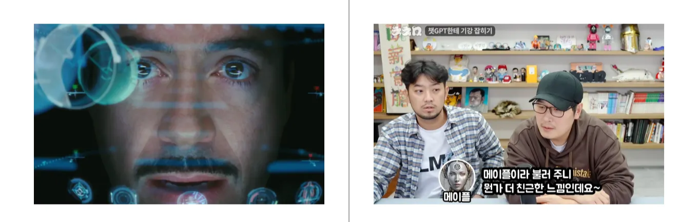
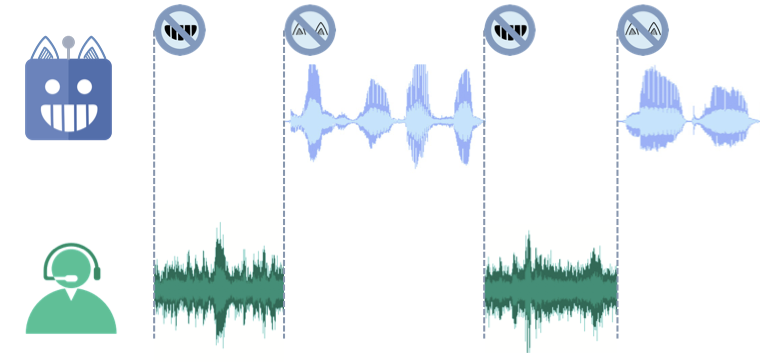
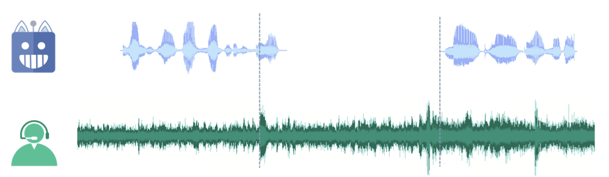
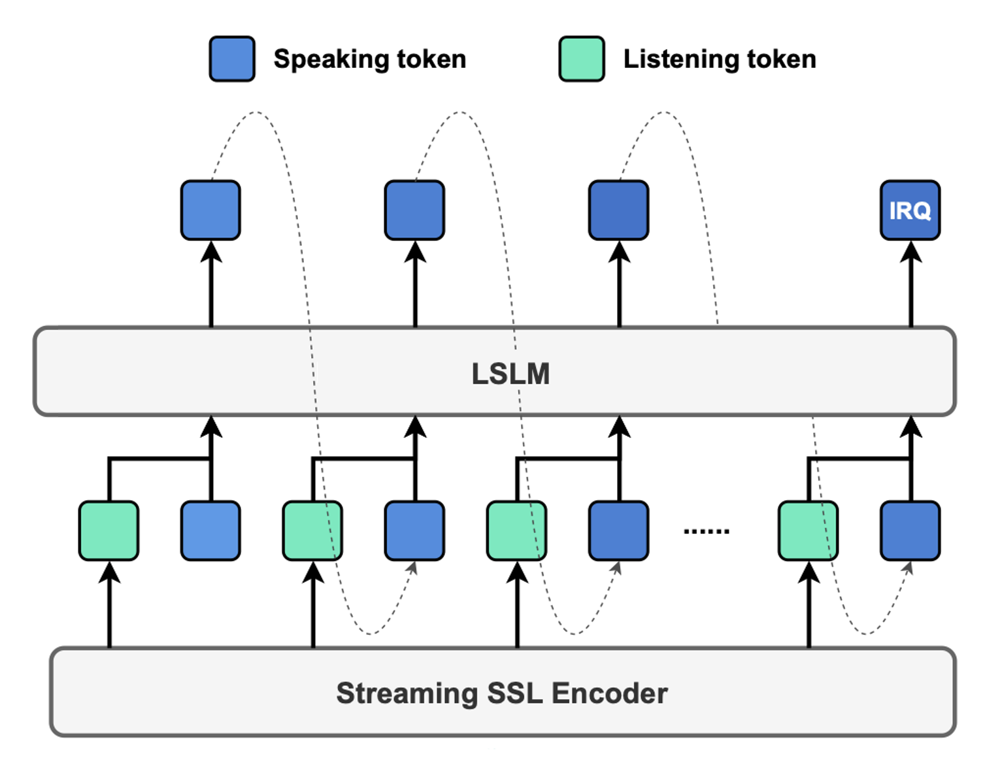
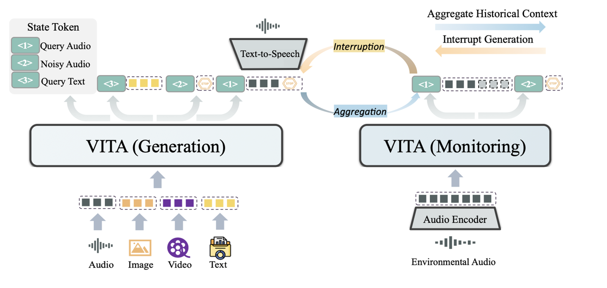
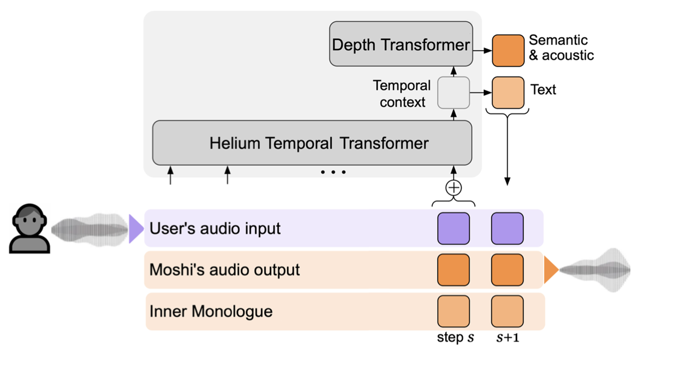
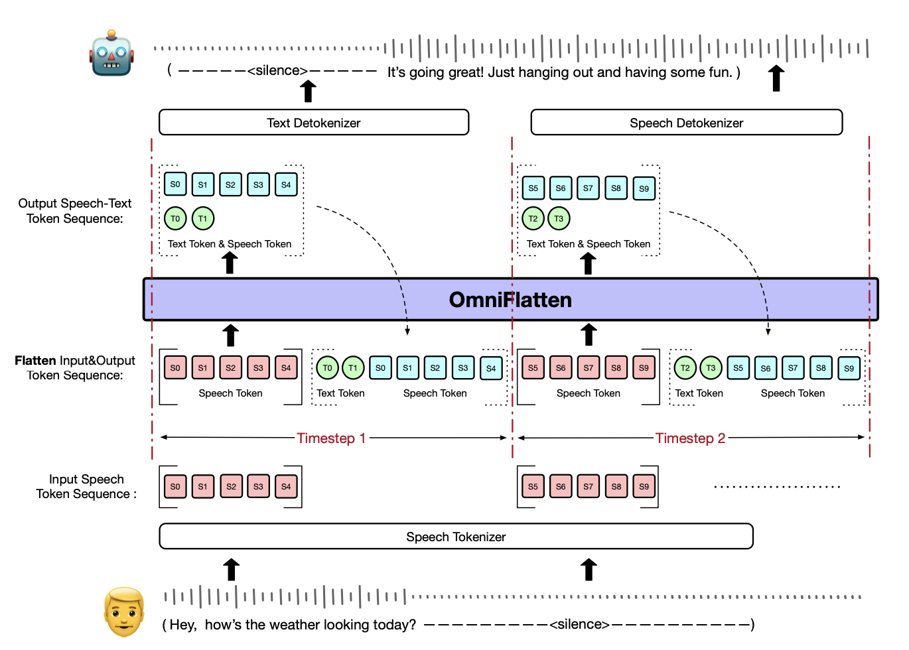

# #84 AI와 말동무를 맺을 수 있을까 — Notion draft

[🏠 Portfolio](https://github.com/heoneyzi) › [🤿 DeepDaiv.](../../../README.md) › [Contents](../../README.md) › [NewsLetter](../README.md) › [Archive](README.md) › **#84 draft**

> [!NOTE]
> Jiheon's (에디터 져니) Notion draft of **위클리 딥 다이브 #84**, published 2025-03-26 → **[read the published issue](https://stib.ee/FtxG)**.
> The published version may differ in title and wording; this archive keeps the draft in the original Korean.

### 인공지능과의 대화

안녕하세요! 에디터 **져니**입니다.

영화에서 주인공이 인공지능과 대화하는 장면을 본 적 있으신가요? 예전에는 그저 영화적 상상으로만 여겨졌던 장면이 점점 우리의 일상에서도 익숙한 풍경이 되어가고 있습니다.

영화 &lt;아이언맨&gt;에서 AI 비서 JARVIS를 사용하는 토니 스타크 출처: <a href="https://www.marvel.com/videos/iron-man-trailer">Marvel &lt;Iron Man Trailer&gt;</a> 유튜브 침착맨 채널의 동영상 “AI야 침착맨이 좋아? 김풍이 좋아?”의 일부  출처: <a href="https://youtu.be/oTyoLq361fI?si=EDz7LSnQaDinx26o">https://youtu.be/oTyoLq361fI?si=EDz7LSnQaDinx26o</a>

특히 유튜브나 숏폼 콘텐츠에서 크리에이터들이 인공지능과 대화를 주고받으며 웃음을 자아내는 모습을 보면, 음성 기반 인공지능 역시 상당한 수준에 이르렀음을 실감하게 됩니다. 어떻게 인공지능과의 음성 대화가 이렇게 자연스러워질 수 있었을까요?

음성 언어 모델(Speech Language Model, SLM)의 발전은 여러 측면에서 바라볼 수 있지만, 자연스러운 음성 대화를 위해 무엇보다 중요한 요소는 데이터를 주고받는 방식입니다. 결국 대화란 상대방과 어떻게 상호작용을 하는지가 핵심이기 때문이죠.

이제 데이터 송수신 방식의 관점에서 SLM을 살펴보고, 지금까지 어떤 발전이 이루어졌으며 또 앞으로 어떻게 발전해 나갈 수 있을지 함께 알아보겠습니다.

### 음성 언어 모델의 발전 과정

데이터 송수신 방식을 기준으로 SLM 모델은 Simplex(단방향), Half-Duplex(반이중), Full-Duplex(완전 이중)로 나눌 수 있습니다.

#### Simplex SLM

Simplex는 한 방향으로만 통신이 가능한 방식을 의미합니다. 즉 Simplex SLM에서는 단일 채널만 활용해 인공지능 모델이 듣기나 말하기 중 오직 하나의 역할만 수행할 수 있습니다.

Simplex SLM의 구조 출처: <a href="https://arxiv.org/pdf/2408.02622">Language Model Can Listen While Speaking (Ziyang Ma et al., 2024)</a>

Simplex SLM는 “Siri야, 날씨 알려줘”와 같은 간단한 ‘명령 → 수행’의 단계로 과거에 많이 사용했습니다. 현재는 특정 태스크에 맞춘 모델로 사용되기도 합니다. 그런데도 Simplex SLM은 단방향 통신이라는 특성상 상호작용이 어렵다는 단점이 있습니다. 이후에 더욱 발전된 Half-Duplex 방식이 등장합니다.

#### Half-Duplex SLM

Half-Duplex는 양방향으로 통신은 가능하지만 **동시에는 수행할 수는 없는** 통신 방식을 의미합니다. **Half-Duplex SLM**에서는 서로 말하고 들을 수는 있지만, 한 사람이 말하는 동안 다른 한쪽은 듣기만 해야 하죠. 흔히 무전기의 사용 방식을 떠올리면 이해가 쉽습니다.

Half-Duplex SLM의 구조 출처: <a href="https://arxiv.org/pdf/2408.02622">Language Model Can Listen While Speaking (Ziyang Ma et al., 2024)</a>

현재 많은 SLM이나 다른 모델에서 가장 널리 적용되는 방식이 바로 이 Half-Duplex입니다. ChatGPT, Google Gemini, xAI(Grok-3)의 음성 모드 역시 Half-Duplex 구조를 기반으로 합니다. Half-Duplex는 <ins>말하기와 듣기를 순차적(Turn-Based)으로 진행해야 하는 구조</ins>입니다. 다양한 연구로 자연스럽게 차례(Turn)를 넘기게 된다고 하더라도, Half-Duplex는 반드시 차례를 지켜서 대화해야 하는 <b>턴 테이킹(Turn-Taking) 문제를</b> 해결할 수 없습니다.

#### Full-Duplex SLM

<b>턴 테이킹</b>은 자연스러운 대화 구현을 어렵게 하는 요인입니다. 실제 인간 대화에서는 훨씬 자유로운 상호작용이 이뤄지기 때문입니다. 상대방이 말하는 도중에도 끼어들어 반응할 수 있고, 그에 따라 이야기 흐름이 달라지기도 하죠. 심지어 동시에 말하기도 합니다. 이렇게 완전한 양방향 통신이 가능한 방식을 <b>Full-Duplex(완전 이중)</b>라고 합니다.

Full-Duplex SLM의 구조 출처: <a href="https://arxiv.org/pdf/2408.02622">Language Model Can Listen While Speaking (Ziyang Ma et al., 2024)</a>

Full-Duplex SLM에 대한 연구는 지금도 활발히 진행되고 있습니다. Half-Duplex와 달리 입력과 출력이 동시에 이루어지기 때문에, 매 순간 모델이 실시간으로 들어오는 입력에 맞춰 출력을 동적으로 조정해야 합니다. 이를 원활하게 구현하기 위해서 새로운 모델 구조와 학습 방식이 끊임없이 시도하고 있습니다.

#### Full-Duplex SLM의 연구들

(2024.08)</b>" width="720">

<a href="https://arxiv.org/pdf/2408.02622">Language Model Can Listen While Speaking</a><b>(2024.08)</b>

Half-Duplex의 고질적 문제인 턴 테이킹 문제를 해결하려면 어떻게 할 수 있을까요? 직관적으로 생각나는 방법은 <b>동시에 듣고 말할 수 있도록 채널을 병렬적으로 구성</b>하는 겁니다. 마치 사람이 상대방 말을 들으면서도 언제든 말할 준비를 하는 것처럼 말이죠. [<b>LSLM</b>](https://arxiv.org/pdf/2408.02622)<b>(2024.08)</b>은 이러한 아이디어를 바탕으로 나온 모델로, 한 모델 내에서 “듣는 채널”과 “말하는 채널”을 <b>따로</b> 두되, <b>나란히(병렬로)</b>운영합니다. 그래서 모델이 음성을 입력으로 받으면서도 동시에 말을 만들어낼 수 있게 했죠. 대화하다 보면 “말하다가 갑자기 멈춰야 할 때”도 있습니다. LSLM은 사용자 음성에 특정 신호(Interrupt Token, IRQ)가 들어오면 즉시 말을 멈추고 새로운 정보를 반영합니다.

이런 식으로 병렬 구조로 만들어서 “들으면서 말할 수 있다”는 장점을 가지지만 연산 비용이 늘어나 지연 시간이 늘어날 수 있습니다. 또한 **말하다가 멈춰서 듣기** 때문에 Full-Duplex에는 조금 거리가 있었습니다.

---

LSLM에서 한발 더 나아가기 위해서 “<b>두 개의 모델</b>을 동시에 돌리면 어떨까?”라는 생각에서 등장한 연구가 바로 [<b>VITA</b>](https://arxiv.org/pdf/2408.05211)<b>(2024.09)</b>입니다. VITA는 <b>Generation 모델</b>(실제로 응답을 생성하는 모델)과 <b>Monitoring 모델</b>(새 질의가 들어오는지 감지하는 모델) <b>두 개를 동시에</b> 운영합니다. 한 모델이 답변을 생성하고 있을 때도 다른 모델이 사용자의 음성을 계속 분석하고 있다는 뜻입니다. <b>Monitoring</b> 모델이 학습된 <b>State Token으로</b> 새로운 질의를 감지하면, <b>Generation</b> 모델이 곧바로 새로운 답변을 만들기 시작합니다.

이렇게 LSLM과 같은 <b>두 모델이나 채널을 병렬로</b> 돌리는 구조는 당연히 <b>자원이 많이</b> 듭니다. 그래서 VITA는 메모리 낭비를 줄이고, 캐시(이미 계산해 둔 결과물)에 빠르게 접근하도록 구조를 최적화해서 <b>지연 시간을 최소화</b>하려고 노력했습니다. 덕분에 LSLM보다 <b>듣기와 말하기를 훨씬 유연하게</b> 처리하게 되었습니다. 그럼에도 <b>사용자가 말하는 도중에 답변 음성을 출력(Speech to Speech Generation, S2S)</b>한다기보다는, 모델이 “전환하는 속도가 빨라졌다”고 이해하는 편이 맞습니다. 구조적으로 실시간 처리는 아니라는 뜻이죠.

---

위 LSLM과 VITA 연구는 음성을 텍스트로 바꿨다가, 다시 음성으로 변환하는 구조이기 때문에 <b>응답 지연</b>이 생겼습니다. 이 문제를 해결하기 위해 기왕이면 <b>단계를 따로 두지 않고 한꺼번에 처리</b>하는 새로운 방식을 [<b>Moshi</b>](https://kyutai.org/Moshi.pdf) <b>(2024.10)에서</b> 시도했습니다. <b>Moshi</b>는 한꺼번에 여러 입력을 동시에 받아 처리하는 <b>다중 스트림(Multi Stream) 구조</b>를 사용했습니다. 이 과정에서 자체적으로 만들어낸 <b>Helium</b>이라는 스트리밍 친화적인 LLM을 사용했습니다. Helium은 기존의 Transformer와 다른 <b>Depth Transformer</b>를 이용해 짧은 구간 단위로 상태를 자주 업데이트해 더 빠른 응답이 가능합니다. 추가로 <b>Inner Monologue</b> 기법으로 텍스트와 오디오 토큰을 <b>동시에 생성</b>할 수 있어서 바로 <b>음성</b>으로 대답을 내보내도록 했죠. 이를 통한 <b>음성에서 바로 음성</b>으로 가는 <b>S2S(Speech to Speech Generation)</b> 방식 덕분에 낮은 지연 시간을 보였습니다. 거의 사람과 대화하듯 즉각적으로 반응하는 거죠.

앞선 2개의 연구에서는 기존 LLM의 순차적 토큰 생성(Autoregressive, AR) 방식을 어느 정도 우회하기 위해 토큰(Token)을 추가하는 기법을 제안했지만, S2S를 구현하려면 이보다 훨씬 근본적으로 방식의 변환이 필요했습니다. Moshi는 이를 구현해 Full-Duplex에 한 걸음 더 가까워졌다는 의의가 있습니다. 그럼에도 새로운 구조를 만들기 위해서 기존에 쓰던 **강력한 GPT**나 다른 LLM을 그대로 가져다 쓰기가 어려워 자체 LLM 모델을 제작해야 했다는 아쉬움이 남습니다.

---

그렇다면 기존의 범용적인 <b>GPT</b> 같은 모델을 <b>어떻게 Full-Duplex</b>로 쓸 수 있을까요? Moshi처럼 완전히 새 모델을 만드는 대신에, ”<b>GPT가 이해할 수 있는 형태</b>로 데이터와 학습 형식을 바꿔주면 되지 않을까?” 하는 생각에서 시작된 방법이 바로  [<b>OmniFlatten</b>](https://arxiv.org/pdf/2410.17799v2) <b>(2025.01)</b>입니다.

<b>OmniFlatten</b>은 음성과 텍스트 데이터를 작은 청크(Chunk) 단위로 잘게 나누고, 이를 <b>하나의 연속된 시퀀스로 평탄화</b>(Flatten)해서 GPT가 순서대로 처리할 수 있도록 했습니다. Moshi 같은 다중 스트림을 모델 내부에서 직접 병렬 처리하는 건 아니지만, <b>GPT 입장</b>에서는 청크 단위로 <b>연속적인 데이터</b>를 받기 때문에 <b>순차 토큰 생성(AR)</b>이라는 기존 구조를 거의 건드릴 필요가 없게 된 것입니다. 추가로 처음부터 Full-Duplex 대화를 가르치면 GPT가 헷갈릴 수 있으므로 <b>단계적 학습</b> 방식을 취했습니다. 처음에는 <b>기존의 턴 기반 대화</b>(Half-Duplex) 예시로 모델이 대화 흐름을 익히도록 학습시킵니다. 그다음 조금씩 스트림 수를 줄인 (3-스트림, 2-스트림) 데이터로 학습해서 점차 <b>텍스트 의존도를 줄여나갑니다.</b> 이를 통해 최종적으로는 텍스트를 제외한 2-스트림(사용자 음성, 모델 음성)으로 학습했습니다. 이는 GPT의 <b>뛰어난 추론 능력</b>을 쓰면서도, <b>S2S</b>(음성→음성)로 빠른 대화가 가능하게 했습니다.

### 인공지능과의 음성 대화, 어디까지 발전할까?

Full-Duplex SLM은 근래에 본격적인 연구가 시작된 분야입니다. 다양한 구현 방안을 시도하면서 빠르게 발전하고 있습니다. 특히 기존의 Turn-Taking 문제를 해결이나 지연 시간을 줄이기 위한 여러 접근을 통해 AI와의 음성 대화가 점점 더 자연스럽고 실시간적인 상호작용을 보여주고 있죠.

이미 우리는 AI와의 대화를 쉽게 접할 수 있습니다. 지금도 AI는 상당히 자연스럽게 대화할 수 있다고 체감하는데, 과연 앞으로는 얼마나 더 자연스러워질까요? 과연 AI가 우리의 진정한 말동무가 되어 일상에 깊숙이 녹아들 수 있을까요? Full-Duplex SLM을 포함한 음성 AI 기술의 발전을 주목하며, 미래의 대화형 AI가 우리와 어떤 방식으로 소통하게 될지 기대해보는 것은 어떨까요?

### Reference

[https://arxiv.org/pdf/2410.17799v2](https://arxiv.org/pdf/2410.17799v2)

[https://arxiv.org/pdf/2405.19487](https://arxiv.org/pdf/2405.19487)

[https://arxiv.org/pdf/2305.11000](https://arxiv.org/pdf/2305.11000)

[https://arxiv.org/pdf/2408.02622](https://arxiv.org/pdf/2408.02622) (그림)

[https://arxiv.org/pdf/2408.05211](https://arxiv.org/pdf/2408.05211)

[https://kyutai.org/Moshi.pdf](https://kyutai.org/Moshi.pdf)

[https://arxiv.org/pdf/2409.15594](https://arxiv.org/pdf/2409.15594)

---
[← Archive](README.md) · [📰 Newsletter index](../README.md) · [Published issue ↗](https://stib.ee/FtxG)
