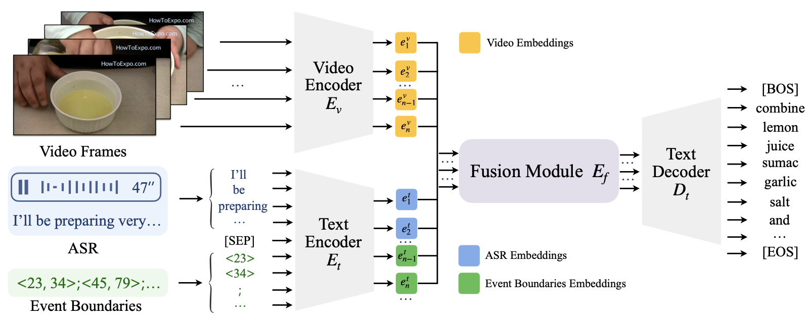
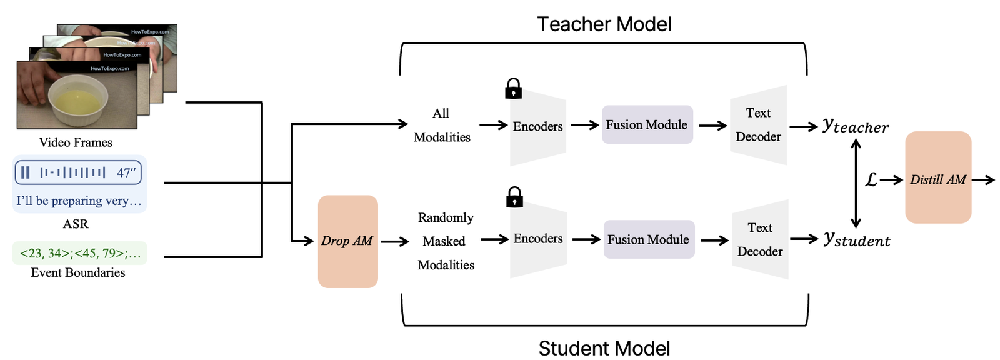
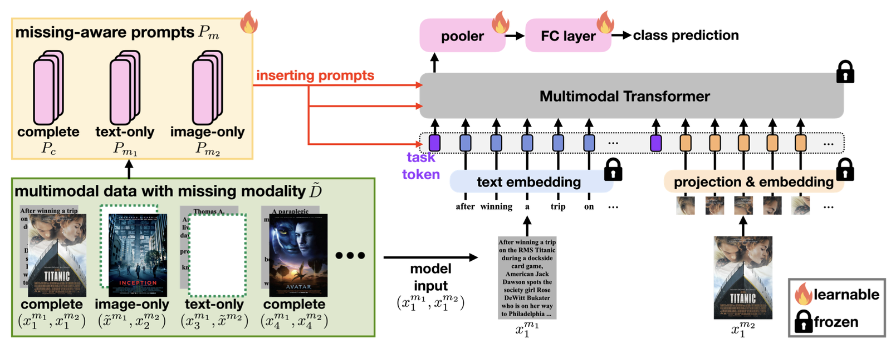

# #91 잃어버린 정보를 찾아서 — Notion draft

[🏠 Portfolio](https://github.com/heoneyzi) › [🤿 DeepDaiv.](../../../README.md) › [Contents](../../README.md) › [NewsLetter](../README.md) › [Archive](README.md) › **#91 draft**

> [!NOTE]
> Jiheon's (에디터 져니) Notion draft of **위클리 딥 다이브 #91**, published 2025-05-14 → **[read the published issue](https://stib.ee/kwXH)**.
> The published version may differ in title and wording; this archive keeps the draft in the original Korean.

#### **#91 위클리 딥 다이브 \| 2025년 5월 14일**

> 💡 **이번주 뉴스레터에는 이런 내용을 담았어요!**
>
> - Missing Modality에 대해 설명했습니다.
> - Missing Modality가 적용되는 태스크를 알아봤습니다.
> - Missing Modality의 해결 방안에 대해 알아봤습니다.

A/B 테스트 제목: 잃어버린 정보를 찾아서 / Missing Modality

## 잃어버린 정보를 찾아서

영화 &lt;라붐&gt;의 한 장면 출처: <a href="https://search.naver.com/search.naver?where=nexearch&sm=tab_etc&mra=bkEw&pkid=68&os=1748106&qvt=0&query=영화%20라붐%20포토">영화 &lt;라붐&gt; 스틸컷</a>

안녕하세요! 에디터 져니입니다.

공공장소에서 이어폰이 없어서, 소리도 자막도 없이 영화를 보고 있다고 가정해 보죠. 우리는 영화의 한 장면을 바라보고 있을 뿐이지만, 두 인물 사이에 묘한 감정의 흐름이 있다는 것을 느낄 수 있습니다. 심지어 헤드폰 너머로 흘러나올 법한 감미로운 음악까지 상상하게 됩니다.

이처럼 우리는 얻은 감각 정보를 스스로 조합해 의미를 추론하는 데 익숙합니다. 그리고 놀랍게도, 이런 능력을 AI에도 요구하는 시대가 오고 있습니다. AI 역시 모든 정보가 완벽하게 주어지지 않는 상황에서 작동해야 합니다. 이러한 상황을 **Missing Modality**라고 부릅니다. 조금 더 자세히 알아보죠.

### Missing Modality란?

여러 가지 정보(Modality)를 동시에 보고 판단하는 인공지능을 멀티모달(Multimodal) AI라고 합니다. 멀티모달 AI는 다양한 감각 정보를 조합해 더 정교하고 유연한 판단을 내릴 수 있습니다.

다양한 정보가 고르게 주어진다면, 이론적으로 AI는 훨씬 더 똑똑해질 수 있을 것입니다. 하지만 모든 정보가 항상 완벽하게 제공되지는 않습니다. 우리가 실제로 다루는 데이터는 종종 불완전하고 결손 형태로 주어집니다. 예를 들어, 소리가 없는 동영상이나 설명 없이 제공되는 이미지처럼 말이죠.

이처럼 필요한 정보가 일부 누락된 상태에서 모델이 여전히 유의미한 결과를 내야 하는 상황을 **“Missing Modality” 문제**라고 부릅니다.

‘고요 속의 외침’ 게임을 하는 피오와 송민호 출처: <a href="https://youtu.be/JEC5VyQ-_Wc?si=y06hOiG3kmelB5-R">tvN &lt;신서유기 6&gt;</a>

좀 더 쉬운 이해를 위해, 우리가 흔히 아는 게임인 ‘고요 속의 외침’을 생각해 보시죠. 청각 정보가 완전히 차단된 상태에서, 입 모양(시각 정보)만 보고 상대가 말하는 단어를 맞춰야 합니다. 실제로 해보면 꽤 어렵죠.

Missing Modality도 유사합니다. 빠진 정보를 제외한 제한된 입력만으로도 높은 정확도를 유지해야 합니다. 이는 단순히 데이터 결손이라는 의미를 넘어서, AI가 유연하게 추론할 수 있는 능력을 키우는 과정이기도 합니다.

### Missing Modality의 적용 태스크

Missing Modality는 텍스트, 이미지, 오디오, 비디오, 센서 데이터 등 두 개 이상의 입력 정보(Modality)를 함께 사용하는 멀티모달 태스크 전반에 걸쳐 폭넓게 적용될 수 있는 문제입니다.

예를 들어, 이미지와 텍스트를 함께 사용하는 분야에서는 제품 이미지와 설명을 기반으로 분류하는 멀티모달 분류(Multimodal Classification) 태스크가 대표적입니다. 이미지 또는 설명이 일부 누락되더라도 올바른 분류가 가능해야 하겠죠.

또한 비디오와 오디오를 함께 활용하는 분야는 어떨까요? 영상 속 내용을 설명하는 비디오 캡셔닝(Video Captioning)과 같은 태스크에도 응용이 가능합니다. 음성 정보가 없더라도, **비디오 프레임만을 이용해 자연스럽고 일관된 설명을 생성할 수 있어야** 합니다. 반대로 시각 정보가 흐리거나 손상되면, 텍스트나 오디오 기반 정보가 주요 단서가 되기도 하죠.

나아가서 서로 다른 촬영 조건에서 얻어진 MRI 시퀀스들을 함께 활용해 질병을 진단하는 의료 분야에 적용할 수 있습니다. 특정 시퀀스가 누락된 경우 나머지 정보를 바탕으로 정확한 판단을 내릴 수 있어야 하겠죠.

이처럼 Missing Modality 문제는 다양한 분야의 실제 환경에서 발생할 수 있는 결손 상황에 대비해 모델을 더욱 견고하게 만드는 현실적인 과제로 여겨지고 있습니다.

그렇다면 이러한 Missing Modality는 어떻게 해결할 수 있을까요? 단순히 성능 좋은 멀티모달 모델을 사용하는 것으로 충분할까요? 그렇지 않습니다. 기존의 멀티모달 모델은 보통 <b>모든 입력 Modality가 완전하게 주어질 것이라는 전제</b> 하에 학습됩니다. 그렇기 때문에 Missing Modality 문제에 직면한 기존 모델들은 <b>입력 불균형에 제대로 대응하지 못해 성능이 급격히 저하되는 문제가 발생합니다.</b>

<b>따라서 Missing Modality에 특화된 대응 전략이 필수적입니다.</b> 핵심은 바로 결손 Modality가 제공하던 유용한 정보를 보완하여, 전체 모델의 성능 저하를 최소화하는 데 있습니다. 이를 위해 연구자들은 남아 있는 Modality를 어떻게 활용해 누락된 정보에 대응할 것인지에 따라 다양한 접근 방식을 제안해 왔습니다.

#### 방식1. 결손 Modality를 보충하자!

가장 일반적인 전략은 **결손 Modality가 없었다면 모델이 활용했을 정보를 다른 Modality로 보완**하려는 시도입니다.

Video Paragraph Captioning(VPC) 태스크를 진행한 [연구](https://arxiv.org/pdf/2403.19221)는 이러한 전략을 보여주는 예시입니다. VPC는 하나의 비디오 클립에 대해 문단 단위의 설명을 생성하는 과제로, 장면 전환이나 시간 흐름에 따라 등장하는 다양한 이벤트와 맥락을 포괄적으로 서술해야 하는 태스크입니다.

해당 연구에서는 핵심 Modality인 비디오에서 보조 Modality(음성 정보나 이벤트 경계 정보)가 누락된 상황에서도, 모델이 여전히 자연스럽고 일관된 문단 설명을 생성할 수 있도록 학습 구조를 설계합니다. 즉, 결손 Modality가 원래 제공했을 중요한 힌트를 **다른 Modality로부터 간접적으로 보완하거나, 결손 상황에 적응하도록 모델을 훈련**하는 것입니다.

VPC 태스크를 위한 기본 멀티모달 모델의 파이프라인 출처: <a href="https://arxiv.org/pdf/2403.19221">Towards Multimodal Video Paragraph Captioning Models Robust to Missing Modality (Sishuo Chen et al., 2024)</a>

논문에서 제안한 기본 구조는 Video Paragraph Captioning(VPC) 태스크를 해결하기 위해 설계된 <b>전형적인 멀티모달 모델 아키텍처와 유사합니다.</b> 각각의 Modality(비디오, 음성, 이벤트 정보)는 해당하는 전용 인코더를 통해 특징을 추출하며, 이후 Fusion Module에서 통합한 표현을 기반으로 텍스트 디코더가 문단 설명을 생성하는 방식입니다. 실제로 모든 입력이 완전한 상태일 때는 기존의 방법과 비슷한 성능을 보입니다. 그러나 이러한 기본 구조에 <b>Knowledge Distillation(지식 증류)</b>를 적용하면서 Missing Modality 상황에서도 더 강건한 성능을 보이게 됩니다.

Missing Modality를 위해 Knowledge Distillation을 적용한 모델의 파이프라인 출처: ⓒ deep daiv.

Knowledge Distillation(지식 증류)은 성능이 뛰어난 모델(Teacher Model)의 예측을, 보다 가벼운 모델(Student Model)이 모방하게 함으로써 지식을 전달하는 학습 기법입니다. 이 방식은 연산량은 적지만, Teacher Model이 학습한 풍부한 표현과 판단 기준을 효율적으로 전달할 수 있습니다. 해당 태스크에서는, 모든 Modality가 주어진 상태에서 학습된 <b>기본 멀티모달 모델을 Teacher Model로 설정</b>하고, <b>특정 Modality가 제거된 입력을 받는 모델을 Student Model</b>로 적용합니다. 이를 위해 연구에서는 <b>DropAM</b>과 <b>DistillAM</b>을 새롭게 사용합니다.

DropAM(Drop Auxiliary Modalities)은 학습 과정 중 보조 Modality(음성(ASR), 이벤트 경계)를 일부러 제거함으로써, 모델이 다양한 결손 상황을 사전에 경험하고, 그에 적응할 수 있도록 유도합니다. DistillAM(Distill Auxiliary Modalities)은 완전한 입력을 바탕으로 예측한 Teacher Model의 출력을, 결손 입력을 가진 Student Model이 모방하도록 학습시키는 전략입니다. **DropAM**은 모델이 결손 상황 자체에 **적응하도록 만들고**, **DistillAM**은 결손 정보가 제공했을 표현을 **간접적으로 복원하도록 유도하는 것이죠.**

이 논문의 제안하는 Missing Modality에 대한 방향성은 단순히 완전한 입력에만 의존하는 것이 아니라, **누락된 정보를 효과적으로 보완하거나 그 공백을 견디는 능력을 갖춘 모델을 만드는 것**입니다. 이를 통해 실제 결손 상황에서도 일관되고 풍부한 문단 수준의 설명을 생성할 수 있도록 학습하는 것이 본 연구의 주요 목표입니다.

---

#### 방식2. 결손 Modality를 냅두자!

위의 일반적인 Missing Modality에 대한 전략과 다르게, <b>결손 정보를 복원하지 않는 방식도 존재합니다.</b> 이는 오히려 모델이 결손 상황 자체를 인식하고 그에 적응하게 만드는 방식인 거죠. 이 접근은 누락된 정보를 억지로 보완하지 않고, 모델이 결손 상황에 자연스럽게 반응할 수 있도록 설계한 것입니다.

멀티모달 분류(Multimodal Classification)을 진행한 [연구](https://arxiv.org/pdf/2303.03369)는 이러한 접근을 보여주는 예시입니다. 위에서 언급한 것처럼 이미지와 텍스트를 활용하여 정확한 카테고리를 분류하는 태스크이죠. 여기서 두 개 중 하나의 Modality가 없더라도 최소한의 성능 저하로 분류할 수 있도록 만드는 것이 목표입니다.

프롬프트 러닝을 사용하는 모델의 파이프라인 출처: <a href="https://arxiv.org/pdf/2303.03369">Multimodal Prompting with Missing Modalities for Visual Recognition (Yi-Lun Lee et al., 2023)</a>

해당 연구는 프롬프트 러닝(Prompt Learning)을 사용해 Missing Modality에 강건성을 가집니다. 프롬프트 러닝은 사전학습된 대형 모델 전체를 Fine-tuning 하는 것이 아니라, 입력 앞에 덧붙여서 추가 정보를 주는 ‘프롬프트’만 학습하여 모델의 출력을 조절하는 학습 방식입니다. 이는 기존 모델의 성능을 해치지 않으면서 효율적으로 태스크에 맞출 수 있다는 장점이 있죠.

이 연구에서는 Missing Modality로 인해 가능한 세 가지 상황인 1) 이미지와 텍스트 모두 있는 경우, 2) 이미지만 있는 경우(Text Missing), 3) 텍스트만 있는 경우(Image Missing)에 맞춰 각기 다른 3가지 프롬프트 토큰을 만듭니다. 그래서 주어진 입력에 맞게 알맞은 프롬프트 토큰을 선택적으로 삽입합니다. 이는 모델이 프롬프트를 통해 **현재 입력이 어떤 결손 상황에 놓여 있는지를 인식**하고, 그에 맞는 분류 전략을 자동으로 조정하게 합니다.

이러한 설계 덕분에, **하나의 단일 모델로 다양한 결손 상황에 유연하게 대응**할 수 있습니다. 또한, 이 모델은 기존의 멀티모달 모델을 그대로 유지(Frozen)하며, 오직 상황 판단을 위한 프롬프트 토큰과 분류를 위한 일부 모듈만 학습합니다. 이러한 방식은 전체 파라미터의 극히 일부분만을 업데이트하므로, 학습에 필요한 연산량과 메모리 비용을 크게 줄여줍니다. 그뿐만 아니라, 프롬프트와 분류 모듈만 소규모로 조정하면 되기 때문에 다른 데이터셋이나 유사한 태스크로의 전이도 용이합니다.

이 연구의 Missing Modality에 대한 접근법은 “빠진 정보를 어떻게 채울 것인가”라는 관점이 아니라, “빠졌다는 사실을 어떻게 활용할 것인가”라는 역발상적인 관점을 통해 문제를 단순화하였습니다.

---

이처럼 Missing Modality 문제에 대한 접근은 크게 두 방향으로 나뉩니다. 하나는 <b>”결손 정보를 복원하거나 근사하여 성능을 유지하려는 방식”, “다른 하나는 결손 상황을 스스로 인지하고, 그에 맞춰 적응하도록 설계한 방식”</b>입니다. 전자는 누락된 정보를 메꾸는 데 초점을 두고, 후자는 결손 자체를 모델이 고려해야 할 하나의 특성으로 받아들이는 전략입니다. 이 두 접근법은 각각 서로 다른 전제와 설계로 만들어졌지만, 공통적인 불완전한 데이터 환경에서도 더욱 유연하게 작동할 수 있도록 만들기 위한 노력이 있습니다.

### Missing Modality의 필요성

우리가 현실에서 다루는 많은 데이터는 실험실에서 사용하는 학습 데이터처럼 친절하지는 않습니다. 항상 모든 정보(Modality)가 완전하게 갖추어진 상태로 수집되기란 쉽지 않으며, 정보의 누락은 예외적인 상황이 아니라 오히려 일상적으로 마주하는 현실에 가까울 수도 있습니다.

이러한 흐름 속에서, 결손을 전제로 한 데이터 환경이 점차 보편화되면서 Missing Modality 문제에 대한 관심과 중요성도 빠르게 커지고 있습니다. 이를 극복하기 위한 다양한 연구들이 활발히 진행되고 있으며, 각기 다른 전략을 통해 이 문제를 해결하고자 하는 시도들이 계속해서 이어지고 있습니다. Missing Modality 문제는 단순한 기술적 예외 처리에 그치지 않고, 멀티모달 AI의 실용성과 적응력을 높이기 위해 고려하는 과제로 자리 잡고 있습니다.

**완전한 입력을 가정하지 않고도 견고하게 작동할 수 있는 모델을 만드는 것**, 그 자체가 이제는 선택의 문제가 아니라 현실 속의 AI가 반드시 직면해야 할 중요한 과제일지도 모릅니다.

---
[← Archive](README.md) · [📰 Newsletter index](../README.md) · [Published issue ↗](https://stib.ee/kwXH)
