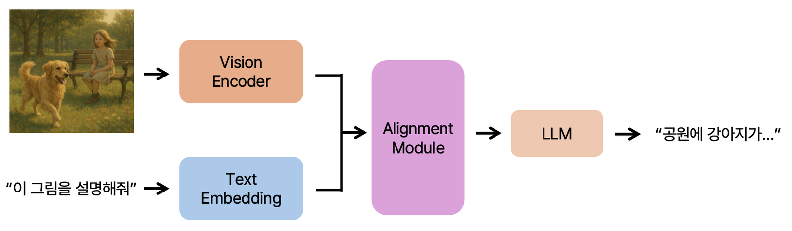
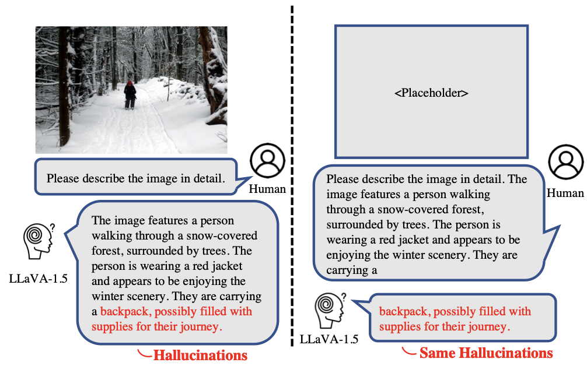

# #95 AI의 목격자 진술, 과연 믿을 수 있을까 — Notion draft

[🏠 Portfolio](https://github.com/heoneyzi) › [🤿 DeepDaiv.](../../../README.md) › [Contents](../../README.md) › [NewsLetter](../README.md) › [Archive](README.md) › **#95 draft**

> [!NOTE]
> Jiheon's (에디터 져니) Notion draft of **위클리 딥 다이브 #95**, published 2025-06-11 → **[read the published issue](https://stib.ee/lq1I)**.
> The published version may differ in title and wording; this archive keeps the draft in the original Korean.

안녕하세요 에디터 져니입니다.

<table><tr>
<td align="center" width="50%"> 영화 &lt;헤어질 결심&gt;의 스틸컷, <a href="https://search.naver.com/search.naver?where=nexearch&sm=tab_etc&mra=bkEw&pkid=68&os=16149275&qvt=0&query=%ED%97%A4%EC%96%B4%EC%A7%88%20%EA%B2%B0%EC%8B%AC%20%ED%8F%AC%ED%86%A0">https://search.naver.com/search.naver?where=nexearch&sm=tab_etc&mra=bkEw&pkid=68&os=16149275&qvt=0&query=헤어질 결심 포토</a></td>
<td align="center" width="50%"></td>
</tr></table>

**수사에 있어서 목격자의 진술은 강력한 단서**가 됩니다. 당시 상황을 직접 본 사람의 말이 때로는 사건의 진실을 바꿀만한 단서가 되죠. 하지만 만약 그 진술이 틀렸다면 어떨까요? 기억이 왜곡되었거나, 본 것을 잘못 해석했다면?

그 한마디는 수사의 방향을 완전히 빗나가게 만들 수 있습니다. 그래서 드라마나 영화에서는 진술을 듣기 전에 종종 이렇게 묻곤 하죠.

**“당신이 본 건 정말 그게 맞습니까?”**

AI의 성능은 날로 발전하고 있습니다. 이제 AI는 단순한 데이터 처리 기계가 아니라, **의미 있는 정보를 말하는 존재**로 받아들이기 시작했습니다. 우리는 AI의 대답을 정보로 삼고, 결정을 내리며, 때로는 기록으로 남깁니다.

특히 이미지를 보고 설명하는 AI는 마치 <b>목격자의 진술</b>처럼 작동합니다. 그 설명을 바탕으로 우리는 판단을 내리거나 기록을 남기기도 하니까요. 이제 우리는 AI에도 같은 질문을 던져야 합니다.

**“당신이 본 건 정말 그게 맞습니까?”**

이미지를 보고 설명하는 AI의 목격자 진술을 과연 믿을 수 있을까요? 이에 대해 더 알아보도록 하겠습니다.

### 이미지를 보고 설명하는 AI

우선, 이미지와 텍스트를 함께 이해할 수 있는 AI를 우리는 VLM(Vision-Language Model)이라고 부릅니다. VLM은 이미지(Vision)와 언어(Language)를 동시에 처리할 수 있는 모델로써 이미지에 대한 설명을 생성하거나, 텍스트와 이미지 사이의 연관성을 판단하는 등의 작업을 수행합니다.

하지만 최근에는 이보다 더욱 발전된 모델인 LVLM(Large Vision-Language Model)이 주목받고 있습니다. LVLM은 초거대 언어 모델(LLM)과 결합한 구조로, 이미지를 단순히 인식하는 것을 넘어서 **복잡한 맥락을 이해하고 더욱 정교한 언어 추론까지 수행할 수 있는** 능력을 갖추고 있습니다.

여기서 우리가 흔히 말하는 “이미지를 보고 자연스럽게 설명하는 AI”는 **LVLM의 범주**에 가깝습니다. 즉, **LVLM은 단순한 시각적 정보 처리에서 한 걸음 더 나아가**, **이미지를 기반으로 해석하고 말할 수 있는 인공지능을 의미하는 것이죠.**

### LVLM의 Hallucination

하지만 AI도 틀릴 수 있습니다.

AI가 사실이 아닌 정보를 그럴듯하게 만들어내는 현상을 Hallucination(환각)이라고 합니다. AI의 목격자 진술이 거짓이라면, 그것은 LVLM의 환각인 것이죠.

그렇다면 LVLM의 환각은 어떤 것이 있을까요?

LVLM의 환각을 다룰 때는 대부분 이미지 내의 <b>“객체(Object)”</b>에 대한 설명과 관련되어 있습니다. 이는 이미지를 처리하는 컴퓨터 비전 기술이 <b>“객체 인식”</b>이라는 과제를 중심으로 발전했기 때문입니다. 그래서 “객체를 제대로 묘사했는가?”는 LVLM의 환각에서 중요한 관점입니다.

그래서 연구에서는 보통 LVLM의 환각을 다음과 같이 세 가지로 나눕니다:

1. **객체 종류(Object Category)** – 종류를 잘못 언급
2. **객체 속성(Object Attribute)** – 색상, 크기, 상태 등을 잘못 언급
3. **객체 관계(Object Relation)** – 객체들 간의 위치, 동작, 상호작용 등을 잘못 설명

예를 들어보죠!

- 고양이랑 여자아이가 공원에 있어. → 객체 종류 환각
- 강아지는 흰색이야. → 객체 속성 환각
- 여자아이와 강아지가 모두 벤치에 앉아 있어. → 객체 관계 환각

### Hallucination의 생성 이유

그렇다면 LVLM은 왜 이런 환각 증상을 일으킬까요?

이는 단순한 실수가 아니라, LVLM의 구조적 한계와 이를 둘러싼 복합적인 상호작용에서 비롯됩니다.  그렇다면 먼저 LVLM의 구조를 한 번 살펴보죠.

대부분의 LVLM은 사전학습된 모델을 가져와 조합하는 <b>조립형 구조</b>로 이루어져 있습니다. 이는 이<b>미 성능이 검증된 Vision 모델과 Language 모델을 효율적으로 재활용하기 위함입니다.</b> 그렇게 이미지와 텍스트는 각각 따로 처리된 후, <b>정렬 모듈(Alignment Module)</b>을 통해 언어 모델과 연결됩니다.

그림처럼 입력 이미지와 텍스트를 각각 개별적으로 처리된 뒤, 정렬 모듈을 총해 통합됩니다. 이 Alignment Module은 Vision Encoder에서 나온 시각적 특징을 **언어 모델이 이해할 수 있는 표현 공간으로 변환**하는 역할을 합니다.

LVLM의 구조를 자세히 들여다보면, 전체 시스템이 <b>LLM 위에서 작동한다는 점</b>을 확인할 수 있습니다. <b>기존의 LLM을 중심에 두고</b>, 그 위에 <b>Vision Encoder를 덧붙이는 느낌이죠.</b> 이런 구조가 선택되는 이유는, 결국 <b>텍스트를 출력하는 것이 모델의 최종 목표</b>이기도 하지만, <b>LLM이 가진 대규모 파라미터와 뛰어난 언어 능력을 최대한 활용하기 위함</b>이기도 합니다.

이러한 구조는 효율성과 성능 면에서 뛰어나지만, 동시에 **환각 증상이 발생할 수 있는 취약점도 함께 내포**하고 있습니다.

#### **약한 Vision Encoder**

이미지 인코더가 객체를 제대로 인식하지 못하거나, 세부 속성을 잘못 파악하면 이후 언어 모델에 **잘못된 정보가 전달**되어 환각이 발생합니다. 즉, 모델이 Task나 질문에 맞게 이미지를 제대로 보았는지 확인해야 하는 셈이죠.

#### **Alignment Module의 한계**

시각 정보와 언어 정보의 연결고리 역할을 하는 <b>Alignment Module</b>이 <b>충분히 정밀하지 않으면 시각 정보가 제대로 전달되지 않아</b> 환각이 발생합니다. 결국, 모델이 <b>이미지 특징을 얼마나 충실하게 전달하고 있는지도 확인해야 하는 것이죠.</b> 

#### **LLM의 과도한 영향력**

LLM은 강력한 텍스트 생성 능력을 가지고 있습니다. LVLM은 LLM에 Vision Encoder을 올리는 형식이기 때문에 이미지보다 **자신이 학습한 언어적 통계에 기반해 말하려는 경향**이 있습니다. 이는 어찌 보면 강력한 LLM을 바탕으로 구성해서 생기는 부작용이기도 합니다.

예를 들어 이미지에는 빨간 강아지가 있지만, 대게 강아지는 노란색이므로 “노란 강아지”라고 텍스트를 만드는 것입니다. 모델이 생성한 토큰이 이미지보다는 **언어적인 관성**에 의해 결정되었음을 뜻합니다. 즉, **LLM이 이미지 정보를 얼마나 잘 반영하여 토큰을 생성하고 있는지를 확인해야 합니다.**

---

LVLM의 조립형 구조는 **효율성과 확장성**이라는 큰 장점을 가지는 동시에, **각 모듈 간의 불완전한 연결로 인해 작은 오류가 누적되어 환각이 발생할 수 있는 구조적 취약성**을 함께 안고 있습니다.

그래서 LVLM의 환각 문제를 해결하기 위해서는 단순히 하나의 모듈만 보는 것이 아니라, **전체 파이프라인의 상호작용과 정보 흐름 전체를 면밀히 검토하는 작업**이 필요합니다.

### 다양한 시도

LVLM의 환각은 다양한 요인이 얽혀 있기 때문에, 현재에도 여러 연구들이 다양한 시도들을 이어가고 있습니다. 그중 하나의 사례를 살펴보겠습니다.

해당 연구는 이미지를 충분히 참고하지 않고, LLM이 기존에 학습한 언어적 패턴에 따라 말하는 경향을 줄여서 환각증상을 완화하려고 했습니다. 즉, **LLM의 과도한 영향력**에 대한 관점에서 환각 증상을 바라본 것이죠.

연구는 <b>동일한 질문을 이미지가 있을 때와 없을 때</b> 각각 모델에 입력해 보고, 생성된 응답이 얼마나 다른지를 비교했습니다. 만약 두 경우의 응답이 거의 같다면, 이는 모델이 이미지를 실제로 <b>‘보지 않고 있다’</b>는 신호로 해석할 수 있죠. 이러한 차이를 하나의 진단 지표로 활용함으로써, 모델이 얼마나 텍스트 기반 지식에 의존하고 있는지를 가늠할 수 있습니다.

그리고 문제 해결을 위해 제안된 방식은 간단하면서도 효과적이었습니다. 이미지에서 얻은 정보에 **더 많은 주의**를 기울이도록 모델 내부의 가중치를 조정합니다. 텍스트와 이미지가 함께 입력될 때와 텍스트만 입력될 때의 차이를 이용해서, 모델이 이미지로부터 나온 정보에 상대적으로 더 많이 ‘신경 쓰게’ 만드는 방식이죠. 이 과정은 **별도의 재학습 없이**, **하이퍼파라미터 조정을 통해 시각 정보의 중요도를 인위적으로 높이는 형태**로 적용됩니다.

이 연구는 LLM의 **언어적 관성**을 진단하고, 모델이 이미지를 ‘제대로 보게’ 만드는 작은 조정만으로도 환각 증상을 완화할 수 있다는 가능성을 보여줍니다. 이는 단순히 모델을 더 크고 복잡하게 만드는 방향이 아닌, **기존 구조 안에서 “무엇을 더 보게 할 것인가”에 집중한 정교한 접근**이라 할 수 있습니다.

### 마무리

AI는 점점 더 똑똑해지고, 더 많은 것을 보고 말하게 되었습니다. 하지만 **본 것을 곧이곧대로 믿을 수 있는지**는 전혀 다른 문제입니다.

LVLM의 환각은 단순한 기술적 결함이 아니라, <b>AI가 무엇을 보고, 무엇을 말하는지 사이에서 벌어지는 균열</b>입니다.  이 균열을 무시한 채, AI의 진술을 그대로 받아들이는 것은 위험한 선택이 될 수 있습니다. 왜냐하면 오늘날의 AI는 <b>의료 분야, 자율주행, 법률 등</b> 실제 판단과 행동이 요구되는 중요한 분야까지 사용하고 있기 때문입니다. AI가 <b>본 것에 대한 잘못된 설명</b>이 곧 치명적으로 이어질 수 있습니다.

이제 LVLM을 단순한 도구가 아니라, <b>‘현장을 목격한 후 진술을 내놓는 디지털 목격자’</b>처럼 다뤄야 할지도 모릅니다. 그리고 진술의 내용만이 아니라, <b>그 진술이 어떤 과정을 거쳐 나왔는지를 함께 따져보는 태도</b>가 필요합니다.

오늘날 우리는 점차 AI의 능력과 그 가능성에 기대를 걸고 있습니다. 하지만 기술이 더 멀리 나아가기 위해서는 단지 **성능을 높이는 것만으로는 부족합니다. AI가 왜 그런 판단을 내렸는지, 무엇을 근거로 그런 말을 했는지** 설명할 수 있어야 하고, 그에 대해 **사람이 신뢰할 수 있는 구조**가 함께 마련되어야 합니다.

<b>AI와 함께 일할 수 있는 신뢰의 기반을 마련하는 일.</b> 그 시작은 아주 단순한 질문에서부터 출발할지도 모릅니다.

**“AI, 당신이 본 건 정말 그게 맞습니까?”**

---
[← Archive](README.md) · [📰 Newsletter index](../README.md) · [Published issue ↗](https://stib.ee/lq1I)
