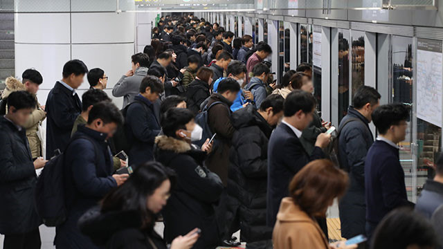
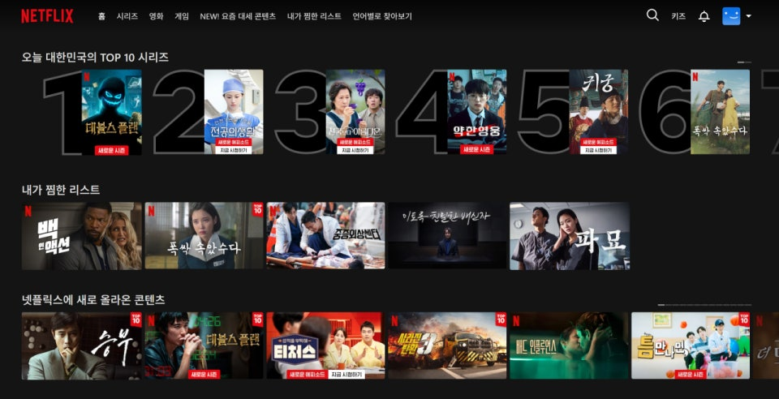
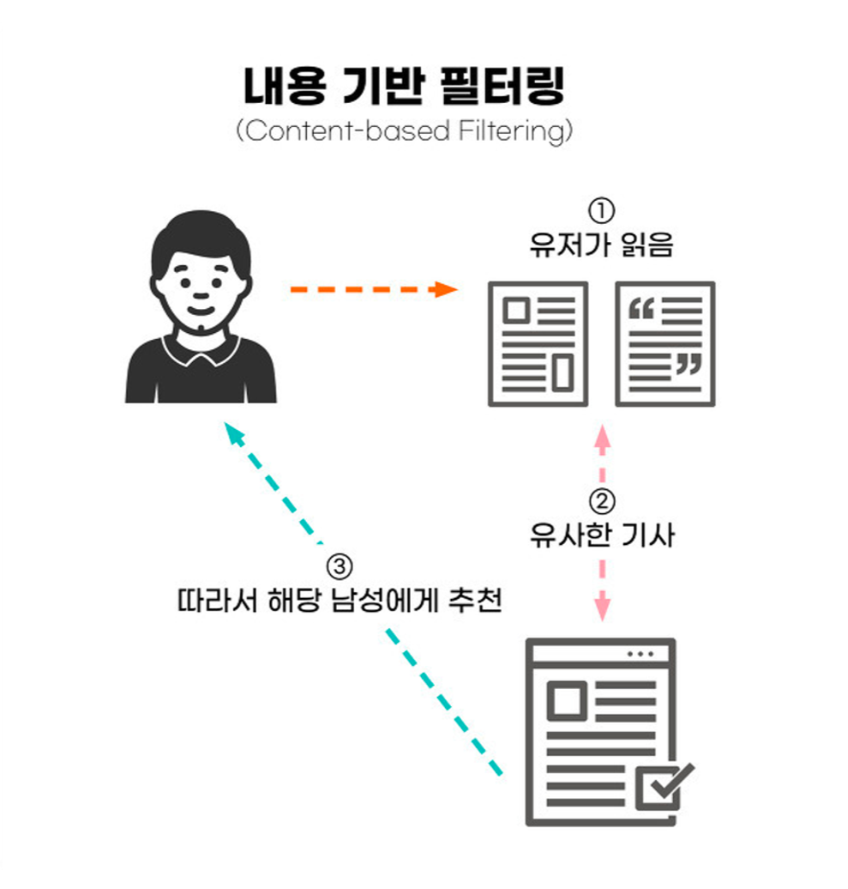
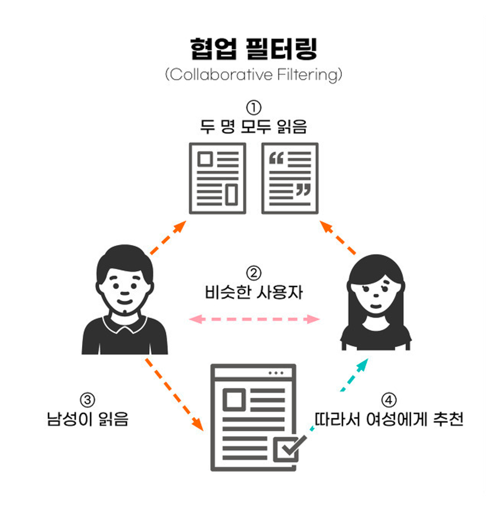
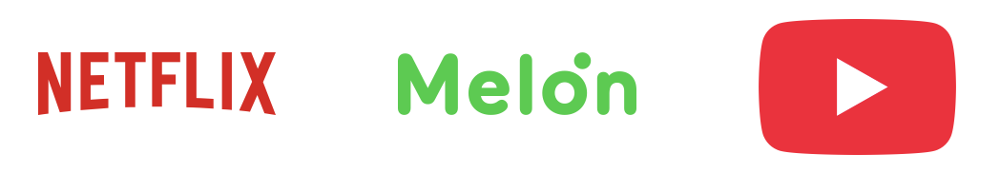
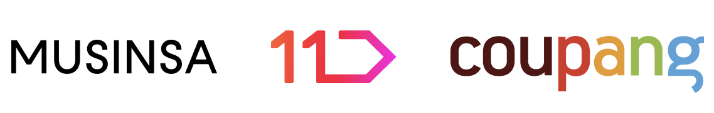
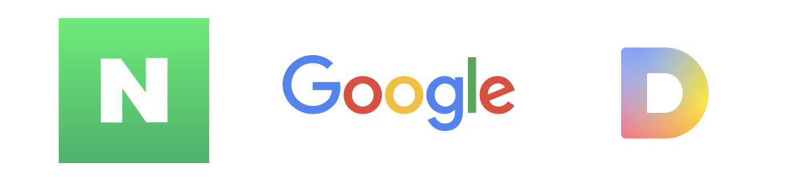

# #96 스마트폰은 당신보다 당신을 더 잘 알고 있다 — Notion draft

[🏠 Portfolio](https://github.com/heoneyzi) › [🤿 DeepDaiv.](../../../README.md) › [Contents](../../README.md) › [NewsLetter](../README.md) › [Archive](README.md) › **#96 draft**

> [!NOTE]
> Jiheon's (에디터 져니) Notion draft of **위클리 딥 다이브 #96**, published 2025-06-18 → **[read the published issue](https://stib.ee/ny5I)**.
> The published version may differ in title and wording; this archive keeps the draft in the original Korean.

안녕하세요 에디터 져니입니다.

출퇴근 사진 출처: <a href="https://n.news.naver.com/mnews/article/056/0010755941">네이버 뉴스</a>

여러분은 출퇴근 시간이나 쉬는 시간에 무엇을 하시나요? 저는 보통 음악을 듣거나, SNS을 잠깐 둘러보고, 유튜브 영상을 보곤 합니다. 버스나 지하철 안을 둘러보면, 저뿐만 아니라 많은 사람들도 그런 편인 것 같았죠.

그런데 여러분이 사용하는 그 앱이 왜 이렇게 유독 재밌게 느껴지는지 생각해 보신 적 있으신가요? 그 이유는 눈에 보이지 않는 추천시스템이 역할을 톡톡히 하고 있기 때문일지도 모릅니다.

사실 제가 출퇴근 시간에 하는 행동들에 모두 추천시스템이 사용되고 있습니다. 그렇다면 추천시스템이 뭘까요? 또 우리에게 얼마나 많은 영향을 끼치고 있을까요? 지금부터 함께 조금 더 들여다보도록 하죠.

### 추천시스템이란?

추천시스템이라는 단어가 생소하실 수도 있습니다. 실생활에서 우리는 다른 말로 “알고리즘”이라고도 부릅니다. 흔히 “인스타 알고리즘”이나 “유튜브 알고리즘”이라고 각각의 앱 명칭을 붙여서 그들의 추천시스템을 부르곤 하죠.

추천시스템이란, 간단히 말해서 **사용자가 관심을 가질 만한 콘텐츠나 상품을 알고리즘을 통해 자동으로 제안해 주는 기술**을 말합니다.

넷플릭스 화면

예를 들어 넷플릭스를 생각해 보겠습니다.  넷플릭스에는 수많은 콘텐츠가 있지만, 여기서 올라오는 콘텐츠는 사용자가 좋아할 만한 콘텐츠가 추천됩니다. 자신 계정의 화면과 친구 계정의 화면에 추천되는 콘텐츠는 완전히 다를 수 있다는 것이죠. 이처럼 **추천 시스템은 각 사용자의 취향과 행동을 분석해, 그 사람에게 맞는 콘텐츠를 골라 보여주는 것**입니다. 그러므로 추천시스템의 핵심은 사용자를 이해하는 일입니다. 그리고 무엇을 좋아할지, 어떤 콘텐츠에 관심을 가질지를 예측하고, 그에 맞춰 적절한 콘텐츠를 보여주는 게 바로 이 시스템의 역할입니다.

이러한 추천은 **정교한 필터링 방법**을 통해 결정됩니다. 추천시스템에서 대표적으로 두 가지 필터링 방법이 있습니다.

바로 <b>콘텐츠 기반 필터링(Content-based Filtering)</b>과 <b>협업 필터링(Collaborative Filtering)</b>입니다.

### <ins>콘텐츠 기반 필터링</ins>

콘텐츠 기반 필터링 출처: <a href="https://blog.daehong.com/237">마음을 읽는 개인화 마케팅의 시대</a>

먼저 <b>콘텐츠 기반 필터링 (Content-based Filtering)</b>입니다. 말 그대로 사용자가 이전에 좋아했던 콘텐츠와 유사한 것들을 추천해 주는 방식입니다. 예를 들어 사용자가 ‘아이언맨’ 영화를 재밌게 봤다면, ‘아이언맨’과 비슷한 액션 영화인 ‘어벤져스’를 추천해 줄 수 있는 것이죠.

이 방식은 콘텐츠 자체의 특성을 기준으로 추천하기 때문에, 새로운 아이템이 등장해도 그 특성을 분석할 수 있다면 쉽게 추천에 활용할 수 있다는 장점이 있습니다. 또한 사용자의 이력이 적어도, 그 몇 가지 정보만으로 추천할 수 있기 때문에 사용자의 이력이 없는 초기 상태를 의미하는 **‘콜드 스타트(Cold Start)’ 상황에도 꽤 강한 편**입니다.

하지만 단점도 명확하게 존재합니다. 아이템의 특성을 얼마나 잘 파악하느냐에 성능이 달려 있기 때문에, 아이템의 속성이 복잡하거나 다양할 경우 추천이 제한적일 수 있습니다. 예를 들어 사용자가 액션 영화를 몇 편 본 이력이 있다면, 이 방식은 액션 영화 위주로만 추천하게 되어 새로운 장르의 콘텐츠를 제안하기가 어렵습니다. 그래서 다양한 특성과 맥락을 잘 반영하는 것이 이 방식의 주요 과제가 됩니다.

### <ins>협업 필터링</ins>

협업 필터링 출처: <a href="https://blog.daehong.com/237">마음을 읽는 개인화 마케팅의 시대</a>

또 다른 방법으로는 <b>협업 필터링 (Collaborative Filtering)</b>이 있습니다. 이는 사용자와 비슷한 특성을 가진 다른 사용자의 행동을 분석해 아이템을 추천하는 방식입니다. 즉, 어떤 아이템에 대해서 비슷한 취향을 가진 사람들이 다른 아이템에 대해서도 비슷한 취향을 가지고 있을 것이라고 가정하고 추천을 하는 것이죠.

협업 필터링의 장점은 콘텐츠의 성격과 관계없이 다양한 영역에서 추천이 가능하다는 점입니다. 콘텐츠에 대한 사전 정보가 없어도 사용자 간의 행동만으로 충분히 효과적인 추천이 가능하다는 뜻이죠.

그러나 협업 필터링은 ‘콜드 스타트’에 취약합니다. 비슷한 사용자를 찾기 위해서는 어느 정도의 사용 이력이 필요한데, 처음 가입한 사용자나 새로 등록된 아이템의 경우에는 관련 정보가 부족해 추천이 어려울 수 있습니다. 또한 많은 사람들이 관심을 두는 인기 콘텐츠만 계속 추천되다 보면, 관심이 덜한 아이템은 점점 더 노출되지 않고 묻히게 되는 비대칭적인 문제가 발생하기도 하죠.

협업 필터링에서는 보통 <b>유저-아이템 매트릭스(User-Item Matrix)</b>를 기반으로 추천합니다. 이 행렬은 사용자가 어떤 아이템과 어떤 방식으로 상호작용했는지를 보여주는 일종의 지도 같은 것입니다.

이 행렬을 활용하는 방식에 따라 협업 필터링을 다시 두 가지로 나눌 수 있습니다.

먼저 <b>기억 기반 (Memory-based)</b>입니다.

유저-아이템 행렬 자체에서 산술적인 계산만으로 유사도를 계산해 추천을 만들어냅니다. 직관적이고 구현이 쉬운 장점이 있지만, 사용자의 데이터가 적거나 행렬이 희소(Sparse)할 경우 추천 성능이 크게 떨어지는 문제가 있습니다.

이러한 한계를 극복하기 위해 등장한 것이 <b>모델 기반(Model-based)</b>입니다.

이는 머신러닝을 통해 사용자가 아직 평가하지 않은 아이템의 평점을 예측하는 방식입니다. 학습된 모델은 희소한 데이터 상황에서도 더욱 정밀한 추천을 가능하게 해줍니다.

가장 대표적으로 행렬 분해 (Matrix Facorization)가 있습니다. 이는 행렬을 분해해서 숨겨진 패턴 (Latent Factor)을 찾아 새로운 요인에 대한 파악하는 방식입니다.

---

추천시스템에서는 콘텐츠 기반 필터링과 협업 필터링과 같은 다양한 필터링 방법을 함께 사용하는 하이브리드 필터링 방식을 사용합니다. 각각의 방식이 가진 장단점을 보완하면서, 더 다양하고 정확한 추천을 만들기 위해서죠.

결국, 추천 시스템의 성능은 <b>얼마나 많은, 그리고 얼마나 다양한 데이터를 가졌는지에 따라</b> 좌우됩니다. 사용자의 행동, 콘텐츠의 속성, 다른 사람들의 반응이 모두 쌓일수록 추천은 더 똑똑해지고, 정교해집니다.

### 추천시스템의 활용

이러한 추천시스템은 어디에서 사용되고 있을까요? 여러분의 머릿속을 지나가는 것들이 다양하게 있을 텐데요?

SNS에서도,

넷플릭스 / 멜론 / 유튜브 로고

웹툰, 영화, 음악, 동영상 같은 콘텐츠 플랫폼에서도,

무신사 / 11번가 / 쿠팡 로고

또한 의류나 상품 쇼핑몰에서도,

네이버 / 구글 / 다음 로고

혹은 뉴스나 정보 혹은 검색 플랫폼에서도 확인해 볼 수 있습니다.

우리는 이미 일상 속 수많은 온라인 활동에서 추천 시스템이 활용되고 있다는 사실을 쉽게 확인할 수 있습니다. 오히려 이제는 추천시스템이 **사용되지 않는 곳을 찾는 게 더 어려울 정도**죠.

그렇다면 왜 이렇게 많은 기업들이 추천시스템을 도입하고 있을까요? 정말 단순히 우리에게 ‘가장 잘 맞는 콘텐츠’를 추천해주고 싶은 **선한 의도**만이 이유일까요?

### 추천시스템 이대로 괜찮은가?

우리는 구글은 그저 검색 엔진이고, 인스타그램은 친구들의 사생활을 볼 수 있는 곳이라고만 생각합니다. 하지만 결코 그렇지 않습니다. 우리는 이 기업의 관점에서 우리를 바라볼 필요가 있습니다.

> 상품의 대가를 치르지 않는다면, 네가 바로 상품이다

넷플릭스 “소셜딜레마”의 일부

이런 기업의 고객은 누구일까요? 우리일까요? 아닙니다. 우리는 이 시스템의 ‘진짜 고객’이 아닙니다. 기업이 돈을 버는 구조를 들여다보면, 돈을 내는 쪽은 사용자보다 광고주입니다. 결국, 추천시스템은 광고주에게 ‘더 정확하게 타겟팅된 광고’를 제공하기 위해 존재합니다. 다시 말해, 우리가 이 플랫폼에서 얼마나 오래 머무르고, 얼마나 자주 돌아오고, 얼마나 많은 시간을 바치는지가 곧 그들의 상품이 됩니다.

그래서 기업은 사용자의 관심을 끌고 유지하는 데에 목숨을 겁니다. 얼마나 많은 시간을 쓰게 할 수 있을지, 인생의 몇 퍼센트를 기업에 바치게 할 수 있을지를 고민하죠. 그 고민의 결과물이 바로 지금 우리가 사용하는 추천시스템입니다. 이 알고리즘은 그 자체로 기업의 무기이며, 경쟁력을 가르는 핵심입니다. 당연히 만만하게 볼 수 없는 수준까지 발전해 왔죠.

우리는 우리가 스스로 선택해서 보고, 클릭하고, 소비한다고 생각하지만, 사실 그 많은 선택지들은 알고리즘이 깔아놓은 길 위에 있는 것들입니다. 이 시스템은 단순히 ‘좋아요’를 누른 게시물만을 기억하지 않습니다. 어떤 이미지를 얼마나 오래 봤는지, 언제 스크롤을 멈췄는지, 얼마나 자주 같은 콘텐츠를 반복해서 봤는지, 얼마나 빠르게 화면을 넘기는지까지… 우리도 인식하지 못한 행동 패턴을 세밀하게 추적하고 분석합니다. 우리가 생각하는 것 이상으로, 추천시스템은 우리를 알고 있습니다.

이렇게 모인 데이터는 다시 추천 시스템을 학습시키고, 또 그 결과로 더욱 정교한 추천이 돌아옵니다. 지금 이 순간에도 수많은 사용자가 앱을 켜고, 무언가를 보고, 반응하고 있습니다. 그 데이터는 알고리즘을 실시간으로 진화시킵니다. 추천 시스템이 우리를 정확하게 꿰뚫을수록 우리는 플랫폼에서 더 오래 머무르게 되고, 더 많은 광고를 보게 되고, 더 많은 클릭을 하게 됩니다. 어쩌면 추천 시스템은 우리 자신보다도 우리를 더 잘 이해하게 될지도 모릅니다. 이미 그럴 수도 있죠. 우리는 어쩌면 우리도 모르게 거대한 싸움에 휘말린 것일지도 모릅니다.

하지만 추천시스템은 여전히 우리에게 선택지만 제시할 뿐입니다. 그것을 받아들일지, 거부할지는 우리의 몫인 거죠. 그럼에도 선택의 주도권은 여전히 우리 손안에 있습니다. 추천시스템이 추천하는대로 선택하며 살 것인지, 그 바깥의 선택지를 찾을지는 오롯이 우리의 판단에 달려 있습니다.

---
[← Archive](README.md) · [📰 Newsletter index](../README.md) · [Published issue ↗](https://stib.ee/ny5I)
