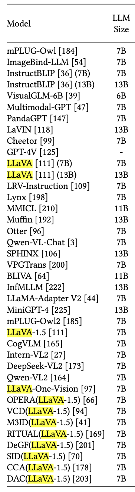
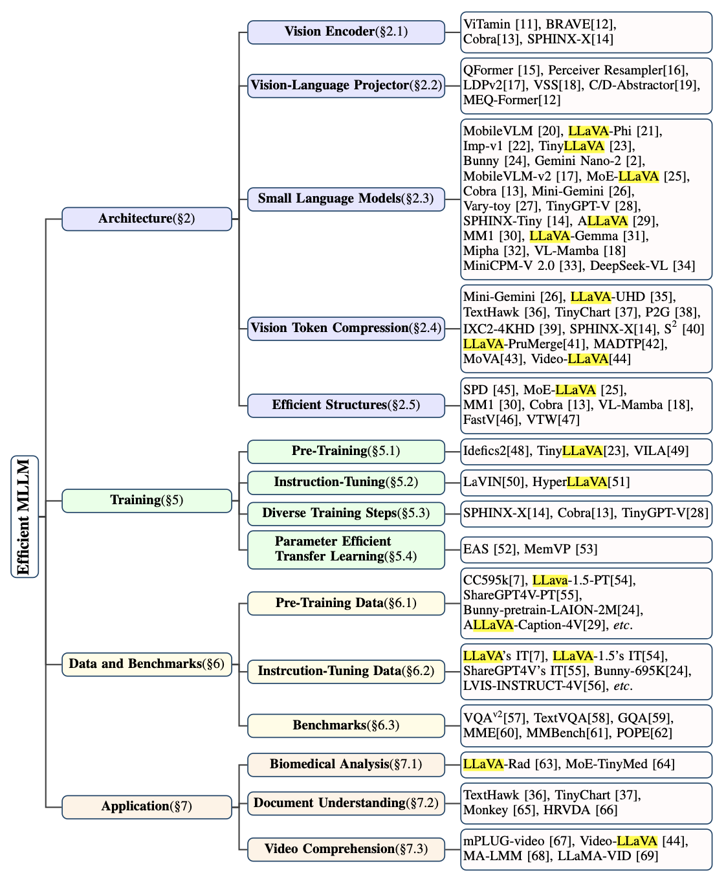
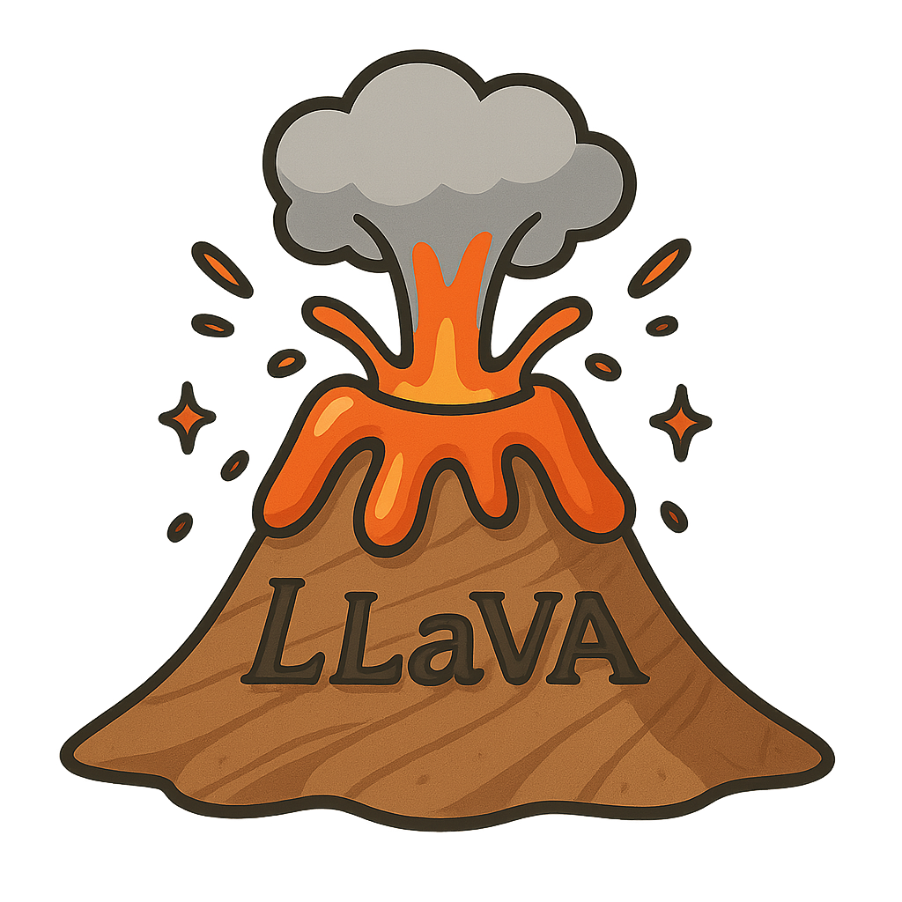
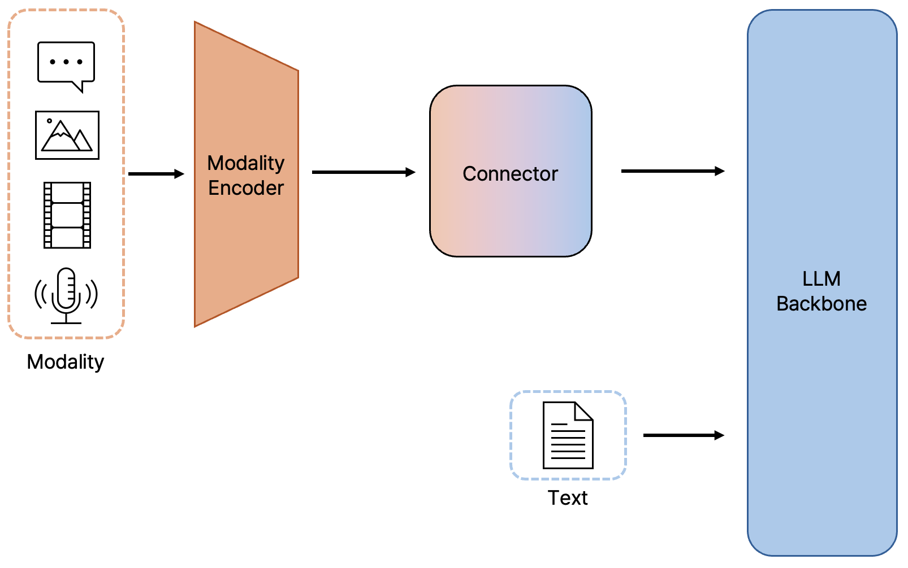
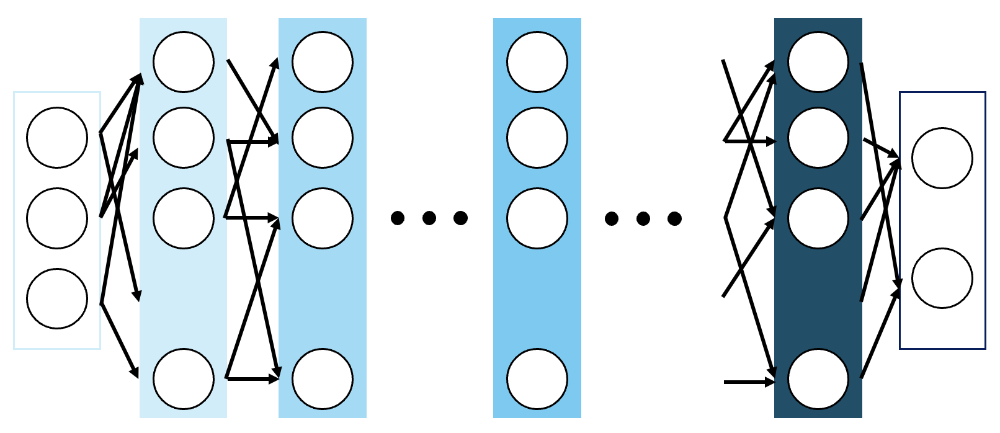
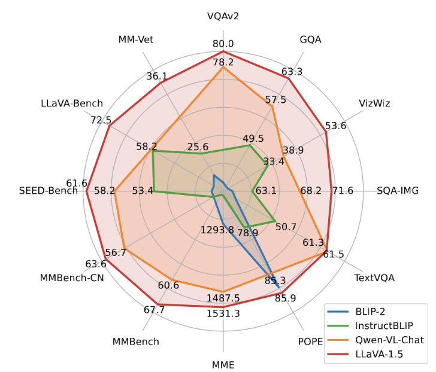
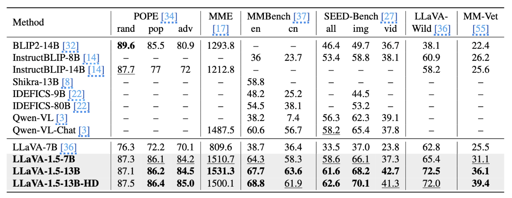

# #105 LLaVA는 어떻게 멀티모달의 기준이 되었는가? — Notion draft

[🏠 Portfolio](https://github.com/heoneyzi) › [🤿 DeepDaiv.](../../../README.md) › [Contents](../../README.md) › [NewsLetter](../README.md) › [Archive](README.md) › **#105 draft**

> [!NOTE]
> Jiheon's (에디터 져니) Notion draft of **위클리 딥 다이브 #105**, published 2025-08-20 → **[read the published issue](https://stib.ee/uIvI)**.
> The published version may differ in title and wording; this archive keeps the draft in the original Korean.

여러분 멀티모달(Multimodal)이라는 말을 들어보신 적 있으신가요?  멀티모달이란, 여러가지 모달리티(Modality)를 함께 다루는 분야를 일컫습니다. 여기서 모달리티는 데이터의 표현 형식을 말합니다. 예를 들자면 텍스트, 이미지, 오디오, 비디오가 모두 하나의 모달리티가 되죠. 그림을 글로 표현하는 작업, 영상을 요약하는 작업부터 자율주행까지 복합적인 작업 모두가 멀티모달의 영역에 들어있습니다.

멀티모달 분야는 인공지능에서 빼놓을 수 없는 핵심적인 분야입니다.

[https://arxiv.org/pdf/2404.18930](https://arxiv.org/pdf/2404.18930)

[https://arxiv.org/pdf/2405.10739](https://arxiv.org/pdf/2405.10739)

다양한 멀티모달에 대한 연구나 논문을 접하다 보면, 유독 눈에 들어오는 모델이 있는데요. 바로 “LLaVA”라는 모델입니다.

“LLaVA”는 “라바”로 읽혀서 그런지, 저는 LLaVA를 들을 때마다 이런 강렬한 용암과 같은 이미지가 떠오르곤 합니다.  수많은 멀티모달 연구에서 익숙하게 만나는 용암과 같이 뜨거운 이 모델, 왜 빼놓을 수 없는 모델이 되었을까요? 왜 멀티모달의 중심에는 하필 LLaVA가 있을까요?

함께 LLaVA를 중심으로 멀티모달 모델의 구조를 함께 알아보시죠.

---

#### 멀티모달 모델은 무엇인가?

멀티모달 분야에서 사용하는 모델은 주로 MLLM(Multimodal Large Language Model)이라고 부릅니다. LLaVA 역시 MLLM에 속하죠.

MLLM은 이름에서 유추할 수 있듯이, 대형 언어 모델 LLM(Large Language Model)이 다양한 모달리티를 처리할 수 있도록 만들어진 모델입니다. 기존의 높은 성능을 가진 LLM이 텍스트 이외의 작업이 가능하도록 확장한 셈입니다.

여기서 핵심은 멀티모달 모델의 기본적인 구조는 LLM에 뿌리를 내리고 있다는 것입니다. 멀티모달 요소의 특징을 Encoder에서 받아서 Connector을 통해 LLM이 이해할 수 있도록 처리합니다. 이를 LLM에 통합하는 형식인거죠.

### LLaVA는 무엇인가?

LLaVA는 멀티모달 오픈소스 모델로써, Large Language-and-Vision Assistant의 약자입니다. 이는 LLM과 시각적 이해 능력을 결합한 MLLM인거죠.

#### LLaVA의 구조

LLaVA의 구조를 보면 그 장점을 명확히 알 수 있습니다. LLaVA는 Vision Encoder을 통해 시각적 특징을 받습니다. 이를 LLM에 통합하기 위해선 Connector의 역할이 필요한데요, LLaVA의 Connector은 다른 MLLM에 비해 굉장히 직관적이면서 단순합니다.

LLaVA의 Connector은 다층 퍼셉트론인 MLP(Multi Layer Perceptron)를 통해 이미지 특징을 LLM 임베딩 공간에 직접적으로 매핑하는 구조입니다.

MLP는 인공지능에서 가장 기본적이며 단순한 신경망 구조 중 하나입니다. 오직 MLP를 통해서 이미지 특징을 LLM에 전달한다는 것은 최대한 간단한 접속부를 통해 두 세계를 연결하고자 했다고 해석할 수 있습니다.

MLP가 아닌 다른 Connector은 대개 어텐션(Attention)기반 모듈을 사용합니다. 이는 텍스트 토큰과 다른 모달리티의 토큰의 관계성을 알아보겠다는 의미입니다. 이 경우 모듈은 더욱 복잡해지고, 토큰마다 관계성을 알아보는 어텐션으로 인해 연산량이 많아지게 되겠죠.

#### **직관적 구조와 받쳐 주는 성능: “기준(baseline)”이 되다**

LLaVA의 직관적이면서 효율적인 구조는 오픈소스 모델로써 큰 장점을 가집니다.

이 직관적인 흐름 덕분에 연구자들은 새로운 아이디어를 자유롭게 실험할 수 있습니다. 복잡한 모듈 대신 블록처럼 쌓아올린 설계 덕분에 더 정교한 Connector를 붙이거나 다른 Vision Encoder로 교체하는 것도 어렵지 않습니다. 결국 LLaVA는 하나의 완성된 모델이면서도, 멀티모달 연구를 위한 실험 플랫폼으로 기능하게 되었습니다.

또한, LLaVA의 또 다른 강점은 **효율성**입니다. 대규모 상용 모델은 뛰어난 성능에도 불구하고, 그 내부 구조가 공개되지 않았거나 막대한 자원을 요구하기 때문에 소수만 다룰 수 있습니다. 반면 LLaVA는 효율적인 구조 덕분에 훨씬 적은 연산 자원으로도 학습과 실험이 가능합니다. 코드와 데이터셋까지 공개되어 있어 누구나 손쉽게 접근하고 재현할 수 있습니다. 이는 곧 멀티모달 연구의 진입 장벽을 낮추고, 대학 연구실이나 개인 연구자까지도 적극적으로 실험에 뛰어들 수 있게 만들었습니다.

이러한 LLaVA는 단순한 구조적 장점에 그치지 않고, 실제 성능 면에서도 이를 뒷받침합니다.

위 그래프는 LLaVA의 업데이트 모델인 LLaVA-1.5가 가지는 성능을 다른 오픈소스 모델과 비교해서 보여줍니다. 다양한 면에서 우수한 성능을 보인다는 것을 확인할 수 있죠.

<a href="https://www.semanticscholar.org/reader/124d4d374fbef2016fa9880489871a58a7450644">https://www.semanticscholar.org/reader/124d4d374fbef2016fa9880489871a58a7450644</a>

어떠한 연구에서도 성능을 공정하게 평가하려면 모두가 납득할 수 있는 기준선이 필요합니다. 바로 이 역할을 한 것이 LLaVA-1.5라는 뜻입니다. LLaVA-1.5는 *Improved Baselines*로 채택되며 다양한 설계 선택지를 체계적으로 제시했습니다. 그래서 LLaVA-1.5는 다양한 범용 벤치마크에서 비교의 출발점이 되었습니다. 덕분에 이후의 연구를 통해 등장한 수많은 파생 모델들은 모두 LLaVA-1.5와 동일한 학습 레시피를 따르며 개발되어, 단순한 성능 경쟁이 아니라 같은 조건에서 얼마나 효율적이고 최적화되어 있는지를 공정하게 비교할 수 있었습니다.  이러한 특성은 신뢰할 만한 평가 체계를 제공했고, 그 결과 LLaVA 계열 모델은 높은 성능을 유지하며 멀티모달 연구의 사실상 표준 모델로 자리매김하게 되었습니다.

#### **한계를 넘는 업데이트: LLaVA → 1.5 → NeXT → OneVision**

위에서 잠깐 LLaVA-1.5를 언급했는데, LLaVA는 등장 이후에 지속적인 업데이트를 거치면서 성능이 개선되고, 이에 따른 다양한 변형 모델이 나왔습니다.

초기 LLaVA가 공개된 이후, 이를 개선한 **LLaVA-1.5**가 나왔습니다. LLaVA-1.5는 **더 큰 데이터셋으로 학습**하고 **보다 긴 텍스트**를 처리할 수 있도록 확장되었습니다. 또한 더욱 정교하게 다듬어져 모델의 전반적인 이해력과 응답 품질이 크게 향상되었습니다.

이후에는 LLaVA-1.5를 더욱 발전시킨 **LLaVA-NeXT**가 등장했습니다. 이 모델은 기존 구조의 장점을 유지하면서도 **더욱 강력한 Vision Encoder**를 도입하거나, **MLP를 강화**하여 여러 기술적 개선을 통해 성능을 크게 끌어올렸습니다.

그리고 <b>LLaVA-OneVision</b>도 나왔습니다. OneVision은 더 이상 이미지와 텍스트에만 국한되지 않고, <b>비디오까지 단일 모델로 통합해 처리할 수 있는 능력</b>을 보여주었습니다. LLaVA-OneVision은 단일 이미지, 다중 이미지, 비디오라는 세 가지를 모두 다룰 수 있는 최초의 단일 멀티모달 오픈소스 모델로 평가받고 있습니다. 이는 오픈소스 모델이 <b>정적 이해에서 동적 추론까지 확장된 전환점</b>을 마련했다는 점에서 중요한 의의를 가집니다.

---

### 멀티모달의 기준은 어떻게 바뀔까? LLaVA는 그 속에 있을까?

LLaVA는 **직관·효율**이라는 미덕으로 출발해, 공개 레시피와 재현 가능한 학습 절차를 통해 연구자들이 공정하게 비교·개량할 수 있는 토대를 만들었습니다. 그 정점이 LLaVA-1.5였죠. “오픈소스 멀티모달 모델은 이렇게 설계·평가하자”는 잣대를 확립했습니다. 그리고 **범용성 확장**입니다. LLaVA-OneVision 같이 다양한 모달리티를 다루려는 노력 역시 이뤄지고 있습니다.

지금의 LLaVA의 토대 위에서 만들어진 다양한 멀티모달 모델은 표준 벤치마크에서는 강하지만, 편향이 줄어든 더 현실적인 시험으로 갈수록 아직 격차가 존재합니다. 모달리티를 진짜로 해석해야만 풀 수 있는 문제들에 대해서는 성능 하락이 있다는 뜻이죠.

그렇다면 다음 세대의 멀티모달 ‘기준’은 어디로 이동할까요? 제 생각에 이제 초점은 “**오픈·재현·전이**”라는 LLaVA 모델이 가졌던 덕목을 넘어서,  - **다양한 모달리티의 통합 처리 - 토큰·속도·메모리 효율성 - 환각 억제·설명 가능성을 가진 높은 신뢰도 - 엄정한 벤치마크에서의 일관된 성능 유지**

등을 가진 모델로 이동하지 않을까 싶습니다.

그렇다면 LLaVA 모델은 멀티모달의 기준에서 밀려나게 될까요? 아직까지 저는 시기상조라고 생각합니다.  LLaVA 계열은 이미지·비디오 과제 전반에서 <b>경쟁력을 꾸준히 유지</b>하고 있습니다. 동시에 초거대 폐쇄형과 최신 대형 모델들 속에서도 상위권을 다투는 양상을 보입니다. 여전히 <b>“강한 기준선이자 경쟁자”</b>로 볼 수 있다는 것이죠.실제로 LLaVA 생태계는 <b>Interleave/Video/OneVision</b>으로 모달리티 통합 방향을 선점했고, 토큰 효율·장문맥·지속 학습을 겨냥한 후속 연구(<b>SlowFast-LLaVA-1.5, LLaVA-c</b>)도 빠르게 축적되고 있습니다. 지금 이 순간에도 LLaVA 계열과 그 파생 모델들은 <b>탄탄한 토대</b>와 <b>높은 재현성</b>을 무기로 실전 최적화와 범용성 확장을 병행하고 있죠. 위에서 언급한 다양한 기준을 넘는 새로운 모델이 나오지 않는다면, 멀티모달 분야에서 “LLaVA = 신뢰 가능한 기준선”이라는 위상은 계속 유지될 가능성이 큽니다. 다음 세대의 <b>표준 모델</b>은 위의 기준을 뛰어넘는 모델이 될 것입니다. 그럼에도 그 속에서 <b>미니멀하고 직관적인 LLaVA의 핵심</b>은 여전히 연구자들에게 든든한 버팀목이 될 겁니다.

---
[← Archive](README.md) · [📰 Newsletter index](../README.md) · [Published issue ↗](https://stib.ee/uIvI)
