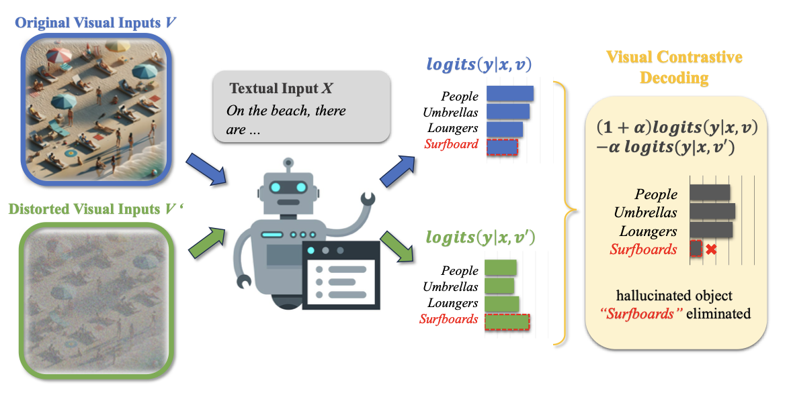
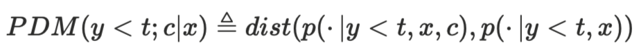

# #114 LVLM의 환각은 어떻게 측정할까? — Notion draft

[🏠 Portfolio](https://github.com/heoneyzi) › [🤿 DeepDaiv.](../../../README.md) › [Contents](../../README.md) › [NewsLetter](../README.md) › [Archive](README.md) › **#114 draft**

> [!NOTE]
> Jiheon's (에디터 져니) Notion draft of **위클리 딥 다이브 #114**, published 2025-10-22 → **[read the published issue](https://stib.ee/eXmJ)**.
> The published version may differ in title and wording; this archive keeps the draft in the original Korean.

안녕하세요 에디터 져니입니다!

성인이시라면 한 번쯤 술자리를 경험해보셨을 겁니다. 친구나 연인과 한두 잔 기울이다보면 어느새 취기가 오르죠. 그럴 때 우리는 흔히 “좀 취했네” 혹은 “별로 안 취했어”라고 말하곤 합니다. 하지만 사람마다 알코올에 대한 반응이 다르기 때문에, 이런 표현만으로는 정확히 ‘얼마나 취했는가’를 판단하기 어렵습니다.

그래서 우리는 혈중알코올농도(BAC, Blood Alcohol Concentration)라는 지표를 사용합니다. 입김에 포함된 알코올이 센서 내부에서 화학 반응을 일으키면, 그 과정에서 전류의 세기가 변하고, 이 변화를 바탕으로 혈중 알코올 농도를 계산합니다. 이렇게 얻은 수치 덕분에 우리는 단순한 감각적인 판단을 넘어, ‘음주운전’처럼 위험한 행동을 예방하고 통제할 수 있게 되었습니다.

AI 모델도 때로는 술에 취한 사람처럼 엉뚱한 말을 자신 있게 내뱉곤 합니다. 사실과 다른 내용을 진실처럼 말하는 이 현상을 우리는 ‘환각(Hallucination)’이라고 부릅니다. 그렇다면 인간의 혈중알코올농도처럼, 모델이 얼마나 취해 있는지, 즉 얼마나 환각을 일으키고 있는지를 수치로 잴 수 있을까요?

오늘은 특히나 눈으로 보고 말로 대답하는 AI를 중심으로 환각을 ‘수치화’하려는 연구들을 알아보고, 인공지능을 위한 ‘음주측정기’가 어떻게 만들어지고 있는지 함께 살펴보겠습니다.

먼저 환각의 가능성을 추정하는 방법이 있습니다.

환각의 가능성을 추정한다는 것은 모델이 얼마나 불안정한 상태로 말을 하고 있는지를 관찰하는 방식을 추정하는 접근입니다. 불안정하게 대답한다는 것은 환각이 일어날 가능성이 높다는 뜻이기 때문에, 이를 사전에 방지하는 것이죠.

모델의 확신(Confidence)을 숫자로 읽는 기본 단서는 로짓(Logit)입니다. LLM은 매 토큰을 생성할 때, 트랜스포머가 쌓아 올린 **은닉표현**(이전 문맥과 이미지 정보까지 요약한 벡터)을 최종 출력 임베딩(어휘 벡터)과 **내적**해 어휘 사전의 각 단어에 대한 **점수**를 만드는데, 이 점수가 곧 로짓입니다. 쉽게 말해, “지금 이 자리에서 특정 단어가 어울리는 정도”를 표현한 수치가 로짓입니다.

따라서 **로짓이 높다**는 건 그 단어가 현재 문맥에 **잘 맞는다**고 모델이 강하게 믿는다는 뜻이고, **로짓이 낮다**는 것은 그 단어 선택에 자신이 없다는 신호인 셈이죠. 대개 로짓이 낮다는 뜻은 그 단어를 선택했음에도 틀릴 확률이 높다고 해석할 수 있습니다.

그래서 많은 연구에서 이 로짓의 후처리 과정을 통해 환각을 제어하려고 합니다.

Logits의 Contrastive Decoding 방법<b> </b><a href="https://arxiv.org/pdf/2311.16922">Mitigating Object Hallucinations in Large Vision-Language Models through Visual Contrastive Decoding</a>

[VCD 연구](https://arxiv.org/pdf/2311.16922)에서 제안된 Visual Contrastive Decoding(VCD)은 로짓을 활용해 모델의 환각을 줄이는 대표적인 후처리 기법입니다. 간단히 말해, 대조적인 상황에서 나온 두 출력을 비교하여 모델이 진짜 이미지를 보고 말하는지를 판별하는 방법입니다.

논문 속 그림 예시를 보면, 모델이 “On the beach, there are”까지 문장을 생성한 상태에서 다음 단어를 예측해야 하는 상황이 나옵니다. 이때 모델은 후보 단어들(*People, Umbrellas, Loungers, Surfboards*)에 대해 각각의 로짓 값을 계산해, 어떤 단어가 문맥상 가장 자연스러운지를 판단합니다. 문제가 되는 건, 모델이 이미지 속 시각 정보보다 “Beach”라는 단어에 과도하게 끌릴 때입니다. 이 경우 실제 이미지에는 없는데도 S*urfboard*의 로짓이 가장 높게 나타날 수 있습니다. 만약 모델이 그 단어를 출력한다면, 이는 이미지와 무관한 출력이므로 환각에 해당하는 결과죠.

Contrastive Decoding은 이 현상을 잡아내기 위해 이미지를 변형한 입력을 추가로 만듭니다. 예를 들어, 이미지의 특징을 일부 흐리거나 제거한 버전을 함께 넣어 두 가지 경우의 로짓을 계산합니다. 만약 S*urfboard*가 이미지의 특징을 제거한 상황 더욱 높은 로짓 값을 가진다면, 그 단어는 이미지 내용과는 상관없이 문맥 때문에 선택된 것임을 알 수 있습니다. 즉, 모델이 “이미지를 보지 않아도 선택하는 단어”는 환각일 가능성이 크다는 것이죠.

이렇게 VCD는 두 로짓을 비교하여(대조하여), “이미지에 근거하지 않은 단어”를 판별하고 그 확률을 낮춰 모델이 실제 시각 정보에 기반한 표현만 출력하도록 유도합니다. 결과적으로, 로짓의 후처리 과정은 단순히 확률을 조정하는 기법이 아니라, 수치 비교를 통해 모델에서 환각이 일어나는 단어를 파악할 수 있게 합니다.

조금 더 나아가, [M3ID 연구](https://arxiv.org/pdf/2403.14003)에서는 이미지의 유무에 따른 로짓의 차이를 수치화하는 개념을 도입했습니다.

PDM 수식 <a href="https://arxiv.org/pdf/2403.14003">Multi-Modal Hallucination Control by Visual Information Grounding</a>

PDM(Prompt Dependency Measure)라고 부르며, 수식을 보면 c(Context)의 유무에 따른 단어를 출력할 확률 즉, 로짓의 차이를 나타내는 수치입니다. 차이가 많이난다면 distance가 클 것이니까요.

PDM이 높다는 것은 c의 유무가 로짓에 많은 차이를 준다는 의미가 됩니다. 이는 현재 출력되는 단어가 문맥에 특화되어 있다고 볼 수 있습니다. 여기서 문맥은 이미지를 의미하므로, 이미지를 많이 보고 있음을 의미하겠죠?

PDM이 낮다고 반드시 환각이 일어났다고 보기는 힘들다 <a href="https://arxiv.org/pdf/2403.14003">Multi-Modal Hallucination Control by Visual Information Grounding</a>

반대로 PDM이 낮다는 것은 c가 영향을 주지 않는다는 뜻이고, 중립적인 단어임을 예상할 수 있습니다. 이미지를 보지 않고 단어를 출력했다는 것이죠. 그렇다면 PDM이 낮다면 반드시 환각이 일어났다고 말할 수 있을까요? 그렇지 않습니다. 예를 들어 조사나 전치사 같이 필수적인 문장의 구성요소나 너무 상세한 단어는 문장의 문맥상으로 알 수 있는 정보는 PDM이 낮아도 환각으로 보기는 힘듭니다. 그러나 이러한 특별한 경우를 제외한다면, PDM은 이미지를 보지 않고 출력했다는 뜻이기 때문에 환각이 일어날 확률이 높은 단어라고 판단할 수 있는 것입니다.

생성 단어(토큰)의 개수가 PDM과 환각에 미치는 영향 Multi-Modal Hallucination Control by Visual Information Grounding

그래프를 통해 더 많은 토큰이 생성되면 PDM이 감소하는 것을 확인할 수 있습니다. 이는 토큰 생성 과정이 진행됨에 따라 시각적 정보가 희석되고 무시된다는 의미입니다. 왜냐하면 단어가 생성되면서 앞의 문장을 구성하는 정보에 치중되고, 시각적 정보가 희석되고 무의미해지기 때문입니다. 그에 따라서 환각이 일어나는 개수도 늘어난다는 것을 확인할 수 있었죠.

보통 환각을 측정하기 위해서는 사람의 판단이 필요하지만, 해당 연구는 PDM을 고안해 환각을 정량화하려는 시도였습니다. 나아가 논문에서는 PDM을 활용해 모델을 고안하였고, 환각이 줄어들었음을 성능적으로 확인할 수 있었습니다.

또 다른 접근법은 직접적으로 Hallucination Benchmark를 사용하는 방법입니다. 강화학습의 보상 등으로 사용해서 모델을 더욱 똑똑하게 만드는 것이죠. 그렇다면 환각을 측정하는 벤치마크는 어떤 것이 있을까요?

가장 널리 사용하고 성능을 비교하는 벤치마크는 POPE와 CHAIR이 사용됩니다.

먼저 **POPE**(Pipeline for Object Presence Evaluation)는 말 그대로 모델이 **보이지 않는 물체를 본다고 착각하는 정도**를 평가합니다. 이는 VQA(Visual Question Answering) 형식으로 구성되어 있으며, “이 이미지에 ○○가 있나요?”와 같은 **객체 존재 여부(yes/no)** 질문을 던집니다. 세 가지 난이도 수준이 존재하는데, 무작위(Random), 인기 객체(Popular), 그리고 도전적(Adversarial) 구성으로 구분됩니다. 평가 방식은 매우 간단하지만 강력합니다. 모델의 응답(Yes/No)과 실제 정답(Yes/No)을 비교하여 정확도를 계산합니다. 즉, POPE는 모델이 **시각적으로 존재하지 않는 객체를 잘못 인식할 확률**을 직접 수치화하여, “얼마나 자주 헛것을 보는가”를 정량적으로 보여주는 벤치마크입니다.

반면, **CHAIR**(Caption Hallucination Assessment with Image Relevance)는 모델이 생성한 **이미지 설명 문장(Caption)** 속에서 **존재하지 않는 객체를 언급했는지**를 평가합니다. 예를 들어 실제 이미지에는 사과만 있는데, 모델이 “테이블 위에 사과와 바나나가 있다”고 말한다면 “바나나”는 환각에 해당합니다. 이를 평가하기 위해 CHAIR은 문장을 토큰화한 뒤, 동의어 사전(synonym dictionary)과 정규화를 거쳐 **객체 언급 목록**을 추출합니다. 그리고 이미지의 정답 객체 주석과 비교해 불일치하는 항목을 “hallucinated object”로 집계합니다. 이때 두 가지 지표를 함께 사용합니다.

$`\text{CHAIR}_s = \frac{\text{환각이 포함된 문장 수}}{\text{전체 문장 수}} , \text{CHAIR}_i = \frac{\text{환각 객체의 수}}{\text{전체 객체 언급 수}}`$

이 두 지표를 함께 보면, 환각이 “얼마나 자주 발생했는가(CHAIR s)”와 “발생했을 때 얼마나 크게 어긋났는가(CHAIR i)”를 동시에 파악할 수 있습니다.

이처럼 POPE와 CHAIR 모두 **‘객체(Object)’를 중심으로 환각을 정의**합니다. 다시 말해, 모델이 **시각적으로 존재하지 않는 객체를 언급하거나 감지했는지**에 초점을 맞추고 있다는 점에서 두 벤치마크는 **객체 기반(Object-centric)** 평가에 속합니다.

그러나 현재의 환각 평가는 전반적으로 <b>객체 중심(object-centric)</b>이며, 불가피하게 <b>단어의 유무</b>로 판단하는 경우가 많습니다. 예를 들어 CHAIR 계열의 평가는 “그 단어(객체)가 이미지에 존재하는가”를 기준으로 하고, POPE는 “있다 / 없다”의 이분법적 질문으로 측정합니다. 이러한 구조는 명료하지만, 더 미묘하고 고차원적인 오류를 충분히 포착하지 못합니다. 대표적인 예시로 “고양이가 개를 쫓는다”를 “개가 고양이를 쫓는다”고 말하는 오류는, 객체는 맞지만 <b>속성과 관계의 방향성이 어긋난 환각</b>입니다. 하지만 객체 중심의 벤치마크는 이런 오류를 ‘환각’으로 잡아내지 못합니다. 결국 <b>더 정확하고 세밀한 환각의 분석과 활용</b>을 위해서는 평가의 초점이 <b>객체 유무</b>를 넘어, 고차원적 관계를 포괄하는 새로운 형태의 벤치마크로 발전할 필요가 있다고 느낍니다.

저는 벤치마크의 고도화와 새로운 환각 유형에 대한 **체계적으로 정의·측정·피드백 루프**가 결합될 때, 인공지능을 위한 **환각 측정기**가 한층 더 정교해질 것입니다. 이제 우리는 “보았다”를 넘어 “**바르게 이해했다**”는 증거를 숫자로 제시해야만 하는 것이죠.

---
[← Archive](README.md) · [📰 Newsletter index](../README.md) · [Published issue ↗](https://stib.ee/eXmJ)
