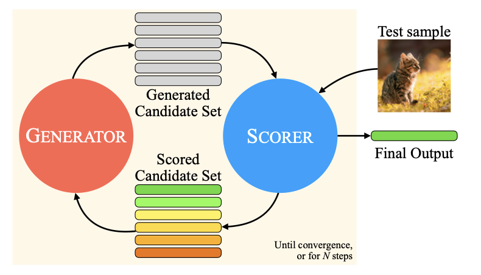

# LLM이 보고 들을 수 있다?! — MILS 소개 (unpublished draft, Feb 2025)

[🏠 Portfolio](https://github.com/heoneyzi) › [🤿 DeepDaiv.](../../../README.md) › [Contents](../../README.md) › [NewsLetter](../README.md) › [Archive](README.md) › **MILS draft (Feb 2025)**

> [!NOTE]
> Jiheon's (에디터 져니) February 2025 draft introducing MILS (*LLMs can see and hear without any training*, arXiv 2501.18096).
> It is **not** among the nine published issues listed in the newsletter index; kept in the original Korean.

#### 사진이나 노래를 글로 설명할 수 있을까?

안녕하세요 에디터 져니입니다.

여러분, 지인들과 재미 삼아 스피드 퀴즈를 해보신 적 있으신가요?

스피드 퀴즈는 위 그림 같이 한 사람이 특정 단어를 문장으로 설명하면 상대방은 이를 맞추는 게임입니다.  막상 익숙한 단어라도 문장으로 설명하려고 하면 쉽지 않다는 것이 바로 스피드 퀴즈의 묘미이죠.

그렇다면 단순한 “단어”를 넘어서, 우리는 사진이나 소리를 문장으로 표현할 수 있을까요?

예를 들어, 외국인에게 태극기나 애국가를 설명하려면 어떻게 해야 할까요?  상상만 해도 쉽지 않은 과정임이 느껴집니다. 그래서 저희는 보통 사진은 시각적, 소리는 청각적인 방식으로 설명하며, 상대방도 이를 자연스럽게 이해합니다.

인공지능 역시 마찬가지였습니다.  멀티모달(multimodal) 요소(이미지, 오디오, 비디오 등)를 다루기 위해서는 해당 모달리티(modality)의 데이터에 특화된, 즉 훈련된 모델이 필수적이었습니다.  그러나 최근 연구에서 이러한 관념을 뒤집는 새로운 접근 방식이 등장했습니다.

[arxiv.org](https://arxiv.org/pdf/2501.18096v1) 에서는 MILS(Multimodal Iterative LLM Solver)는 새로운 방법론을 제시했습니다. MILS는 고도화된 LLM의 강력한 추론 능력을 활용하여, 멀티모달 요소를 텍스트로 변환하고 이를 기반으로 학습 없이 다양한 태스크를 해결하는 방안입니다. 마치 스피드 퀴즈에서 단어를 설명하듯, MILS는 오디오, 이미지, 비디오와 같은 데이터를 문장으로 표현하여 이해하는 것이죠. 그렇다면 MILS는 이러한 과정을 어떻게 수행할 수 있을까요? 구체적인 파이프라인을 함께 살펴보겠습니다.

---

#### MILS 프레임워크

MILS의 기본적인 구조는 다음 그림과 같습니다.

MILS는 “Generator(생성기)”와 “Scorer(평가기)”, 그리고 “Iterative Feedback(반복적 피드백)”이라는 세 가지 핵심 요소로 구성되어 있습니다.

Generator는 LLM을 통해 여러 개의 후보 답안을 생성합니다. 후보 답안이라는 것은 태스크의 종류에 따라 달라질 수 있지만, 텍스트 기반의 표현이라는 공통점을 가지고 있습니다.

Scorer는 Generator가 생성한 후보 답안의 적절성을 평가하고, 최적의 답안을 선택합니다. 해당 모달리티에 대한 평가가 필요하기 때문에 Scorer은 알맞은 멀티모달 모델을 사용합니다.

Scorer의 평가 결과는 다시 Generator에 피드백으로 전달됩니다. 이에 따라 Generator에서는 피드백에 맞는 더 나은 후보군을 생성할 수 있습니다. 그리고 다시 Scorer에서 평가 후 Generator에 피드백을 주는 반복적인 형식을 이루게 됩니다. 이러한 반복적인 피드백 형식을 사용함으로써 점진적으로 더 적절한 답안을 찾을 수 있게 되는 것이죠.

이러한 간단하면서 효율적인 구조 덕분에, MILS는  훈련 없이 멀티모달 태스크를 해결할 수 있습니다. 또한 멀티모달 요소를 텍스트로 변환할 수 있는 다양한 태스크에서 활용 가능하다는 장점을 가집니다.

연구에서는 캡셔닝(Captioning), 멀티모달 연산(Cross-modal Arithmetic), 이미지 생성(Image Generation), 이미지 스타일 변환(Style Transfer)이라는 다양한 태스크에 적용할 수 있다는 것을 보였습니다.

캡셔닝은 주어진 모달리티(이미지, 비디오, 오디오)에 적절한 설명(캡션)을 생성하는 태스크입니다. Generator가 다양한 캡션 후보를 만들고, Scorer가 가장 적절한 문장을 선택하는 방식으로 해결됩니다. 비교적 단순한 구조로, 하나의 모델을 Scorer로 이용해서 MILS를 만들 수 있습니다.

멀티모달 연산은 여러 멀티모달의 입력을 조합하여 텍스트로 표현하는 태스크입니다. 멀티모달 연산 역시 캡셔닝과 유사한 방식으로 동작합니다. 다양한 조합으로 문장을 생성한 후, 가장 관련성 높은 문장을 선택합니다.

캡셔닝과 멀티모달 연산은 최종적으로 텍스트를 출력하는 태스크이므로, Generator가 생성한 문장을 Scorer가 점수를 통해 피드백을 주는 과정을 거치게 됩니다.

반면 이미지 생성이나 스타일 변환의 경우는 최종 출력이 텍스트가 아닌 이미지이므로, 위의 두 태스크와는 다른 방식으로 작동합니다. 이 과정에서 이미지 생성을 위해 LLM을 프롬프트의 최적화 과정으로 활용했습니다. 즉 Generator가 주어진 입력을 바탕으로 다양한 변형된 프롬프트를 생성하며, Scorer가 해당 프롬프트로 생성한 이미지의 품질을 평가하고 프롬프트에 대한 피드백을 주는 과정을 반복하게 되는 것이죠.

태스크의 성격에 따라 Scorer의 역할은 달라지지만, Generator에서 LLM의 추론 능력을 최대한 활용하려는 것이 MILS의 핵심입니다.

---

#### MILS에 대한 심층적 분석

MILS 프레임워크는 Generator와 Scorer의 상호작용을 통해 최적의 결과를 점진적으로 찾는 구조를 가지며, 훈련 없이(Training-free) 다양한 태스크를 수행할 수 있다는 혁신적인 장점을 갖고 있습니다. 기존의 모델은 특정 태스크를 수행하기 위해 적절한 학습이 필요했습니다. 데이터 수집과 모델 훈련 과정이 필수적이었다는 점을 고려하면, MILS와의 차이가 더욱 두드러집니다.

MILS의 접근 방식은 단순히 자원과 비용이 절감할 수 있다는 점에서 그치지 않고, 기존 방식과 차별화되는 뛰어난 적응력을 갖추고 있습니다. MILS는 특정 데이터셋에서 학습된 모델이 아닌 상태임에도 다양한 모달리티에서 태스크를 수행할 수 있습니다. 이는 제한된 데이터셋 속의 일반화 능력을 넘어, 완전히 새로운 데이터에서도 성능을 발휘할 수 있다는 점에서 기존의 Zero-shot 개념을 뛰어넘는 유연함을 보여줍니다.

그러나 MILS는 구조적으로 큰 장점을 가지고 있지만, 한계점도 존재했습니다.

MILS의 성능은 Generator와 Scorer에 크게 의존적입니다. 특히나 Scorer가 얼마나 정밀하게 평가하고, 적절한 피드백을 제공하는지에 따라 성능이 크게 달라질 수 있습니다. 혹은 Generator가 LLM의 표현 능력이 충분하지 않다면, 최적의 답안을 생성하는 과정에서 한계가 발생할 수도 있습니다.

또한 MILS의 반복적 피드백의 구조는 최적화 속도(Optimiation speed) 문제에도 영향을 줄 수 있습니다. 점진적으로 최적의 결과를 찾아가는 MILS의 과정은, 한 번의 평가로 즉시 결과를 도출하는 기존의 End-to-End 방식보다 속도가 느릴 수 있다는 것이죠. 하지만 이는 LLM이 발전함에 따라 함께 개선될 가능성이 큽니다. 이는 더 적은 횟수의 최적화 스텝만으로도 결과를 얻을 수 있기 때문입니다.

앞으로 Generator의 표현력 강화, Scorer의 평가 정밀도 향상, 그리고 피드백의 알고리즘 개선과 같은 추가적인 연구가 이루어진다면, MILS는 더욱 강력한 멀티모달 프레임워크로 성장할 것입니다.

---

#### MILS로 바라보는 멀티모달 AI의 가능성

LLM의 성능은 나날이 빠르게 성장하고 있습니다.

본 연구는 LLM이 단순히 텍스트를 처리하는 모델로 머물기에는, 활용 가능성이 크다는 점을 보여주었습니다. 이제 LLM의 추론 능력은 적절한 입력과 피드백을 통해서 텍스트뿐 아니라 다양한 모달리티를 이해하고 처리할 수 있음을 입증했기 때문입니다.

더 나아가서 MILS 프레임워크는 기존의 멀티모달 태스크를 해결하는 새로운 가능성이자 관점을 제시했습니다. 특정 태스크를 위해 개별적으로 학습된 모델을 구축해야 하는 기존의 접근 방식과 달리, LLM의 추론 능력과 Scorer의 평가 능력을 적절히 조합함으로써 다양한 태스크를 수행할 수 있다는 패러다임을 보여준 셈이죠. 이는 향후 LLM을 활용하여, 훈련 없이도 강력한 일반화 능력을 갖춘 모델을 구축하는 방향으로 멀티모달 연구가 발전할 수 있음을 시사합니다. 물론 MILS가 해결해야 할 과제는 여전히 남아 있지만, 지속적인 연구가 이루어진다면 더욱 강력한 프레임워크로 발전할 것입니다.

앞으로 멀티모달 AI는 어떤 방향으로 발전할까요? MILS와 같은 프레임워크가 새로운 표준이 될 수 있을까요? 또한 어떤 새로운 모달리티로 확장될 수 있을까요?  수많은 질문과 가능성을 제시하는 MILS 프레임워크를 함께 알아보았습니다.

참고 논문: [LLMs can see and hear without any training (arXiv 2501.18096)](https://arxiv.org/abs/2501.18096)

---
[← Archive](README.md) · [📰 Newsletter index](../README.md)
