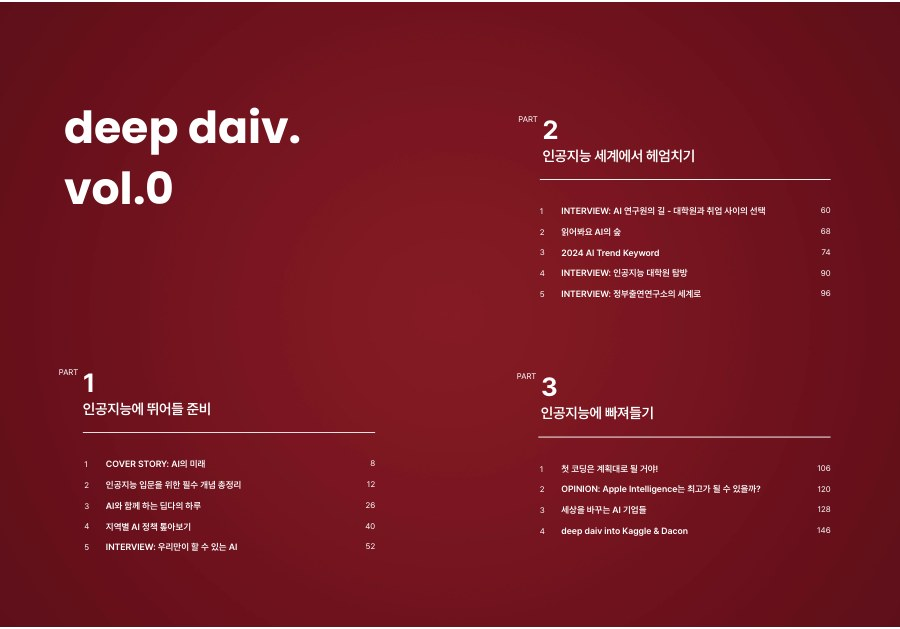

[🏠 Portfolio](https://github.com/heoneyzi) › [🤿 DeepDaiv.](../README.md) › **Contents**

# ✍️ deep daiv. Contents Team — writing about AI

The Contents Team turns the club's study into public writing: a printed AI magazine and the weekly e-mail newsletter *위클리 딥 다이브*. Jiheon wrote under the pen name **에디터 져니 ("Editor Journey")** — first as a magazine editor, then as a weekly newsletter writer.

  

<table>
<tr>
<td width="50%" valign="top">

 <b><a href="Magazine/README.md">📖 Magazine vol.0</a></b>
 The club’s printed AI magazine for newcomers, in three parts; 43-page excerpt with Jiheon’s pieces (concept primer, NAVER interview, first-coding guide).
 <b>AI Magazine Editor · Aug – Dec 2024</b>
</td>
<td width="50%" valign="top">

 <b><a href="NewsLetter/README.md">📰 위클리 딥 다이브</a></b>
 Weekly newsletter issues explaining multimodal-AI papers with everyday analogies — 9 issues (#84 → #125), 6 Notion drafts archived.
 <b>Weekly AI Newsletter Writer · Mar 2025 – Jan 2026</b>
</td>
</tr>
</table>

## 🗓️ Timeline

| When | What | Role (CV wording) |
|---|---|---|
| Aug – Dec 2024 | Magazine vol.0 (printed 10 Dec 2024) | AI Magazine Editor — edited and reviewed articles on AI |
| Feb 2025 | MILS draft (unpublished) | — |
| 26 Mar 2025 → 7 Jan 2026 | Newsletter issues #84, #91, #95, #96, #105, #109, #114, #121, #125 | Weekly AI Newsletter Writer — covered emerging multimodal AI trends |

---
[← Project](../Project/README.md) · [🤿 DeepDaiv.](../README.md) · [🏠 Portfolio](https://github.com/heoneyzi)
