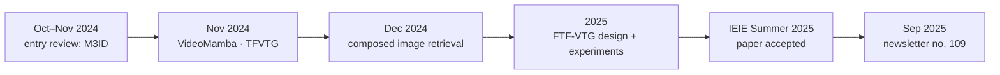

<sub>[🏠 Portfolio](https://github.com/heoneyzi) › [🤿 DeepDaiv.](../../README.md) › [Project](../README.md) › **Multimodal**</sub>

<div align="center">

# 🎥 deep daiv. Multimodal track — from paper study to a published grounding method

**What does it take to turn a season of multimodal paper study into an accepted, training-free research method?**


[📄 FTF-VTG paper page](https://github.com/heoneyzi/Paper/blob/main/FTFVTG/README.md) · [🗒️ Study notes](notes/README.md) · [💻 Code](https://github.com/heoneyzi/Frame_based_Training_Free-Video_Temporal_Grounding) · [📰 Newsletter #109](https://stib.ee/PbLJ)

</div>

> [!TIP]
> **TL;DR** — In deep daiv.'s multimodal track (Nov 2024 – spring 2025), Jiheon reviewed VLM-hallucination, video-model and composed-image-retrieval papers, then led the **Video Temporal Grounding (VTG) research team**. The team's frame-level, training-free method, **FTF-VTG**, was accepted at the 2025 IEIE Summer Annual Conference with Jiheon as first author (reported: DiDeMo R@1 19.30, VidSTG mIoU 39.01, 788 MiB of GPU memory), and the topic returned in his newsletter issue #109 (Sep 2025).

| | |
|---|---|
| **Period** | Nov 2024 – spring 2025 — entry assignment Oct–Nov 2024 · study Nov–Dec 2024 · research early 2025 · paper at the IEIE Summer Annual Conference 2025 |
| **Team** | deep daiv. multimodal track; the VTG research team was led by Jiheon, and the resulting paper's co-authors are Suyong Kim, Harim Noh and Heejae Yang |
| **My role** | **Team Lead** — Video Temporal Grounding research (video-language models, temporal localization), per the CV; first author of the resulting paper |
| **Stack** | PyTorch · CLIP · OpenCV · NumPy — studied: BLIP-2, LLaVA-style VLMs, Mamba / state-space video models, CLIP-based retrieval |
| **Status** | ✅ Completed — paper accepted at the 2025 IEIE Summer Annual Conference |

<p align="center">
<picture>
  <source media="(prefers-color-scheme: dark)" srcset="../../../02_Paper/FTFVTG/assets/observation_dark.png">
  
</picture>
</p>
<p align="center"><sub>Figure: the observation the research was built on — frame–query similarity rises inside the described moment. DiDeMo example bundled with the FTF-VTG code, drawn by <code>02_Paper/FTFVTG/code/scripts/plot_pipeline_example.py</code>.</sub></p>

## 🧭 Why it matters

deep daiv. is an AI academic club. Jiheon's earlier deep daiv. work was project development (a persona chatbot, a BU-Net medical-imaging model, a restaurant recommender); the multimodal track is where the CV lists **research** instead. It started with reading: how vision-language models hallucinate, how video backbones model time, and how retrieval combines an image with a text edit.

The research question came from video: **video temporal grounding** finds the start and end of the moment a sentence describes. The training-free method the team reviewed most closely (TFVTG, ECCV 2024) stacks an LLM, BLIP-2 and sliding-window proposals. The team asked whether one frozen image–text model and a readable 1-D signal pipeline could do the job; the figure above shows the kind of signal that idea relies on.

## 🛠️ Approach — how the track unfolded



| Phase | When | What Jiheon did | Notes / output |
|---|---|---|---|
| Entry assignment | Oct–Nov 2024 | Two-part review of M3ID — measuring VLM hallucination with a prompt-dependency measure and reducing it with mutual-information decoding | [M3ID review](notes/01_m3id_hallucination_review/README.md) |
| Video models | Nov 2024 | VideoMamba (state-space video backbone) and TFVTG (training-free grounding with an LLM + BLIP-2) | [VideoMamba](notes/02_videomamba/README.md) · [TFVTG](notes/03_tfvtg_review/README.md) |
| Retrieval | Dec 2024 | Remote-sensing CIR (WEICOM) and an 8-paper composed-image-retrieval reading list, from supervised to zero-shot to training-free | [CIR for remote sensing](notes/04_cir_remote_sensing/README.md) · [CIR reading list](notes/05_cir_survey/README.md) |
| Research | 2025 | Led the VTG team: frame-level similarity + post-processing instead of query decomposition and proposals; scoring design notes | [Design notes](notes/06_ftfvtg_score_design/README.md) · [FTF-VTG](https://github.com/heoneyzi/Paper/blob/main/FTFVTG/README.md) |
| Publication & outreach | 2025 | First-author paper at the IEIE Summer Annual Conference; newsletter #109 on how AI makes video highlights | [Paper page](https://github.com/heoneyzi/Paper/blob/main/FTFVTG/README.md) · [#109](https://stib.ee/PbLJ) |

## 🔬 Experiments & results

The track's research output is **FTF-VTG**; its code, figures and full result tables live on the [paper page](https://github.com/heoneyzi/Paper/blob/main/FTFVTG/README.md).

| # | Question | Setup | Key result | Folder |
|---|---|---|---|---|
| 1 | Can one frozen VLM plus post-processing ground video moments? | DiDeMo R@1 (IoU ≥ 0.5) and VidSTG mIoU vs training-free baselines | **19.30** and **39.01** vs 15.56 and 24.94 for TFVTG run without its LLM stage | [FTF-VTG results](https://github.com/heoneyzi/Paper/blob/main/FTFVTG/results/README.md) |
| 2 | At what cost? | GPU memory recorded with nvidia-smi | **788 MiB** vs 9,537 MiB for that TFVTG baseline | [FTF-VTG results](https://github.com/heoneyzi/Paper/blob/main/FTFVTG/results/README.md) |
| 3 | Does the released code run? | synthetic demo and 12 tests | 12 passed (re-run Sep 2026) | [FTF-VTG code](https://github.com/heoneyzi/Paper/blob/main/FTFVTG/code/README.md) |

## 🗒️ Study notes

| # | Note | Paper(s) | When |
|---|---|---|---|
| 1 | [M3ID review](notes/01_m3id_hallucination_review/README.md) | *Multi-Modal Hallucination Control by Visual Information Grounding* (CVPR 2024) | Oct–Nov 2024 |
| 2 | [VideoMamba](notes/02_videomamba/README.md) | *VideoMamba: State Space Model for Efficient Video Understanding* | Nov 2024 |
| 3 | [TFVTG review](notes/03_tfvtg_review/README.md) | *Training-free Video Temporal Grounding using Large-scale Pre-trained Models* (ECCV 2024) | Nov 2024 |
| 4 | [CIR for remote sensing](notes/04_cir_remote_sensing/README.md) | *Composed Image Retrieval for Remote Sensing* (WEICOM) | Dec 2024 |
| 5 | [CIR reading list](notes/05_cir_survey/README.md) | 8 papers: CIRR/CIRPLANT, CLIP4Cir, candidate re-ranking, Pic2Word, iSEARLE, CompoDiff, FREEDOM, weighted modality fusion | Dec 2024 |
| 6 | [FTF-VTG design notes](notes/06_ftfvtg_score_design/README.md) | the team's post-processing and scoring design | 2025 |

<sub>Months come from screenshot timestamps inside the Notion pages. Full index with one-line summaries: <a href="notes/README.md">notes/README.md</a>.</sub>

## 🙋 My contribution

- **Team Lead** of the deep daiv. Video Temporal Grounding research team (CV) and **first author** of the resulting IEIE paper.
- Wrote the track's entry review (M3ID, in two versions: an easy-read walkthrough and a paper-format summary with the equations) and kept the study notes collected here.
- Reviewed TFVTG, the training-free baseline the team set out to simplify, and kept the team's scoring design notes that led to FTF-VTG (both in `notes/`).
- Brought the topic to a general audience in the deep daiv. newsletter (#109, Sep 2025).

## 🗂️ Repository map

```text
Multimodal/
├── README.md                        ← you are here
└── notes/                           ← study notes in Korean, one folder per note (figures in each assets/)
    ├── README.md                    ← notes index
    ├── 01_m3id_hallucination_review/
    ├── 02_videomamba/
    ├── 03_tfvtg_review/
    ├── 04_cir_remote_sensing/
    ├── 05_cir_survey/               ← CIR reading list + 8 paper notes
    └── 06_ftfvtg_score_design/
```

The research code, results and figures sit with the paper in [`02_Paper/FTFVTG/`](https://github.com/heoneyzi/Paper/blob/main/FTFVTG/README.md).

## ♻️ Reproduce

The notes are static. To rerun the research code or redraw the figure above:

```bash
cd 02_Paper/FTFVTG/code
python -m pip install -r requirements.txt matplotlib
python -m pytest -q tests
python scripts/plot_pipeline_example.py     # writes ../assets/observation*.png and hero*.png
```

> [!IMPORTANT]
> **Scope notes**
> - Paper numbers are the team's reported results (2025 result notes), not re-run here; see the scope notes on the [FTF-VTG page](https://github.com/heoneyzi/Paper/blob/main/FTFVTG/README.md) (TFVTG was run without its LLM stage; hyper-parameters were swept on the evaluation data).
> - The notes are personal study notes in Korean; figures inside them are screenshots from the papers under review, credited by title.
> - The entry assignment also held application-form answers (motivation, personal reflections); only its two paper reviews are published. The paper's manuscript-draft page is not published.
> - The sources do not record the exact start and end dates of the track.

## 🔗 Links

- 📄 [FTF-VTG paper page](https://github.com/heoneyzi/Paper/blob/main/FTFVTG/README.md) · 💻 [original code repository](https://github.com/heoneyzi/Frame_based_Training_Free-Video_Temporal_Grounding)
- 📰 Newsletter #109 “AI는 어떻게 동영상 하이라이트를 만들까?” (2025-09-17): [stib.ee/PbLJ](https://stib.ee/PbLJ) · [newsletter archive](../../Contents/NewsLetter/README.md)
- 🧪 Related study on hallucination in audio-visual models: [03_Study/Hallucination](https://github.com/heoneyzi/Study/blob/main/Hallucination/README.md)
- 🤿 Other deep daiv. projects: [NLP](../NLP/README.md) · [R.S](../R.S/README.md)

---
<sub>[← Prev: R.S · Taste Trip](../R.S/README.md) · [🏠 Portfolio](https://github.com/heoneyzi) · [Next: NewsLetter →](../../Contents/NewsLetter/README.md)</sub>
