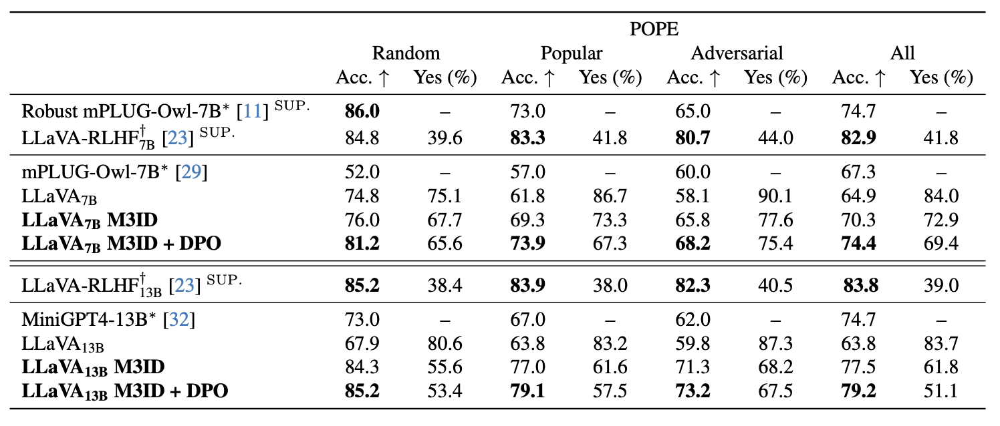
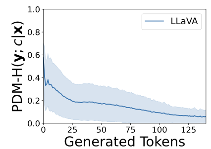
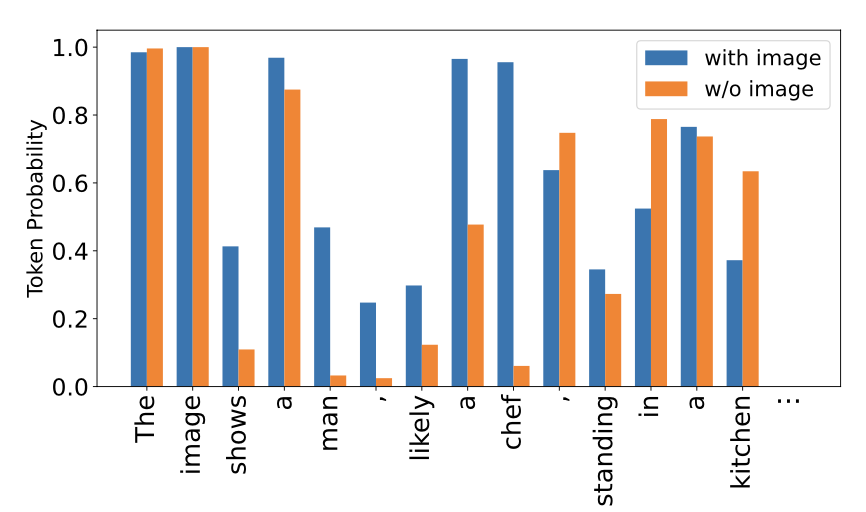
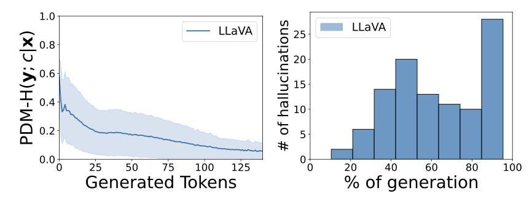
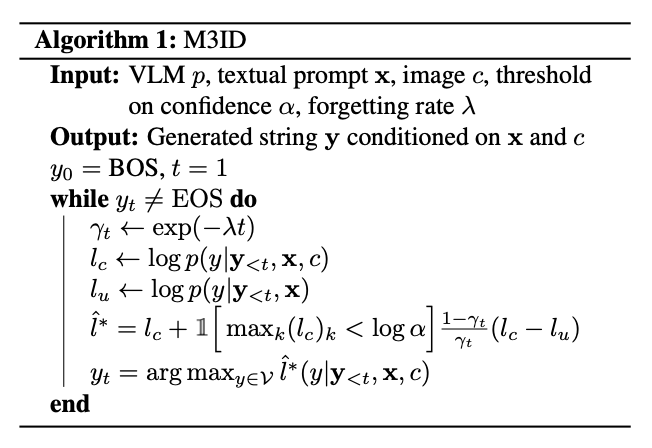
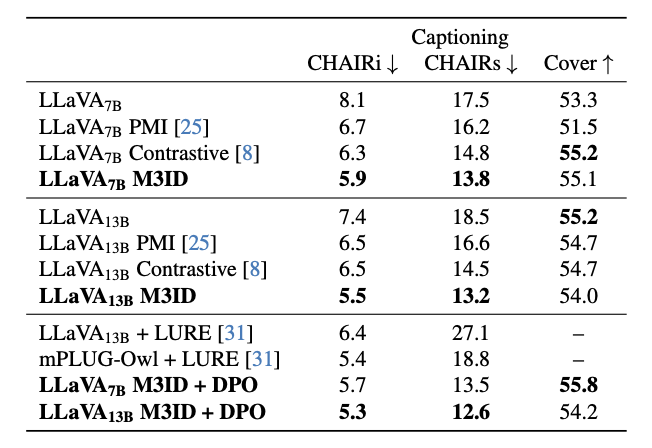
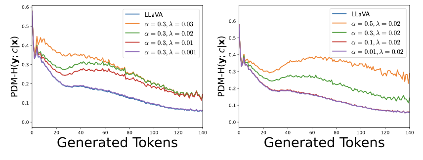

# Paper review — Multi-Modal Hallucination Control by Visual Information Grounding (M3ID)

[🏠 Portfolio](https://github.com/heoneyzi) › [🤿 DeepDaiv.](../../../../README.md) › [Project](../../../README.md) › [Multimodal](../../README.md) › [Notes](../README.md) › **M3ID review**

> [!NOTE]
> **Paper review (Oct–Nov 2024, in Korean)** — Two-part review of M3ID (CVPR 2024): how VLM hallucination is measured with the Prompt Dependency Measure (PDM) and reduced at inference time by mutual-information decoding. Written as the track entry assignment. Written by Jiheon Kang as the entry assignment of the deep daiv. multimodal track (the application-form answers of that assignment are not included). Converted from Notion.

## Part 1 · 쉽게 풀어 쓴 리뷰

총 2가지 방안으로 Paper Review를 진행했습니다.

- 첫 번째는 논문의 내용을 순서를 재배치하여 논문을 모르는 사람이 읽어도 최대한 이해하기 쉽고 간편하게 만들려고 노력했습니다. 그러다보니 위에서는 수식에 대한 내용은 최대한 자제했습니다.
- 두 번째는 논문 형식으로 아래에 다시 요약했습니다. 최대한 이해한 것을 적고 풀어보려고 했습니다.

### Multi-Modal Hallucination Control by Visual Information Grounding

#### 배경

VLMs(Vision-Language Models)는 기존의 언어모델을 활용함으로써 유의미한 성장을 할 수 있었음 → BUT 언어모델이 가지고 있던 **Hallucination** 문제도 함께 VLMs에 동반

- ***Hallucination이란?*** “환각”으로 input과는 연관성이 없지만 그럴싸한 출력을 만들어내는 현상을 의미 **VLMs에서는** 시각적 프롬프트에 대한 의존성이 떨어지는 토큰을 생성해내는 것

#### Hallucination 측정 방법

Hallucination은 일반적으로 사람의 판단이 필요함 → 논문에서는 PDM(Prompt Dependency Measure) 고안해 시각적 프롬프트에 대한 의존성 정량화함!

**PDM이란?** 이미지가 있을 때 토큰의 생성 확률과 이미지가 없을 때 토큰의 생성 확률을 비교하는 방법 ⇒ 우리는 생성한 출력이 얼마나 보편적인지, 문맥에 특성화되어 있는지 확인하는 지표로도 해석 가능!!  x = 프롬프트, c = 이미지 정도, y = 생성 토큰이라면, $`p(y|x,c) = \prod_{t=1}^Tp(y_t|y_{<t},x,c)`$를 구해 y = \[$`y_0`$,...,$`y_T`$\]를 만드는 것이 목적이 됨  여기서 $`PDM(y<t; c|x) ≜ dist(p(·|y<t, x, c), p(·|y<t, x))`$으로  수식화 가능

- **PDM이 높다 ⇒ 문맥에 특성화되어 있다 PDM이 낮다 ⇒ 이미지와는 상관 없이 중립적인 문장이다** 와 거의 같다고 볼 수 있다.
- 그러나!!  **PDM이 낮다 ⇒ Hallucination이다** 라고 말할 수는 없음

그러한 경우를 Contextual Pressure이라고 부르는데,

문법적인 단어 같이 문장을 구성하는 필수요소 or 너무 상세한 단어는 문장의 문맥상으로 알 수 있는 정보는 PDM이 낮아도 Hallucination으로 보기는 힘듦

#### 생성 토큰과 Hallucination의 관계

- 생성된 토큰의 수가 많아질수록 PDM은 감소

WHY?→ 토큰이 생성되면서 앞의 문장을 구성하는 정보에 치중되고, 시각적 정보가 희석되고 무의미해지기 때문

#### 해결 방안

M3ID (Multi-Modal Mutual-Information Decoding)이라는 방안을 찾음

- 생성 토큰의 수가 늘어나면 Hallucination이 증가하는 현상을 대응하기 위한 논문의 방안
- 새로운 계수를 사용해 토큰의 생성 초기와 후기에 각각 다른 항에 집중을 해서 이미지에 대한 의존성을 최대한 유지하고자 하는 방법 <ins>*수식적인 부분은 아래의 Extra Summary에서 확인가능*</ins>
- 모델을 수정하지 않고 사용 가능 = 추가적인 training이 필요없고, 가중치를 finetuning하지 않아도 됨

⇒ 만약 학습이 가능하다면 DPO(Direct Preference Optimization)을 함께 이용 가능!

***DPO란?*** 선호도에 대한 최적화 훈련 방법으로, 선호하는 답의 가중치를 높이는 방식으로 학습하는 방법

#### 실험 결과

캡셔닝 (Captioning)과 VQA (Visual Question Answering)인 2가지로 평가

<table><tr>
<td align="center" width="50%"></td>
<td align="center" width="50%"></td>
</tr></table>

Captioning 결과

- 다른 모델에 비해 Hallucination의 비율은 줄이면서 성능도 비슷하게 나옴
- DPO를 함께 사용하면 더 높은 성능 향상을 보여줌 + 추가적인 주석도 필요 없다는 장점

VQA 결과

- 다른 모델에 비해 Yes의 편향 비율이 낮아짐
- 다른 모델에 비해 정확도도 향상
- DPO를 함께 사용하면 더 높은 성능 향상을 보여줌 + 추가적인 주석도 필요 없다는 장점

#### 개선 사항

- M3ID에서 2번의 추론(이미지 유무)을 진행해야하기 때문에, 추론 시간 증가 가능
- 언어 맥락으로 쉽게 알 수 있는 정보도 시각 정보에 의존하는 결과로 이어질 수 있음

⇒ 모델이 세부적인 설명을 생성하면서도, 시각적 정보를 유지할 수 있도록 하는 방안 연구 필요

## Part 2 · 논문 형식 요약 (Extra Summary)

Part 1에서 적은 내용의 상세한 수식에 대한 설명이나 추가적인 정보를 논문의 형식에 맞춰 적었습니다.

### 0. Abstract

VLMs(Vision-Language Models)는 기존의 언어모델을 활용함으로써 유의미한 성장이 있었지만, 언어모델이 가지고 있던 Hallucination 문제도 함께 VLMs에 동반되었다. Hallucination이란, “환각”으로 input과는 연관성이 없지만 그럴싸한 출력을 만들어내는 현상을 의미한다.

논문에서는 이런 Hallucination은 더 많은 토큰이 생성되면 시각적 프롬프트에 대한 의존성이 감소하면서 생기는 문제임을 알 수 있었고, 이러한 문제를 완화하기 위해서 M3ID(Multi-Modal Mutual-Information Decoding)이라는 새로운 샘플링 방법을 도입한다. 이 방법은 VLM의 기능은 유지하면서 Hallucination을 줄일 수 있다는 것을 벤치마크를 통해 확인할 수도 있다.

### 1. Introduction

VLMs는 멀티모달 영역에서 놀라운 성능을 보여주지만, LLM과 같이 Hallucinaton이 일어나기 쉽다.

VLMs에서 일어나는 Hallucination은 결국 시각적 프롬프트에 대한 의존성이 떨어지는 토큰을 생성해내는 것과 같은 의미이다.  그래서 논문에서는 시각적 프롬프트에 대한 의존성을 정량화하는 방법인 PDM(Prompt Dependency Measure) 고안했다. 이는 모델의 출력이 근거 없는지 판단한다. → 시각적 정보 없이 동일한 출력을 생성할 가능성을 토대로 시각적 프롬프트와 관련해서 판단한다.

그러나 PDM이 낮다고 해서 꼭 환각이 일어났다는 뜻은 아니다. → 전치사나 접속사 같은 언어에는 낮게 나오기 때문! 그럼에도 Hallucination을 판단하기 위해서는 인간의 판단이 필요하지만, PDM은 즉각적이고 객관적으로 나오기 때문에 효율적이다.

생성된 토큰의 수가 늘어나면 PDM이 감소한다는 것을 실험적으로 알 수 있었다.

이에 대응하고자 M3ID(Multi-Modal Mutual-Information Decoding)을 도입했다.

M3ID는 추론할 때 시각적 프롬프트에 대한 의존성을 극대화시키기 위해 VLM의 생성에 개입하는 방안이다. M3ID는 다른 모델을 수정하지 않고 사용할 수 있는 디코딩 방식이라 간편하다는 장점도 있다. 추가적인 training이나 가중치에 접근이 필요치 않다는 뜻.

가중치 접근이 가능한 경우 Direct Preference Optimization (DPO)을 이용하여 프롬프트에 더 맞춰진 결과를 유도할 수 있다.  *DPO는 선호도에 최적화하는 훈련방법으로, 시각적 프롬프트와 연관된 정보를 정확하게 포함하는 출력을 선호하게 설정할 수 있다.*

M3ID와 DPO를 사용하면 Hallusination의 비율이 각각 25%와 28% 감소하고, 기본 모델에 비해 POPE VQA Hallucination 벤치마크의 정확도가 21%와 24% 향상된다는 것을 보여준다.

### 2. Related Work

#### Hallucinations in VLMs.

visual 인코더를 pretrain한 LLMs(Large Language Models)에 결합하는 VLMs가 등장하고 성공적인 성능을 보여줌. 그러나 결합한 VLMs는 LLM이 가지고 있는 Hallucination의 특징 역시 가지게 된다.

특히 데이터셋에서 자주 등장하는 오브젝트에 대해 더욱 현상이 두드러진다.

Hallucination을 식별하고 수정하기 위해 새로운 알고리즘에 대한 연구도 진행.

#### Context-dependent decoding

디코딩 알고리즘은 search와 sampling 알고리즘으로 나눌 수 있다.

search 알고리즘은 정확한 문장 생성에 용이하지만, 확률적으로 높은 단어만 선택하기 때문에 반복적인 단어 선택으로 지루한 문장이 만들어진다. greedy search나 beam search가 그 예시. Sampling 알고리즘에서는 낮은 확률의 단어도 선택해 문장의 다양성을 높인다는 장점이 있지만, 주제를 이탈하는 (topic drift)가 발생할 수도 있다.

이러한 단점들을 보완하고자 언어 생성 모델에 다양한 디코딩 방안이 제시되어 왔음.

문맥을 인식하여 좀 더 사실에 기반하여 Hallucination을 완화하려는 context-aware decoding과 Point-wise Mutual Information (PMI) decoding의 방안도 나옴.

논문의 방안은 상호간의 정보 (mutual information)를 활용하여 시각적 프롬프트에 대한 일관성을 유지하려고 함. 시간에 따라 낮아지는 프롬프트의 영향력에 대해 페널티를 가변적으로 부여함으로써 일관적이도록 하는 방안을 처음 이용함.

### 3. Analysis of hallucinations in VLMs

Prompt Dependency Measure (PDM)을 지표로 이용해 Hallucination을 조사했다.

최종적인 목표는 input으로 프롬프트와 이미지를 받으면, 유창하고 일관된 output을 생성하는 VLM을 만드는 것이다.

생성되는 토큰을 y라고 하면 y = \[$`y_0`$,...,$`y_T`$\]를 만드는 것이 목적이 된다.

프롬프트 x와 이미지 정보 c에 대해 생성되는 토큰 y에 대한 확률을 p(y\|x,c)로 표현한다면,

$$
p(y|x,c) = \prod_{t=1}^Tp(y_t|y_{<t},x,c)
$$

다음과 같은 식으로 해석할 수 있다.

이미지가 있을 때 토큰의 생성 확률과 이미지가 없을 때 토큰의 생성 확률을 비교하는 PDM은 다음과 같다.

$$
PDM(y<t; c|x) ≜ dist(p(·|y<t, x, c), p(·|y<t, x))
$$

PDM을 통해 우리는 생성한 출력이 얼마나 보편적인지, 문맥에 특성화되어 있는지 확인하는 지표로도 해석할 수 있다. PDM이 높으면 문맥에 특성화되어 있다고 볼 수 있다. PDM이 낮으면 이미지와는 상관 없이 중립적인 문장이 생성된다고 볼 수 있다.

$`dist`$는 어떤 거리 측정 방법을 사용해도 무관하다. 어떤 방법을 선택하는지에 따라 PDM의 분포도가 달라진다. 일반적으로는 Hellinger distance를 이용한 PDM-H를 사용한다.

$`H(P, Q) = \frac{1}{\sqrt{2}} \sqrt{\sum_{i=1}^{n} \left( \sqrt{P(i)} - \sqrt{Q(i)} \right)^2}`$

*Hellinger distance는 확률의 분포 유사도를 측정하기에 알맞다. 일부의 값이 0이어도 사용할 수 있고, 데이터가 sparse해도 사용할 수 있는 안정적인 측정법이다.*

#### Contextual Pressure

contextual pressure이란, 충분한 문맥의 정보가 주어졌다면 모델이 프롬프트 없이도 예측이 가능한 현상을 일컫는다.

다음의 그래프를 통해 확인해보자.

1. 전치사나 접속사 같은 문법적인 단어는 문장을 구성하는 필수요소이기 때문에 시각 정보가 없어도 잘 예측할 수 있다.
2. 논문에서는 “Fine-grained Objects”라고 표현을 했는데, 너무 상세한 단어를 의미한다. “Peanut butter”라는 단어에서 앞부분이 “Peanut bu”까지 주어졌다면, 문맥만으로 쉽게 “butter”라고 예측할 수 있는 것처럼 말이다.

즉, contextual pressure의 경우는 시각적 정보에 대한 의존성이 떨어져 PDM이 작아지겠지만 그것이 Hallucination이라고 보기 힘든 경우를 말한다.

#### Conditioning dilution and hallucinations

그래프를 통해 더 많은 토큰이 생성되면 PDM-H가 감소하는 것을 확인할 수 있다. 이는 토큰 생성 과정이 진행됨에 따라 시각적 정보가 희석되고 무시된다는 의미이다.

이를 수식적으로 표현하면 t가 증가함에 따라 확률질량이 $`p(y_t|y_{<t}, x, c) → p(y_t|y_{<t}, x)`$로 이동한다는 것과 같다.

위에 언급한 Contextual Pressure과 같은 현상에서는 PDM이 낮게 나오는 경우도 있기 때문에 PDM이 낮게 나온다는 것이 완벽하게 Hallucination이 일어났다고 말할 수는 없다.

하지만 위의 그래프에서도 볼 수 있듯이 생성 토큰이 늘어날수록 PDM-H의 값은 줄고, 실제로 입력 근처에서는 hallucination은 거의 일어나지 않았다는 점은 논문에서 PDM의 값을 최대로 늘리는 목표를 잡기에는 충분한 동기가 되었다.

### 4.Methods

$`l(y_t|y_{<t}, x, c) ≜ log p(y_t|y_{<t}, x, c)`$ 라고 앞으로 표현하겠다.

#### 4.1. **M3ID: Improving grounding at inference time**

생성하는 토큰 수가 많아지면 시각적 정보를 잃어버리는 경향성도 커지기 때문에, 더 긴 길이의 문장을 생성한다면 맥락의 특수성이 아닌 이전의 생성 언어에 높은 의존도를 보인다.

#### Preventing conditioning dilution

$`l(y_t|y_{<t}, x, c) = γ_t l^∗(y_t|y_{<t}, x, c) + (1 − γ_t) l(y_t|y_{<t}, x)`$

$`γ_t`$는  $`exp(−λt)`$로써, 시간이 지나면서 감소하는 계수이다.

$`l^*`$은 문맥을 계속 유지하는 모델이라면, $`l^∗(y_t|y_{<t}, x, c)`$과 $`l(y_t|y_{<t}, x)`$간의 보간을 통해 $`l^∗(y_t|y_{<t}, x, c)`$를 표현할 수 있다.

가중치 $`γ_t`$가 높을수록 이미지에 대한 영향력이 크다는 의미이다.

프롬프트와 이미지가 주어진 것은 conditioned이고, 프롬프트만 주어진 것은 unconditioned이므로 $`l_c ≜ l(y_t|y_{<t}, x, c)`$ , $`l_u ≜ l(y_t|y_{<t}, x)`$로 표현하자.

$`l^*`$이 $`l_c`$에서 약간의 변화만 준 모델이라고 가정한다면, 우리는 $`l^* = l_c+\Delta`$로 표현 가능하다.

여기서 $`\Delta`$는 평균이 0인 제한된 변수로 가정해서 $`l_c`$에서 크게 벗어나지 않도록 표현한다.

$`(1 − γ_t)(l_c − l_u) = γ_t∆`$ 라는 식으로 표현이 가능하고,

$`\hat{l}^{*} = l_c+\hat{\Delta}`$라고 근사치를 표현한다면 식을 다음과 같이 표현할 수 있다.

$`\hat{l}^{*}=l_c+\frac{1-γ_t}{γ_t} (l_c-l_u)`$

토큰 생성 초기에는 즉, $`γ_t`$가 1에 가까울수록 $`l^*`$은 $`l_c`$에 가까워진다.

반대로 생성이 많아질수록 즉,$`γ_t`$가 0에 가까울수록 $`l^*`$은 $`(l_c-l_u)`$에 비례하게 된다.  → 이는 condition dilution을 완화할 수 있다. 왜냐하면 $`(l_c-l_u)`$가 차이가 많이 나는 즉, 예기치 못한 (”surprised”)한 토큰을 더 강조해 샘플링하면 되기 때문이다.

$`max_ylog\frac{p(c,x|y)}{p(c)p(y|x)} = max_ylog\frac{p(y|x,c)}{p(y|x)} = max_y(l_c-l_u)`$

수식적으로 표현하면, $`p(c,x|y)`$가 의미하는 것은 텍스트 y가 있을 때, 시각적 정보 c와 입력 x가 함께 발생할 가능성을 의미하며, 이는 시각 정보 c가 얼마나 작용했는지에 대한 뜻이다.

$`p(c)p(y|x)`$는 독립적으로 c에 대한 확률과 시각적 정보가 없을 때 발생 가능성을 곱해서 시각적 정보가 작용하지 않은 경우를 측정할 수 있다.

결국 이 비율을 최대화하는 것은 시각 정보가 텍스트 생성에 미치는 영향을 극대화한다는 것이고, 각각의 식을 정리하면 $`(l_c-l_u)`$가 나오게 된다.

결국 이로써 초기와 후기에 모두 시각적 정보가 영향력을 행사할 수 있도록 할 수 있다는 것을 알 수 있다.

#### Accommodating for contextual pressure

$`(l_c-l_u)`$의 값의 차이가 큰 경우를 강조하는 방법을 이용해 시각 정보에 대한 영향성을 높이려고 했다.

그러나 위에서 나온 contextual pressure의 경우는 $`l_c`$와 $`l_u`$의 값이 비슷하게 나옴에도 필요한 토큰의 경우로 이럴 때는 위의 $`\hat{l}^{*}=l_c+\frac{1-γ_t}{γ_t} (l_c-l_u)`$의 개입을 억제함으로써 보정이 들어가지 않도록 한다.

#### Multi-Modal Mutual Information Decoding (M3ID)

결국 최종적인 $`\hat{l}^*`$은 다음과 같게 된다.

$`\hat{l}^* = l_c + \mathbf{1} \left[ \max_k (l_c)_k < \log \alpha \right] \frac{1 - \gamma_t}{\gamma_t} (l_c - l_u)`$

$`\left[ \max_k (l_c)_k < \log \alpha \right]`$는 뒤의 항에 대한 활성화 조건이다.

결국 이를 이용한 식은 $`y_t = \arg \max_{y \in \mathcal{V}} \hat{l}^* (y | y_{<t}, x, c)`$과 같이 된다.

$`y_{<t}`$를 추가하는 것은 문맥 파악을 위해서이다.

전체적인 M3ID의 진행 알고리즘

#### 4.2 M3ID+DPO to learn more grounded policies

가중치를 변화함으로써 더욱 이미지 정보에 기반한 출력을 할 수 있다.

이는 선호 최적화 문제 (preference optimization problem)으로 해석했다. *이미지 정보에 기반한 출력을 그렇지 않은 출력보다 더 선호하도록 학습하는 방식*

#### Multi-modal preference optimization

선호 최적화 문제에 DPO(Direct Preference Optimization)를 사용했다.

같은 프롬프트 x와 이미지 c에 대해 다른 $`y_w`$와 $`y_l`$이 생성되었다고 가정하자. 그리고  $`y_w`$와 $`y_l`$중  $`y_w`$를 선호한다면, DPO는 $`y_w`$에 비슷하게 학습방향을 지정해주는 것이라고 볼 수 있다.

DPO의 손실함수를 보면 다음과 같다.

$`\mathcal{L}_{\text{DPO}} = - \mathbb{E}{(c, x, y_w, y_l) \sim \mathcal{D}} \left[ \log \sigma \left( \beta \log \frac{p_\theta(y_w | c, x)}{p_{\text{ref}}(y_w | c, x)} - \beta \log \frac{p_\theta(y_l | c, x)}{p_{\text{ref}}(y_l | c, x)} \right) \right]`$

$`p_\theta`$는 현재 finetuning 중인 모델의 확률이고, $`p_{ref}`$는 기존 모델의 확률이다. $`y_w`$에 대한 항은 더하고,  $`y_l`$에 대한 항은 빼주면서 학습 방향을 지정할 수 있다.

#### **Generating multi-modal preference data**

DPO는 $`\mathcal{D}`$에서 샘플링하기 때문에 $`\mathcal{D}`$의 질이 무엇보다 중요하다.

데이터셋 $`\mathcal{D}`$를 구성하기 위해서 위의  $`y_w`$와 $`y_l`$에 맞는 각각의 데이터를 가져와야한다. 선호하는  $`y_w`$의 경우는 M3ID로 사전학습된 모델에서 나온 $`p^*(y | x, c)`$를 이용하게 된다. 부정적인 $`y_l`$의 경우는 $`p(y | x)`$를 통해 시각 정보가 없이 샘플링을 한다. → 너무 동떨어진 토큰이 생성될 수 있으므로, x에 VLM이 처음 생성한 문장을 넣어줌으로써 맥락을 이어나갈 수 있다.

### 5. Experiments

MS COCO 데이터셋을 이용해 캡셔닝(captioning)과 VQA (Visual Question Answering)를 평가한다.

모델이 생성한 캡션이나 VQA 응답에서 실제 이미지에 없는 객체가 예측되는 경우를 확인한다.

#### Architecture

M3ID를 적용할 수 있는 모델 아키텍처에 대해 생각해본다.

LLaVA를 중점적으로 사용함. → 사전학습한 시각 인코더와 LLM을 연결한 오픈 소스 VLM이다.

#### Baselines

M3ID를 비교하기 위해서 다양한 학습 모델을 사용해 비교한다.

#### **Evaluation**

캡셔닝은 CHAIR과 Cover 평가지표를 사용해 평가한다.

CHAIR (Captioning Hallu- cination Assessment with Image Relevance)은 생성된 캡션이 Hallucination인지 확인한다.

$`\text{CHAIR}_i = \frac{\text{ hallucinated objects}}{\text{ generated objects}}`$ 는 캡션 전체에서 Hallucination 객체의 비율

$`\text{CHAIR}_s = \frac{\text{ hallucinated captions}}{\text{ generated captions}}`$는 Hallucination 객체를 포함하는 캡션의 비율

Cover은 포괄성(comprehensiveness)을 측정한다.

$`\text{Cover} = \frac{|\text{ correct mentioned objects}|}{|\text{ annotated objects}|}`$는 실존 객체 중 캡션에 포함시킨 비율

VQA는 POPE (Polling-based Object Probing Evaluation) 벤치마크를 사용했다.

“Is a ⟨object⟩ present in the image?“라는 질문에 Yes/No로 답해 정확도를 측정했다.

#### **5.1 VLM grounding on captioning**

M3ID를 training이 없는 decoding 방법과 비교하면,

PMI와 Contrast decoding과 비교하면 토큰이 생성됨에 따라 language prior이 줄었다.

13B나 7B의 크기에서 모두 CHAIR 지표는 향상되면서, Cover 지표는 큰 손실이 없었다. 그럼에도 모델 크기가 클수록 더 큰 성능 향상을 보여줘, 복잡한 모델에서 더 큰 성능 상승을 보여줄 가능성이 높다.

training이 들어간 DPO를 사용한 경우를 다른 방법과 비교하면,

M3ID + DPO가 M3ID보다 높은 성능을 보여준다.

LLaVA + LURE보다도 높은 성능을 보여준다. 그리고 따로 annotation이 필요 없다는 점도 장점이다.

#### **5.2 VLM grounding on VQA**

기본 모델에 비해 M3ID는 Yes에 대한 편향을 줄이고, 정확도도 향상했다.

M3ID+DPO는 M3ID보다 성능이 향상되었다.

mPLUG-Owl나 LLaVA-RLHF 같은 다른 training이 된 베이스라인과 비교하면 M3ID+DPO는 라벨 데이터가 없어도, 추가 annotation이 없어도 유사한 성능을 보였다.

### Ablations

**Forgetting Factor** $`λ`$는 얼마만에 시각적 정보를 잊는지에 대한 계수이다. 이는 너무 크면 시각적 정보에 대한 지나친 의존으로 인해 허상 객체가 더 많이 생성될 수 있으며, 캡션에서 언어 prior가 자연스럽게 예측할 수 있는 정보까지 누락될 가능성이 있다.

**Confidence Threshold** $`\alpha`$는 인디케이터 함수의 활성화 빈도를 정하는 계수이다. α 값이 너무 높으면 시각적 정보에 대한 과도한 집중으로 인해 텍스트의 **자연스러운 흐름이 방해**될 수 있다.

→ λ와 α 값을 적절히 조정하여 **시각 정보와 언어 prior 간의 균형**을 유지해야 한다.

### 6. Conclusion

M3ID는 Hallucination을 줄여주는 효과적인 방법이다.

M3ID는 예측을 위해 추론 시 2번의 과정이 필요해 추론 시간이 증가할 수 있다.

M3ID는 language prior를 제거할 때, 언어 맥락으로 쉽게 알 수 있는 정보도 시각 정보에 의존하는 결과로 이어질 수 있다는 단점도 있다.

그래서 모델이 세부적인 설명을 생성하면서도, 시각적 정보를 유지할 수 있는 캡션을 생성하도록 학습시키는 것에 대해 연구해볼 필요성이 있다.

### 논문에 대한 나만의 의견

멀티모달의 큰 숙제를 생각했을 때 단순하게 서로 다른 데이터 구조로 인해 생기는 Alignment에 대한 고민에 대해 집중했는데, 다른 관점도 볼 수 있었습니다.

기존의 이미지 처리 모델과 언어 모델을 합쳐 멀티모달의 모델이 만들어진다는 것은 알고 있었지만, 그로 인해 생기는 단점에 대해 알아볼 수 있었습니다.

Hallucination을 알고 있었지만, 이를 정량화하는 방법에 대해 고민해봤다는 점이 이 논문의 색다르고 기발한 아이디어라고 생각이 들었습니다. 하지만 PDM이 항상 Hallucination과 반비례한다고 볼 수는 없었기 때문에 논문에서 추가적인 처리를 진행했지만, 이에 대해 추가적인 연구를 진행해도 좋을 것 같았습니다.

특히나새로 제안한 M3ID 기법은 학습 없이도 Hallucination을 억제할 수 있다는 점에서 큰 의의를 가진다고도 생각합니다. 그렇기 때문에 DPO와 연결해 성능을 더욱 높일 수도 있었습니다.

그리고 멀티모달에서의 Hallucination에 대한 근본적인 해결책 즉, Language Prior에 대한 상쇄를 다루는 것을 넘어서서 Language Prior이 미치는 영향에 대해 연구를 해봄으로써 더욱 효과적인 대안을 제시할 수 있을지에 대한 궁금증도 남았습니다.

---
[🗒️ Notes index](../README.md) · [Multimodal track](../../README.md) · [VideoMamba →](../02_videomamba/README.md)
