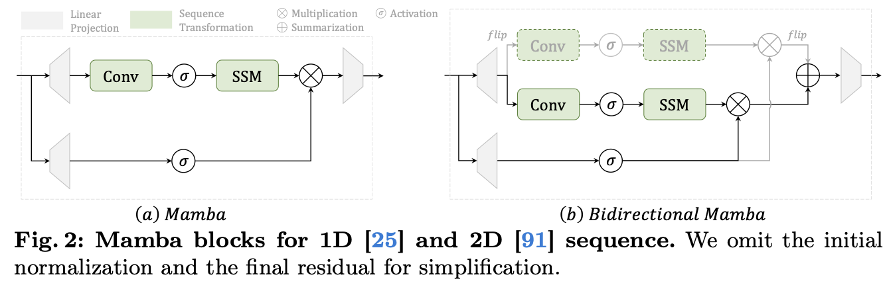
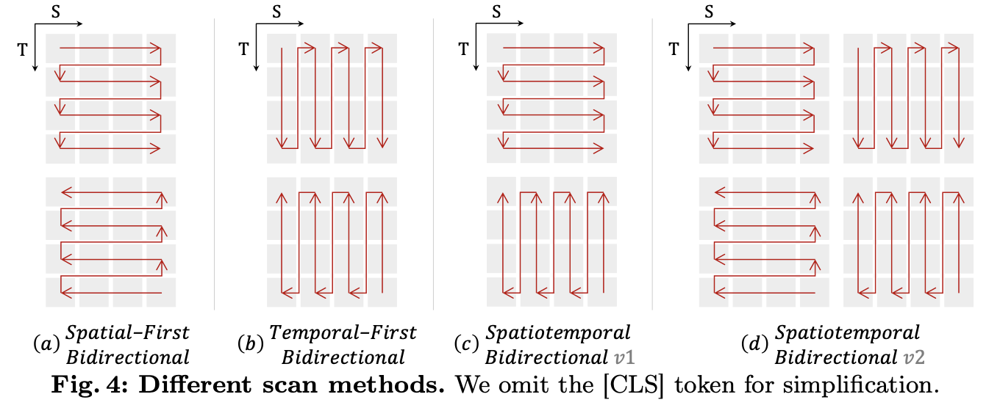

# VideoMamba: State Space Model for Efficient Video Understanding

[🏠 Portfolio](https://github.com/heoneyzi) › [🤿 DeepDaiv.](../../../../README.md) › [Project](../../../README.md) › [Multimodal](../../README.md) › [Notes](../README.md) › **VideoMamba**

> [!NOTE]
> **Study note (Nov 2024, in Korean)** — Short study note on VideoMamba: bidirectional Mamba (state-space) blocks for spatio-temporal video modelling with self-distillation. From Jiheon Kang's deep daiv. multimodal-track notes; converted from Notion.

비디오의 시공간적 측면을 효과적으로 표현하는 것이 목적

**시공간적 중복**: 짧은 비디오 클립 내에서 발생하는 큰 시공간적 중복 ⇒ 반복이나 불필요한 내용 처리 문제 **시공간적 의존성**: 긴 맥락 간의 복잡한 시공간적 의존성 ⇒ 상호작용 방법 필요

NLP 모델을 어떻게 비전에 적용할까?

- 효율적인 모델의 등장
- 특히나 Mamba!
    - SSM을 사용하여 선형 복잡도를 유지하면서 장기 동적 모델링을 용이
    - Vision Mamba 및 VMamba → 향상된 2D 이미지 처리를 위해 다양하게 SSM을 활용
    - 메모리 사용량도 감소
    - 어떻게 Video에 접목할까?

VideoMamba

- vanilla ViT의 강점인 conv와 attention의 적절한 조화
- 순수 Mamba를 확장함으로써 가지고 있던 과적합 문제를  self-distillation strategy로 해결
- 섬세한 동작 차이를 가진 짧은 동영상에 대해 우수
- 긴 비디오에 대해 빠르고 메모리가 덜 사용
- video-text retrieval에서 ViT보다 향상 , 복잡한 시나리오에서 두드러짐

기존의 Mamba와 비교하면 Vision 관점에서 B-Mamba는 양방향으로 읽어 공간적 인식 능력이 향상됨

과적합 방지를 위해 Self-Distillation strategy를 사용

마스킹 기법

---
[← M3ID review](../01_m3id_hallucination_review/README.md) · [🗒️ Notes index](../README.md) · [Multimodal track](../../README.md) · [TFVTG review →](../03_tfvtg_review/README.md)
