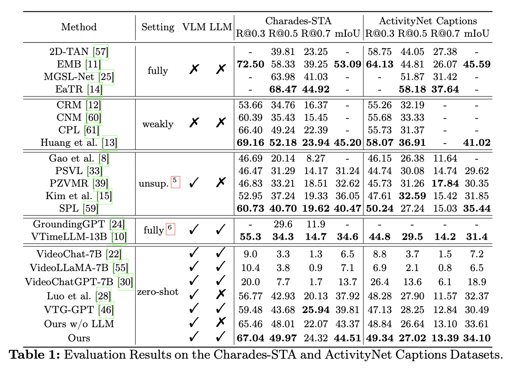
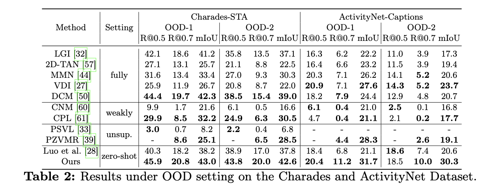
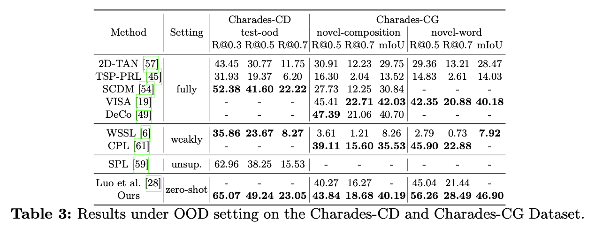
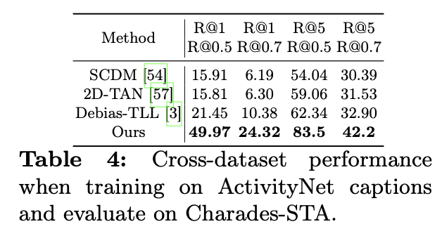
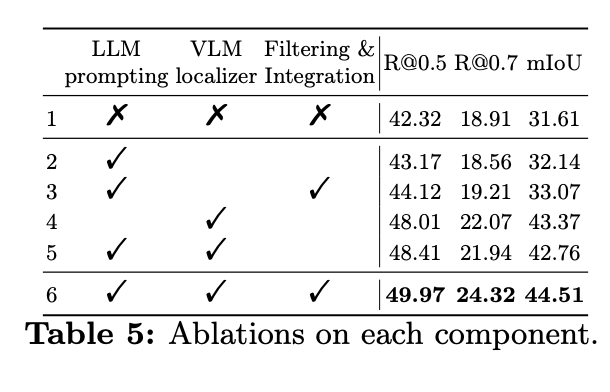
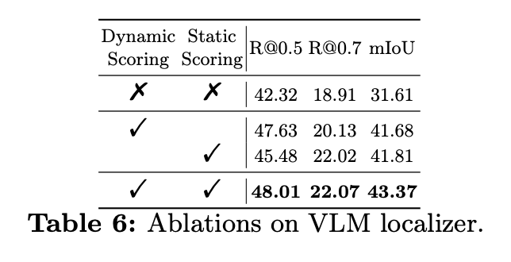
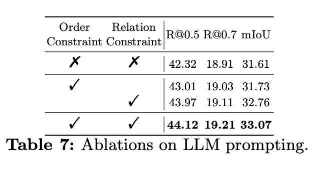
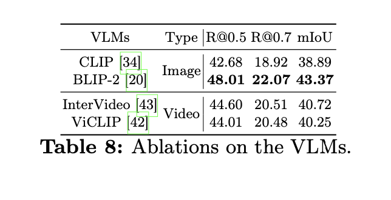
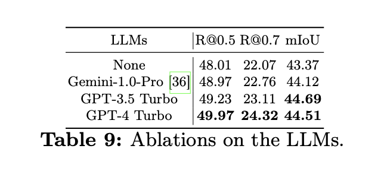

# Training-free Video Temporal Grounding using Large-scale Pre-trained Models (TFVTG)

[🏠 Portfolio](https://github.com/heoneyzi) › [🤿 DeepDaiv.](../../../../README.md) › [Project](../../../README.md) › [Multimodal](../../README.md) › [Notes](../README.md) › **TFVTG review**

> [!NOTE]
> **Paper review (Nov 2024, in Korean)** — Review of TFVTG (ECCV 2024): LLM query decomposition + BLIP-2 similarity with dynamic/static proposal scores. This is the training-free baseline that FTF-VTG later simplified. From Jiheon Kang's deep daiv. multimodal-track notes; converted from Notion.

기존의 모델은 특정 데이터셋에 훈련되어 있어 동적 전환과 일반화 능력이 떨어진다. → 그래서 사전학습된 모델을 훈련없이 접근할 수 있는 방식을 생각해보자.

Video temporal grounding: 비디오에서 사용자의 입력 쿼리에 가장 잘맞는 시간 구간을 찾기

기존의 기법 Video temporal grounding

- 모델 훈련을 위해 주석처리된 데이터를 사용 → 비디오와 쿼리 간 관계 학습이 가능
- 결과적으로 눈에 띄는 성능 향상이 있었음
- 그러나 자원이 많이 듦 (데이터셋, 비디오마다 분류하고 설명하는 행위)
- 데이터셋에 의존적임 (OOD나 교차 데이터셋)

**Training-Free Video Temporal Grounding (TFVTG)**

사전학습한 모델을 이용해 proposal(제안된 비디오 클립)과 alignment(쿼리 정렬)을 평가하고 가장 높은 점수의 구간을 선택하는 방안이다.

- LLM 사용: 쿼리를 여러 하위 사건으로 분석하고 사건의 시간적 순서와 관계 분석
- VLM 사용: 사건이 동적 전환 부분인지, 정적 상태인지 구분하고 VLM으로 사건과 설명 사이의 연관성 분석

문제점

- 비디오의 시간적 경계를 알기 어려움
- 사건의 시작 부분의 동적 전환을 놓치는 경향성

자세한 방법

1. 쿼리를 분석한다.
    1. 쿼리를 분석하여 사건의 구성과 시간적 관계를 파악한다.
    2. LLM 프롬프팅을 사용한다.
2. 비디오 내 사건의 위치 지정한다.
    1. VLM을 사용해 나눠진 하위 사건의 시간적 구간 위치를 찾아낸다.
    2. 동적 구간(dynamic segment)과 정적 상태(static segment)를 나눠서 각 점수를 구해 합산해 Top-K로 정한다.
3. LLM을 이용해 최종 판단한다.
    1. 하위 사건의 위치를 알았다면 논리적으로 연결하여 예측을 생성한다.
    2. LLM이 사건간 순서와 관계를 바탕으로 필터링한다.
1. 쿼리를 분석한다.
- 추론

여러 개의 하위 사건으로 식별하는 과정이다.

- 하위 사건의 순서

하위 사건의 시간적 순서를 결정한다.

- 사건간 관계 분석

하위 사건간의 관계가 독립 발생, 동시 발생, 순차 발생인지 확인한다.

- 텍스트 생성

하위 사건들을 자연어로 세부 설명을 만든다.

1. 비디오 내 사건의 위치를 지정한다.
- 사용한 모델은 BLIP-2 Q-Former

텍스트 (하위 사건)과 비디오 프레임의 특징을 추출하고 shared embedding space에 매핑한다.

- 유사도를 계산해 가장 잘 맞는 구간을 찾아낸다.

단순히 코사인 유사도만을 이용하면 동적 구간에 대한 정보가 소실되기 때문에 동적 구간과 정적 구간의 score을 구해 합산한다.

코사인 유사도 식

$`S = \frac{f^c F^{vT}}{\|f^c\| \|F^v\|}`$

$`f^c`$: 텍스트의 특징 벡터

$`F^v`$: 비디오의 프레임에 해당하는 특징 벡터 행렬

1. **동적 점수**

$`\hat{S} = G(S)`$

가우시안 필터를 이용해 smoothing을 진행한다. 갑자기 튀는 노이즈를 제거하기 위함이다.

$`D_i = \hat{S}_i - \hat{S}_{i-1}`$, $`D_l > \delta, \quad \forall l \in [i, k]`$

이는 연속된 프레임 간의 유사도의 차이이다. 이 차이가 특정 임계값을 넘는 부분만 동적 변환으로 칭할 수 있다.

$`S^{\text{dynamic}}_{i,k} = \sum{D_l}`$

위의 임계값을 넘는 부분만 합하여 score을 구해준다. (나머지는 0으로 처리)

b. **정적 점수**

$`\frac{1}{j - k} \sum_{l \in [k,j]} S_l`$

\[k,j\]에서 평균 유사도를 구한다.

$`\frac{1}{N - (j - k)} \sum_{l \notin [k,j]} S_l`$

그 외의 영역에 대한 평균 유사도를 구한다.

$`S^{\text{static}}_{k,j} = \frac{1}{j - k} \sum{l \in [k,j]} S_l - \frac{1}{N - (j - k)} \sum_{l \notin [k,j]} S_l`$

구간 내 평균 유사도와 구간 외 평균 유사도를 구해서 차이 값이 score이 된다.

c. **최종 점수**

$`S^{\text{final}}_{i,j} = \max{k=i}^j \left( S^{\text{dynamic}}_{i,k} + S^{\text{static}}_{k,j} \right)`$

Top-K를 골라 구간 P를 구한다.

만약 동시 발생의 경우라면,

$`P^{\text{final}} = P_1 \cap P_2 \cap \ldots \cap P_m`$

만약 순차 발생의 경우라면,

$`P^{\text{final}} = P_1 \cup P_2 \cup \ldots \cup P_m`$

---

사용 데이터셋: ActivityNet Captions, Charades-STA로 성능 평가

평가지표: R@m (IoU 임계값 이상 예측 비율)과 mIoU (평균 IoU)로 예측 정확도를 평가

사용 모델: BLIP-2 Q-former와 GPT-4 Turbo API 사용

하이퍼파라미터: K=3를 사용하고 $`\delta = 5 \times 10^{-4}`$를 사용함

**실험 결과**

**IID(Independent and Identically Distributed)에서**

zero-shot에서 가장 높은 성능을 보여주었다.

LLM의 텍스트 이해와 추론 능력과 VLM의 비전-텍스트 정렬 능력을 결합하여 시너지를 극대화했다고 해석할 수 있다.

**OOD(Out-of-Distribution) 상황에서 일반화 능력을 본다.**

OOD는 크게 3가지로 나눠서 사용한다.

1. Novel Location: 테스트 비디오의 시작 부분에 무작위로 생성된 비디오 세그먼트를 삽입하여, 새로운 비디오 분포에서 모델 성능을 평가.
    • 테스트 비디오 분포가 달라져도 성능 유지
2. Novel Text: 텍스트 표현이 기존 학습 데이터와 다를 때 모델 성능을 평가.
    • 새로운 텍스트 표현에 대한 강건성
3. Cross-Dataset: 학습한 모델을 다른 데이터셋에서 테스트하여 데이터셋 간 일반화 성능을 평가.
    • 데이터셋 간 일반화 성능이 뛰어남

Fully-supervised 및 unsupervised 방법과 비교하여 제안된 방법이 모든 OOD 설정에서 우수한 성능을 보인다.

학습 데이터 분포나 사전 정의된 표현에 덜 의존하며, LLM의 텍스트 이해 능력과 VLM의 시각적 정렬 능력을 효과적으로 통합했기 때문이라고 해석할 수 있다.

<table><tr>
<td align="center" width="33%"></td>
<td align="center" width="33%"></td>
<td align="center" width="33%"></td>
</tr></table>

<table><tr>
<td align="center" width="50%"></td>
<td align="center" width="50%"></td>
</tr></table>

다양한 요소들이 모두 유효하게 작용했음을 알 수 있다.

---
[← VideoMamba](../02_videomamba/README.md) · [🗒️ Notes index](../README.md) · [Multimodal track](../../README.md) · [CIR for remote sensing →](../04_cir_remote_sensing/README.md)
