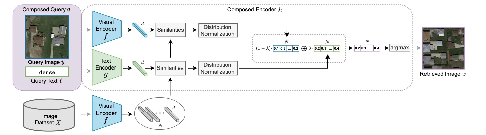
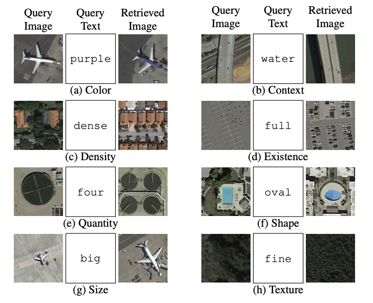
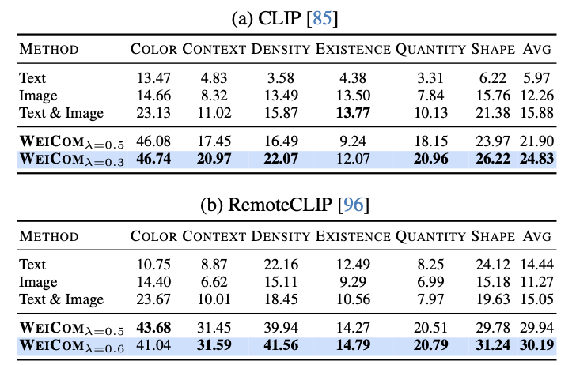
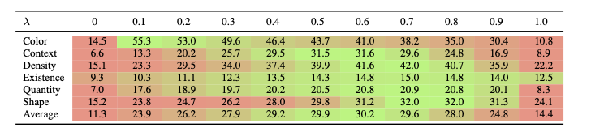

# Composed Image Retrieval for Remote Sensing (WEICOM)

[🏠 Portfolio](https://github.com/heoneyzi) › [🤿 DeepDaiv.](../../../../README.md) › [Project](../../../README.md) › [Multimodal](../../README.md) › [Notes](../README.md) › **CIR for remote sensing**

> [!NOTE]
> **Paper review (Dec 2024, in Korean)** — Review of remote-sensing composed image retrieval: a training-free weighted fusion (WEICOM) of normalised image- and text-similarities. From Jiheon Kang's deep daiv. multimodal-track notes; figures are screenshots from the reviewed paper. Converted from Notion.

### Abstract

논문에서는 Composed Image Retrieval이라는 새로운 작업을 제안했습니다.

기존의 이미지간 유사성을 텍스트 - 이미지 유사성과 융합하는 새로운 방식을 도입해 이미지 검색에서 이미지와 텍스트를 동시에 넣는 멀티모달 쿼리를 가능하도록 했습니다.

CIR(Composed Image Retrieval)은 쿼리에서 이미지를 기반으로 하되 텍스트를 통해 색상, 맥락, 밀도, 존재 여부, 수량, 모양 등의 기본적인 특정 속성을 수정하거나 추가해 사용할 수 있습니다.

논문에서는 WEICOM이라는 훈련 없이도 모달리티를 제어할 수 있는 작동할 수 있는 새로운 방식을 제안했고, CIR에서 RS(Remote Sensing)을 도입하기 위한 새로운 밴치마크 데이터셋을 만들기도 했습니다.

### Method

#### 목표

$`q=(y,t)`$ y: 쿼리 이미지, t: 텍스트

$`C_y`$: 쿼리 이미지의 클래스, $`A_t`$: 텍스트로 정의된 속성

$`s(q,x)`$: 쿼리 q와 데이터 이미지 x의 유사도

→ $`x \in X`$중에서 $`C_y`$를 공유하고 $`A_t`$를 만족하는 이미지를 검색하는 것이 목표입니다.

#### Pre-trained VLM

시각 인코더와 텍스트 인코더를 통해 이미지y와 텍스트t를 임베딩 공간으로 매핑합니다.

$`f: I \to \mathbb{R}^d`$, $`g: T \to \mathbb{R}^d`$

임베딩은 다음과 같이 정의합니다.

$`y :  v_y = f(y) \in \mathbb{R}^d`$, $`t :  v_t = g(t) \in \mathbb{R}^d`$, $`x :  v_x = f(x) \in \mathbb{R}^d`$

#### Baselines

Unimodal baseline과 Multimodal baseline을 모두 사용합니다.

**Text only**

텍스트 임베딩과 데이터셋 이미지 임베딩 간 내적으로 계산합니다.

$`s_g(q, x) = g(t)^T f(x)`$

**Image only**

쿼리 이미지 임베딩과 데이터셋 이미지 임베딩 간 내적으로 계산합니다.

$`s_f(q, x) = f(y)^T f(x)`$

**Multimodal**

멀티모달 유사도를 계산하기 위해서 새로운 유사도 계산 방안을 고안했습니다.

$`s_a(q, x) = \frac{s_g(q, x) + s_f(q, x)}{2}`$

→ 그러나 이는 이미지 기반 쿼리에 더 편향된 결과를 생성할 가능성이 있어서 더 나은 방안을 알아볼 필요성이 있습니다.

#### WEICOM: Weighted Composed Image Retrieval Method

WEICOM은 논문에서 소개한 이미지와 텍스트 쿼리를 이미지와 검색하는 새로운 방법입니다.

각각의 유사도 $`s_f`$, $`s_g`$를 표준 정규분포로 변환하고 정규화합니다. 이를 통해 모달리티 간의 기여도 균형을 맞추게 되었습니다.

$`s_{WC}(q, x) = \lambda s{\prime}_g(q, x) + (1 - \lambda) s{\prime}_f(q, x)`$

가중 평균 유사도를 기준으로 데이터셋 이미지를 정렬하고 가장 적합한 이미지를 반환합니다.

가중치 $`\lambda`$를 넣어서 기여도를 달라지게 할 수 있습니다.

### **EXPERIMENTS**

#### Dataset

새로운 데이터셋 PatternNet을 만들어 벤치마크로 사용했습니다.

일부 클래스를 쿼리 이미지로 설정하고, 해당 클래스의 속성을 정의하는 텍스트 쿼리를 추가하는 형식으로 구성됩니다.

#### Network

이미지와 텍스트를 공통 임베딩 공간에 매핑하기 위해 CLIP을 사용합니다. Remote-CLIP도 사용해보고 비교합니다.

이미지 인코더는 ViT-L/14를 사용합니다.

#### Evaluation

mAP를 사용합니다.

### Result

직접 이미지와 쿼리를 넣어주면 다음과 같은 결과가 나온다는 것을 확인할 수 있습니다.

CLIP 기반의 성능은 (a)에서 확인할 수 있습니다. WEICOM을 사용하면 약 8.95% 높은 성능을 보여줬습니다. RemoteCLIP 기반의 성능도 (b)에서 확인할 수 있는데, 이 역시 약 15.14% 성능 향상을 보여줬습니다.

WEICOM은 모든 속성에서 뛰어난 성능을 보여줬지만, Density와 Shape에서 두드러진 향상을 보였습니다.

### Abliation

$`\lambda`$의 값에 따라 바뀌는 mAP 값을 보여줍니다.

### Conclusion

해당 연구는 Remote Sensing Composed Image Retrieval (RS CIR)이라는 이미지와 텍스트를 조합한 쿼리를 활용해 원격 탐사 데이터 검색이라는 새로운 과제를 정의했습니다.

이 과정에서 다양한 속성을 넣어 다양성을 입증하기도 했습니다.

task에 맞는 새로운 벤치마크 데이터셋을 설계하고 활용 가능성을 보여주는 평가기준과 데이터 구조를 제공했다는 의의를 가지고 있습니다.

WEICOM이라는 추가적인 훈련이 필요없는 검색 방안을 고안했고, 파라미터 $`\lambda`$를 통해서 이미지나 텍스트의 기여도를 조정할 수 있습니다.

---
[← TFVTG review](../03_tfvtg_review/README.md) · [🗒️ Notes index](../README.md) · [Multimodal track](../../README.md) · [CIR reading list →](../05_cir_survey/README.md)
