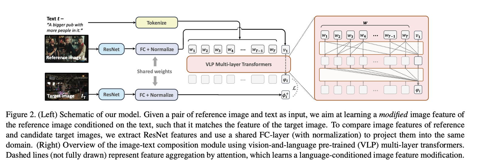
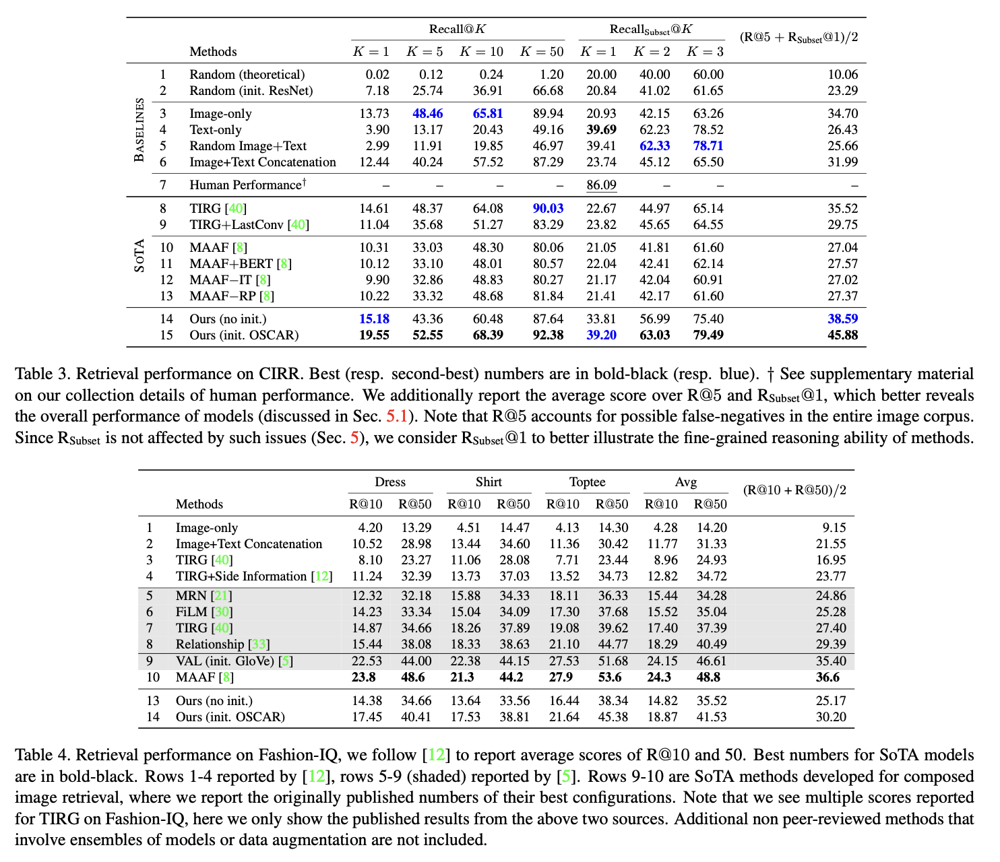

# Image Retrieval on Real-life Images with Pre-trained Vision-and-Language Models (CIRR / CIRPLANT)

[🏠 Portfolio](https://github.com/heoneyzi) › [🤿 DeepDaiv.](../../../../../README.md) › [Project](../../../../README.md) › [Multimodal](../../../README.md) › [Notes](../../README.md) › [CIR](../README.md) › **CIRR / CIRPLANT**

> [!NOTE]
> **Paper note (Dec 2024, in Korean)** — part of the composed-image-retrieval reading list of the deep daiv. multimodal track. Figures are screenshots from the paper under review. Converted from Notion.

CIRR이라는 데이터셋이 있음

→ image와 text의 쌍으로 이루어져있어 Composed Image Retrieval의 성능을 확인할 수 있음.

OSCAR를 기반으로 이미지의 특성을 텍스트의 특성에 의거하여 교체하고 이를 Target Image 특징과 가까운 곳으로 매칭하면서 학습하고 이미지 검색을 효과적으로 할 수 있게 된다.

Recall을 이용하였다.

---
[CIR reading list](../README.md) · [🗒️ Notes index](../../README.md) · [CLIP4Cir →](../02_clip4cir/README.md)
