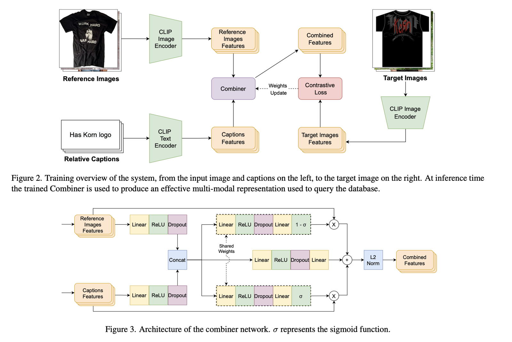
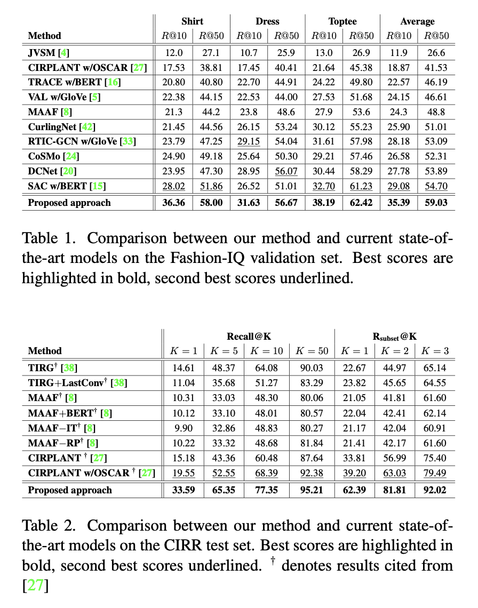

# Effective conditioned and composed image retrieval combining CLIP-based features (CLIP4Cir)

[🏠 Portfolio](https://github.com/heoneyzi) › [🤿 DeepDaiv.](../../../../../README.md) › [Project](../../../../README.md) › [Multimodal](../../../README.md) › [Notes](../../README.md) › [CIR](../README.md) › **CLIP4Cir**

> [!NOTE]
> **Paper note (Dec 2024, in Korean)** — part of the composed-image-retrieval reading list of the deep daiv. multimodal track. Figures are screenshots from the paper under review. Converted from Notion.

---
[← CIRR / CIRPLANT](../01_cirr_cirplant/README.md) · [CIR reading list](../README.md) · [🗒️ Notes index](../../README.md) · [Candidate re-ranking →](../03_candidate_reranking/README.md)
