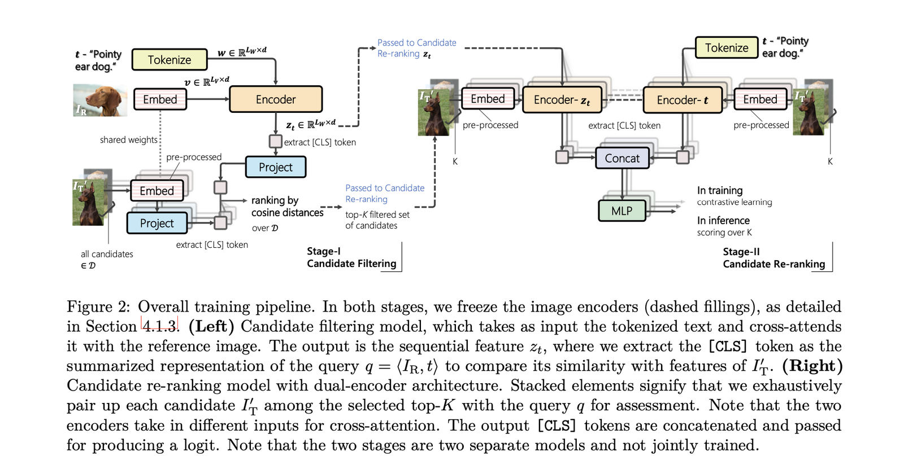

# Candidate Set Re-ranking for Composed Image Retrieval with Dual Multi-modal Encoder

[🏠 Portfolio](https://github.com/heoneyzi) › [🤿 DeepDaiv.](../../../../../README.md) › [Project](../../../../README.md) › [Multimodal](../../../README.md) › [Notes](../../README.md) › [CIR](../README.md) › **Candidate re-ranking**

> [!NOTE]
> **Paper note (Dec 2024, in Korean)** — part of the composed-image-retrieval reading list of the deep daiv. multimodal track. Figures are screenshots from the paper under review. Converted from Notion.

원래의 CIR의 방법은 뒤에 stage2의 단계를 따르는데, stage1을 넣어줌으로써 완전히 쌩뚱맞은 이미지들은 버려버린 뒤, 해서 효율과 정확도를 높였다는 논문이다.

Stage1은 BLIP을 이용해서 코사인 유사도가 높은 Top-K 후보를 선택한다. 그러나 여기에는 후보 이미지와 쿼리의 텍스트와 별개이기 때문에 깊은 연관성을 가지기 어렵다. 이를 stage2에서 해결한다.

Stage2에서는 두개의 독립적인 인코더를 사용해서 의미를 더해준다. stage1에서 구한 임베딩과 텍스트 임베딩을 각각의 인코더에 입력한다. 나머지는 다른 논문들과 비슷하다.

실험은 다른 논문들과 같은 데이터셋을 사용한다.

---
[← CLIP4Cir](../02_clip4cir/README.md) · [CIR reading list](../README.md) · [🗒️ Notes index](../../README.md) · [Pic2Word →](../04_pic2word/README.md)
