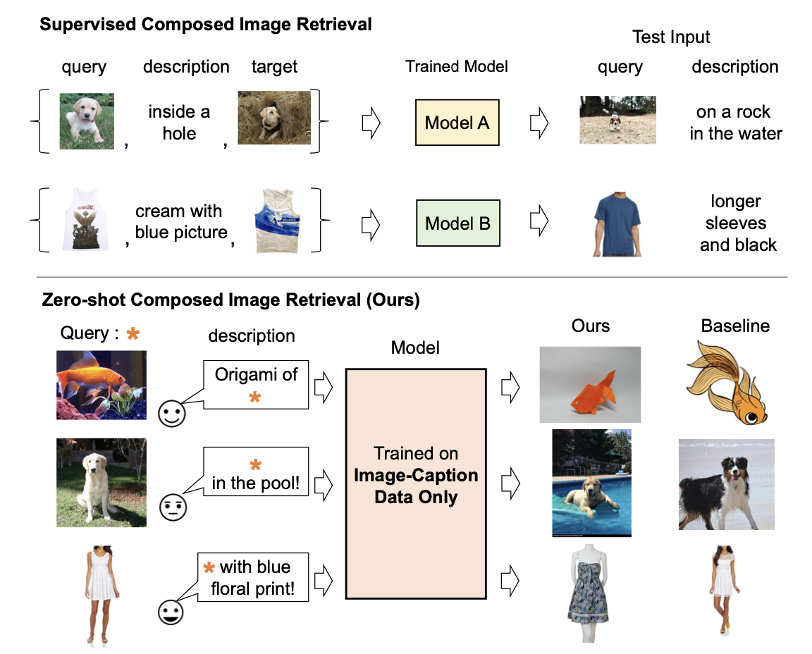
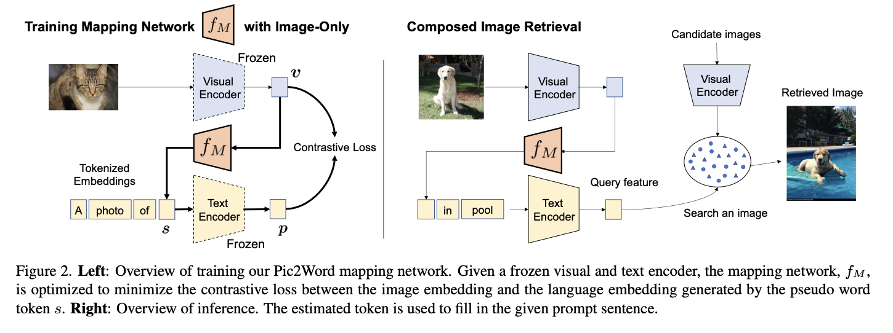

# Pic2Word: Mapping Pictures to Words for Zero-shot Composed Image Retrieval

[🏠 Portfolio](https://github.com/heoneyzi) › [🤿 DeepDaiv.](../../../../../README.md) › [Project](../../../../README.md) › [Multimodal](../../../README.md) › [Notes](../../README.md) › [CIR](../README.md) › **Pic2Word**

> [!NOTE]
> **Paper note (Dec 2024, in Korean)** — part of the composed-image-retrieval reading list of the deep daiv. multimodal track. Figures are screenshots from the paper under review. Converted from Notion.

ZS-CIR(Zero-Shot Composed Image Retrieval)의 첫 단계의 논문이다.

레이블이 없는 데이터를 통해 학습해 CIR의 task를 진행하려고 노력한다.

Pic2Word는 입력 이미지 임베딩을 pseudo language token으로 변환하는 매핑 네트워크 $`f_M`$를 학습한다.

---
[← Candidate re-ranking](../03_candidate_reranking/README.md) · [CIR reading list](../README.md) · [🗒️ Notes index](../../README.md) · [iSEARLE →](../05_isearle/README.md)
