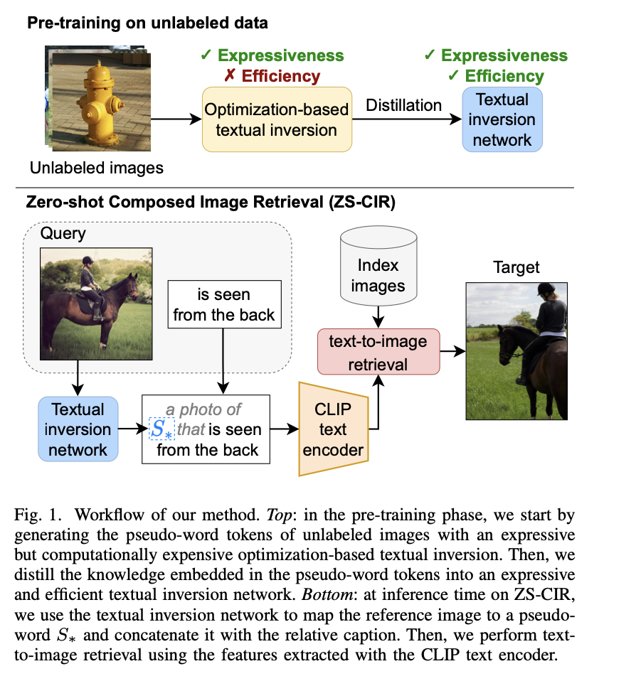
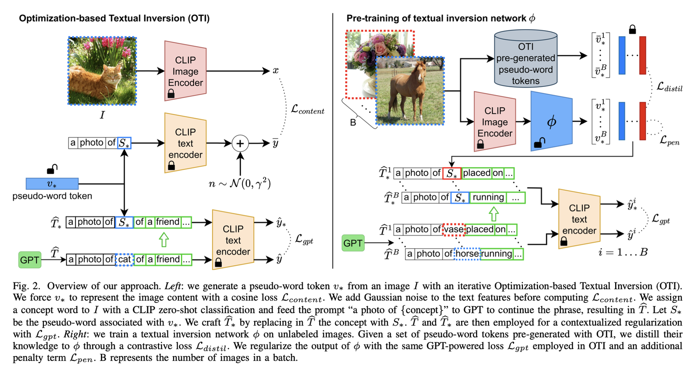

# iSEARLE: Improving Textual Inversion for Zero-Shot Composed Image Retrieval

[🏠 Portfolio](https://github.com/heoneyzi) › [🤿 DeepDaiv.](../../../../../README.md) › [Project](../../../../README.md) › [Multimodal](../../../README.md) › [Notes](../../README.md) › [CIR](../README.md) › **iSEARLE**

> [!NOTE]
> **Paper note (Dec 2024, in Korean)** — part of the composed-image-retrieval reading list of the deep daiv. multimodal track. Figures are screenshots from the paper under review. Converted from Notion.

기존의 지도학습 기반 학습은 유연성이 떨어진다. 그래서 Zero-Shot CIR인 ZS-CIR을 이용해서 레이블이 없는 데이터셋을 활용해 해결하고자 했다.

OTI(Optimization-based Textual Inversion) 단계 → 이미지에 대한 가상 단어를 생성한다.

이미지에서 image encoder를 통해 표현된다. 그 이후에 pseudo-word를 text encoder를 통해 표현되고 최적화를 거치게 된다.

뒤에 있는 문맥은 GPT를 이용해 생성하고 loss를 구해 최적화한다.

Textual Inversion Network 단계

OTI에서 생성한 pseudo-word를 사용해서 네트워크를 학습한다. 레이블이 없는 이미지를 사용해 네트워크가 예측한 단어와 OTI의 단어간 차이를 학습한다. 비슷한 이미지끼리 배치로 묶어서 학습을 진행한다.

$`L_{GPT}`$는 문맥에 대한 학습을 진행하게 된다.

$`L_{pen}`$은 생성한 단어가 적절한 위치에 임베딩 되도록 제약한다.

OTI는 시간이 오래 걸리는 단계이므로 학습 이후에는 네트워크를 사용할 수 있다는 장점이 있다.

CIRCO 데이터셋

기존에 많이 사용하는 CIRR 데이터셋보다 더 이미지의 정보를 많이 가져오는 데이터셋을 제작했다.

COCO의 레이블 없는 데이터셋을 사용했다.

“a photo of \{shared concept\} S_\* that \{relative caption\}” 쿼리를 사용하여 검색 결과에서 다중 정답 이미지를 선택한다.

---
[← Pic2Word](../04_pic2word/README.md) · [CIR reading list](../README.md) · [🗒️ Notes index](../../README.md) · [CompoDiff →](../06_compodiff/README.md)
