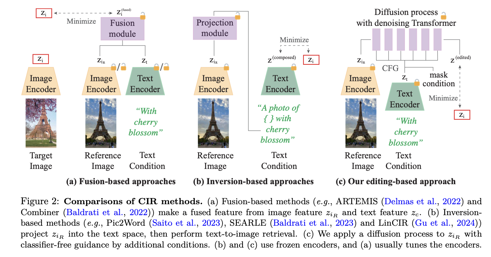

# CompoDiff: Versatile Composed Image Retrieval With Latent Diffusion

[🏠 Portfolio](https://github.com/heoneyzi) › [🤿 DeepDaiv.](../../../../../README.md) › [Project](../../../../README.md) › [Multimodal](../../../README.md) › [Notes](../../README.md) › [CIR](../README.md) › **CompoDiff**

> [!NOTE]
> **Paper note (Dec 2024, in Korean)** — part of the composed-image-retrieval reading list of the deep daiv. multimodal track. Figures are screenshots from the paper under review. Converted from Notion.

기존의 CIR은 퓨전모델을 사용한다.

이는 유연성이 낮고 사용자 정의 사항을 지정하기 어렵다.

a는 기존의 CIR 방법이다. 이미지와 텍스트를 인코더에 태우고 이를 합하여 타겟 이미지와의 차이를 줄이는 방식으로 학습한다. fusion model로 앞의 논문의 combiner 등을 사용할 수 있다.

b의 경우는 zero-shot CIR의 방법이다. 이미지 입력을 텍스트 조건으로 투영해 텍스트-이미지 검색으로 문제를 변환해 풀어낸다. 앞의 논문인 Pic2Word 나 SEARLE가 대표적이다.

논문의 모델은 단순 텍스트 - 이미지 검색 문제를 넘어서 Diffusion을 활용해 다양한 조건과 제어 가능성을 높여주었다. 뿐만 아니라 합성 데이터셋인 SynthTriplets18M을 사용해 더욱 성능을 높였다.

---
[← iSEARLE](../05_isearle/README.md) · [CIR reading list](../README.md) · [🗒️ Notes index](../../README.md) · [FREEDOM →](../07_freedom/README.md)
