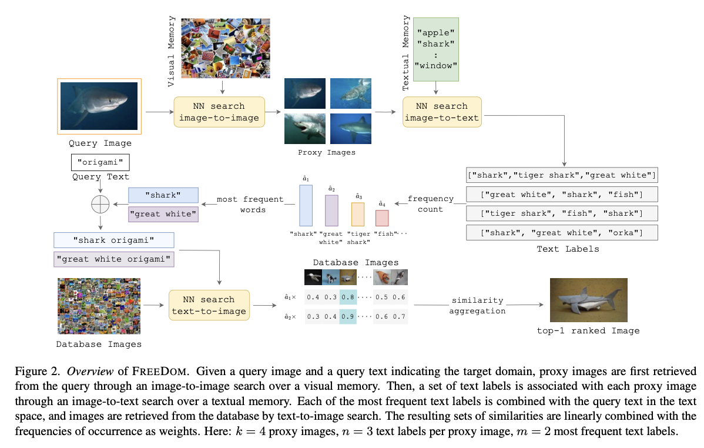

# Composed Image Retrieval for Training-FREE DOMain Conversion (FREEDOM)

[🏠 Portfolio](https://github.com/heoneyzi) › [🤿 DeepDaiv.](../../../../../README.md) › [Project](../../../../README.md) › [Multimodal](../../../README.md) › [Notes](../../README.md) › [CIR](../README.md) › **FREEDOM**

> [!NOTE]
> **Paper note (Dec 2024, in Korean)** — part of the composed-image-retrieval reading list of the deep daiv. multimodal track. Figures are screenshots from the paper under review. Converted from Notion.

---
[← CompoDiff](../06_compodiff/README.md) · [CIR reading list](../README.md) · [🗒️ Notes index](../../README.md) · [Weighted modality fusion →](../08_weighted_modality_fusion/README.md)
