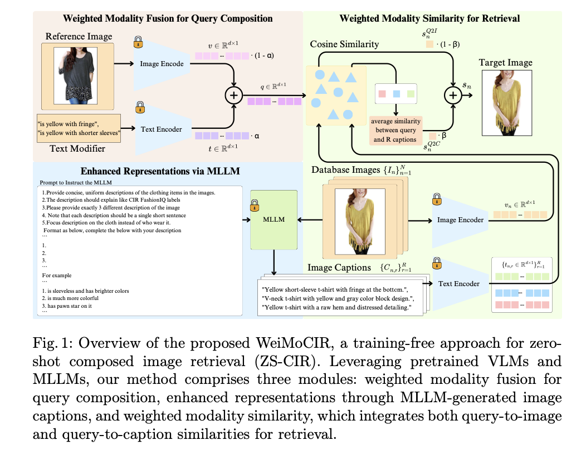

# Training-free Zero-shot Composed Image Retrieval via Weighted Modality Fusion and Similarity

[🏠 Portfolio](https://github.com/heoneyzi) › [🤿 DeepDaiv.](../../../../../README.md) › [Project](../../../../README.md) › [Multimodal](../../../README.md) › [Notes](../../README.md) › [CIR](../README.md) › **Weighted modality fusion**

> [!NOTE]
> **Paper note (Dec 2024, in Korean)** — part of the composed-image-retrieval reading list of the deep daiv. multimodal track. Figures are screenshots from the paper under review. Converted from Notion.

프롬프트 엔지니어링을 사용한다.

기존의 fusion을 사용해서 이미지와 텍스트에 대한 임베딩을 하고 이를 프롬프트를 통해 database의 이미지에 캡션을 넣어주고 이를 임베딩해 코사인 유사도를 구한다.

---
[← FREEDOM](../07_freedom/README.md) · [CIR reading list](../README.md) · [🗒️ Notes index](../../README.md)
