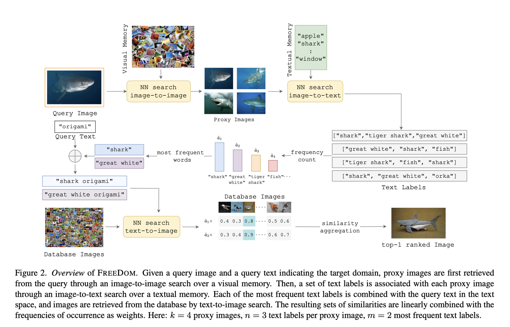

# Composed Image Retrieval (CIR) — reading list

[🏠 Portfolio](https://github.com/heoneyzi) › [🤿 DeepDaiv.](../../../../README.md) › [Project](../../../README.md) › [Multimodal](../../README.md) › [Notes](../README.md) › **CIR reading list**

> [!NOTE]
> **Reading list (Dec 2024, notes in Korean)** — eight paper notes on composed image retrieval (CIR: retrieve an image from a reference image plus a text edit): supervised CIR (CIRR/CIRPLANT, CLIP4Cir, candidate re-ranking), zero-shot CIR (Pic2Word, iSEARLE, CompoDiff) and training-free CIR (FREEDOM, weighted modality fusion). Written by Jiheon Kang during the deep daiv. multimodal track; converted from Notion.

- 📄 [Image Retrieval on Real-life Images with Pre-trained Vision-and-Language Models](01_cirr_cirplant/README.md)

- 📄 [Effective conditioned and composed image retrieval combining CLIP-based features](02_clip4cir/README.md)

- 📄 [Candidate Set Re-ranking for Composed Image Retrieval with Dual Multi-modal Encoder](03_candidate_reranking/README.md)

아래의 논문은 zero-shot을 이용한 논문들이다.

- 📄 [Pic2Word: Mapping Pictures to Words for Zero-shot Composed Image Retrieval](04_pic2word/README.md)

- 📄 [iSEARLE: Improving Textual Inversion for Zero-Shot Composed Image Retrieval](05_isearle/README.md)

- 📄 [CompoDiff: Versatile Composed Image Retrieval With Latent Diffusion](06_compodiff/README.md)

Training Free

- 📄 [Composed Image Retrieval for Training-FREE DOMain Conversion](07_freedom/README.md)

- 📄 [Training-free Zero-shot Composed Image Retrieval via Weighted Modality Fusion and Similarity](08_weighted_modality_fusion/README.md)

---
[← CIR for remote sensing](../04_cir_remote_sensing/README.md) · [🗒️ Notes index](../README.md) · [Multimodal track](../../README.md) · [FTF-VTG design notes →](../06_ftfvtg_score_design/README.md)
