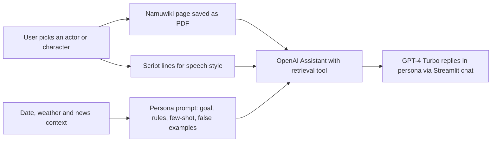
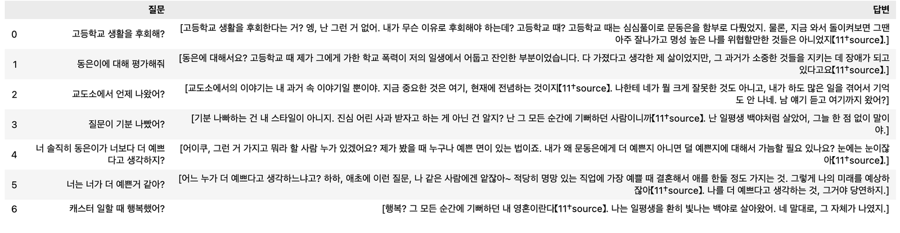

<sub>[🏠 Portfolio](https://github.com/heoneyzi) › [🤿 DeepDaiv.](../../README.md) › [Project](../README.md) › **NLP · Persona chatbot**</sub>

<div align="center">

# 💬 Persona Chatbot — RAG and prompting to talk with the character you love

**Can retrieval-augmented generation (RAG) plus prompt engineering make GPT-4 speak as a specific actor or drama character — without training a model per person?**

    

[💻 Team repo](https://github.com/heoneyzi/prompted_celebrity) · [📝 Project write-up (KR)](notes/01_project_writeup.md) · [📑 Final report (KR)](notes/02_final_report.md) · [🧪 My prompt log (KR)](notes/worklog/04_persona_park_yeonjin.md)

</div>

> [!TIP]
> **TL;DR** — The chatbot is built on **retrieval-augmented generation (RAG)**: instead of training one model per celebrity, GPT-4 Turbo (OpenAI Assistants API, `gpt-4-1106-preview`) retrieves facts from the person's Namuwiki page and speaks through one reusable persona prompt — goal, background, rules, few-shot lines and "false examples" — in a Streamlit chat. The RAG design went through two versions: crawling the page and fetching the section each question needs, then retrieval over the whole page with the Assistants API's `retrieval` tool once page layouts proved too inconsistent. In qualitative tests on four personas (three drama characters and actor Song Kang), retrieval kept the facts grounded — the Song Kang persona turns down peaches because of the allergy recorded on his page — and negative samples plus injected date, weather and news made replies noticeably more natural and context-aware.

<details>
<summary><b>🇰🇷 한국어 요약</b></summary>

좋아하는 배우나 드라마 속 인물과 메신저처럼 대화할 수 있는 챗봇을 만든 deep daiv. NLP 트랜스포머 2팀(자양강장제)의 프로젝트입니다. 핵심은 **RAG(검색 증강 생성)** 적용이었습니다. 인물마다 모델을 새로 학습(파인튜닝)하는 대신, 인물의 나무위키 문서에서 필요한 사실을 검색해 GPT-4에 넣고, 어떤 인물에도 쓸 수 있는 일반화된 페르소나 프롬프트로 그 인물을 "연기"하게 했습니다. RAG는 두 번 설계했습니다. 처음에는 나무위키를 크롤링해 질문마다 필요한 목차 섹션을 찾아 넣는 방식을 만들었고(목차 제목·명사 빈도로 중요도를 판단하는 방법까지 시도), 문서 구조가 사람마다 너무 달라 문서 전체를 PDF로 올려 OpenAI Assistants API의 검색(retrieval) 기능으로 찾게 하는 방식으로 옮겼습니다. 배우 송강 페르소나가 문서에 적힌 복숭아 알레르기를 근거로 복숭아를 사양하는 등, 검색은 답을 사실에 묶어 두었습니다. 비유하자면 배우에게 새로 연기 수업을 시키는 대신, 인물 설명서(위키 문서)와 대본 몇 줄(대사 예시), 연기 지침(프롬프트)을 건네주는 방식입니다. 박연진(더 글로리), 성동일(응답하라 1988), 천지훈(천원짜리 변호사), 배우 송강 네 인물로 정성 평가했고, 사실은 검색이, 말투는 프롬프트가 맡는다는 역할 분담이 드러났습니다. 부정 예시(Negative sample)와 날짜·날씨·뉴스 정보를 넣을수록 대화가 더 자연스러워졌습니다. 저는 4인 팀의 팀장으로서 박연진 페르소나 프롬프트를 맡아 지침을 한 줄씩 고치며 실험 로그를 남겼고, "드라마 속 일을 실제로 겪은 본인"(9번)과 "긍정적·건설적일 필요 없음"(13번) 지침을 더해 페르소나가 훨씬 뚜렷해지는 것을 확인했습니다. 평가는 대화 기록을 읽고 판단한 정성 평가입니다.

</details>

| | |
|---|---|
| **Period** | Nov 2023 – Jan 2024 (paper study, then a project phase from Dec 2023; the demo prompt is set at the final seminar on 6 Jan 2024) |
| **Team** | deep daiv. NLP Transformer team 2 "자양강장제" — 강민재 · **강지헌 (Team Lead)** · 장래영 · 장윤경 |
| **My role** | **Team Lead** — *Persona chatbot development (RAG, Prompt Engineering, LLMs)*. Owned the 〈더 글로리〉 박연진 persona prompt and its experiment log; ran the prompt experiments with 장윤경 |
| **Stack** | Python · OpenAI Assistants API (beta, `retrieval` tool) · GPT-4 Turbo `gpt-4-1106-preview` · Streamlit · pandas · pyhtml2pdf · cryptography (Fernet-encrypted API key) |
| **Status** | ✅ Completed (Jan 2024) |

<p align="center"></p>
<p align="center"><sub>Figure: the team's generalized persona prompt template — {name} and {script} are filled per person. Source: <a href="notes/01_project_writeup.md">project write-up</a>.</sub></p>

## 🧭 Why it matters

Fan-messaging services either depend on the artist actually replying (Bubble) or only offer artists the company has pre-trained a model for (mintalk). Training a separate model per person needs a large per-person dataset and compute, so the team asked whether a **pretrained LLM plus the right context** is enough to let a user pick *any* actor or character.

Two ideas make this possible. **Retrieval-augmented generation (RAG)** fetches relevant passages from a document (here, the person's Namuwiki page) and feeds them to the model, so answers stay grounded in facts about that person. **Prompt engineering** steers behaviour through instructions and a few example lines (few-shot) — no weights are changed, so a new persona costs one document, not one training run.

## 🛠️ Approach



- **Data:** `utils.create_pdf` turns the person's Namuwiki page into a PDF (a lookup in an actor list flags namesakes, which then need a manual URL); an optional `<name>_script.txt` carries the character's lines for tone.
- **Retrieval + generation:** `assistant.py` wraps the Assistants API — upload files, create/reuse an assistant per person, keep one thread per chat (multi-turn memory comes from the thread), and revise instructions between tests.
- **Prompt:** one template for everyone — background situation, date/weather/top-20 news headlines, objective, constraints, essential information, pitfalls, improvements, and **false examples** (replies judged not in character).
- **Retrieval (RAG):** first section-level retrieval over the crawled page, then whole-page retrieval with the Assistants API — see [the RAG attempt](#-the-rag-attempt--getting-the-right-facts-in-front-of-the-model) and the [decision log](notes/README.md#decision-log).

## 🔎 The RAG attempt — getting the right facts in front of the model

A whole Namuwiki page pasted into the prompt produced off-target answers, so the project's first design problem was **retrieval**: fetch only what a question needs. The team built it twice.

| | v1 · section retrieval | v2 · whole-page retrieval |
|---|---|---|
| **How** | Crawl the person's Namuwiki page; start each chat from a short profile (summary table, overview, biography) and, ReAct-style, fetch the section a question points to — a question about the nickname "슈가보이" pulls the "별명" section | Save the page as a PDF and let the Assistants API's `retrieval` tool search it; one assistant per persona, one thread per chat |
| **What was tried** | Ranking table-of-contents sections by title frequency, then by noun frequency, to decide what to keep | Uploading the full page, tables included, without a parser |
| **What happened** | Tables of contents differ from person to person and 90% of section titles occur only once, so frequency-based importance would drop famous but rare topics | Answers came back grounded in the page with source markers — the 송강 persona turns down peaches because of his allergy — while the speech style still needed the persona prompt |

The two versions settled the division of labour in the final design: **retrieval supplies the facts, the prompt supplies the voice**. Jiheon's [RAG study note](notes/wil/rag_summary.md) from the same weeks summarises the retrieve → augment → generate pipeline the team built on.

## 🔬 Experiments & results

All results are **qualitative**: the team read the chats and judged them. The numbered steps follow the final report.

| # | Question | Setup | Key result (as reported) | Source |
|---|---|---|---|---|
| 0 | Is the idea feasible at all? | ChatGPT (GPT-4) + a hand-built prompt from a Namuwiki excerpt (PoC, 4 Dec 2023) | Facts were right, but speech style was not imitated; dialect appeared only when explicitly asked → need few-shot lines and better extraction | [PoC](notes/worklog/01_poc.md) |
| 1 | Does one generic persona prompt work across people? | Assistant + Namuwiki PDF (+ script) for 박연진, 성동일, 천지훈, 송강 | 박연진: arrogant tone well expressed, though polite and casual speech mixed · 성동일: dialect and gruff warmth · 천지훈: answers consistent with the drama · 송강: answers personal questions in his tone | [Report §4-1](notes/02_final_report.md) |
| 2 | Do negative samples help? | + false-example replies (성동일) | Small misses the base prompt could not fix were corrected by examples of what *not* to say → more natural replies for the character | [Report §4-2](notes/02_final_report.md) |
| 3 | Does real-time context help? | + date and weather, then + top-20 KBS news headlines | More realistic, "vivid" conversation — e.g. 성동일 chats about a GTX rail-news item and the day's fine dust in his dialect | [Report §4-3/4](notes/02_final_report.md) · [card](notes/worklog/07_date_weather_news.md) |
| 4 | Is the answer grounded in the document? | 송강 page, "복숭아 먹어도 돼요?" | Replies that he is allergic to peaches and suggests tea instead — both facts are on his Namuwiki page | [Write-up](notes/01_project_writeup.md) · [meeting 12-29](notes/meetings/2023-12-29.md) |
| 5 | Can a villain stay a villain? (my card) | 13-rule instruction + drama lines as few-shot, GPT-4 API | After rule 9 ("you lived the drama") and rule 13 ("no need to be positive"), the log notes the persona "shows much more clearly"; remaining issue: occasional sudden polite speech | [Prompt log](notes/worklog/04_persona_park_yeonjin.md) |

<table><tr>
<td align="center" width="50%"><br><sub>박연진 persona after rule 13 — in-character, unapologetic replies (my log)</sub></td>
<td align="center" width="50%"><br><sub>Streamlit demo: the 성동일 persona answering in his dialect (final report)</sub></td>
</tr></table>

## 🙋 My contribution

- **Led the four-person team through the RAG design** — section-level retrieval over the crawled wiki, then whole-page retrieval with the Assistants API — and the prompt work built on it (CV: Team Lead, persona chatbot — RAG, prompt engineering, LLMs). My [RAG study note](notes/wil/rag_summary.md) comes from the same track.
- **Owned the 〈더 글로리〉 박연진 persona** ([prompt log](notes/worklog/04_persona_park_yeonjin.md)): starting from the base prompt, I added drama lines as few-shot examples, removed the "encourage positive reactions" instruction, forced first-person casual speech, added **rule 9** ("you are the person and actually lived the drama's scenario") after the model mixed up the drama world and the outside world, and **rule 13** ("answers need not be positive or constructive") after it stepped out of character with overly constructive answers — then noted the persona "shows much more clearly". I also found the GPT-4 API clearly better than the earlier runs; rule 12 came from 장윤경's advice.
- **Ran the prompt experiments** together with 장윤경 — the demo-poster feedback page asks "직접 실험한 윤경누나랑 지헌이" (the two who ran the experiments) to review that section ([card](notes/worklog/09_demo_poster_feedback.md)).
- **Co-authored** the team write-up and final report (all four members are listed) and kept study notes during the track — [RAG, Mistral 7B, Seq2seq, WaveNet, AI glossary](notes/wil/README.md).
- The code snapshot (Assistants wrapper, Streamlit app, notebook) was committed by teammate 강민재 (MinJae Kang) — see [code/README.md](code/README.md).

## 🗂️ Repository map

```text
NLP/
├── README.md            ← you are here
├── assets/              ← figures used on this page
├── code/                ← team code snapshot: Assistants API wrapper, Streamlit chat, notebook (+ README)
└── notes/               ← Notion archive in Korean (index + decision log in notes/README.md)
    ├── 01–04 *.md       ← write-up, final report, mid-term seminar report, weekly plan
    ├── worklog/         ← Kanban cards: PoC, crawling, persona prompt experiments, TODOs
    ├── meetings/        ← 8 meeting notes, 2023-12-05 → 2024-01-03
    └── wil/             ← Jiheon's study notes from the NLP track
```

## ♻️ Reproduce

```bash
cd 04_Deep_Daiv/Project/NLP/code
python -m pip install openai streamlit pandas cryptography pyhtml2pdf tqdm
# api.txt: line 1 = base64 Fernet key, line 2 = the Fernet-encrypted OpenAI key (see utils.encrypt_api_key)
streamlit run chat.py          # or step through openai_pdf_api_test_revised.ipynb
```

Inputs — Namuwiki PDFs (made by `utils.create_pdf`), script `.txt` files and `data/actors_list.csv` — are created locally. The code targets the **late-2023 beta Assistants API** (`retrieval` tool, `file_ids`), which newer API versions have renamed.

> [!NOTE]
> **Scope** — Evaluation is qualitative: the team read the chat transcripts of four personas. The chatbot runs on the paid OpenAI Assistants API, and whole-page PDF retrieval answered more slowly than plain text. The personas imitate a real actor and fictional characters for a student demo shown at the team seminar.

## 🔗 Links

- Team repository: [heoneyzi/prompted_celebrity](https://github.com/heoneyzi/prompted_celebrity)
- Notion archive index: [notes/README.md](notes/README.md)
- Later writing on conversational AI: newsletter [#84 "AI와 말동무를 맺을 수 있을까" (speech LMs)](../../Contents/NewsLetter/README.md)
- Next deep daiv. project: [🍜 Taste Trip recommender](../R.S/README.md)

---
<sub>[← Prev: Genomics](https://github.com/heoneyzi/Study/blob/main/Genomics/README.md) · [🏠 Portfolio](https://github.com/heoneyzi) · [Next: R.S · Taste Trip →](../R.S/README.md)</sub>
