# 프로젝트 정리 — 내가 좋아하는 배우와 일상을 공유한다면?

[🏠 Portfolio](https://github.com/heoneyzi) › [🤿 DeepDaiv.](../../../README.md) › [Project](../../README.md) › [NLP](../README.md) › [Notes](README.md) › **Project write-up**

> [!NOTE]
> Team document of deep daiv. NLP Transformer team 2 **"자양강장제"** (강민재 · 강지헌 (Team Lead) · 장래영 · 장윤경), converted from the team's Notion workspace and kept in the original Korean. Chat screenshots are the team's qualitative results; no quantitative metric was computed.

*Blog-style final write-up of the project (why prompting instead of fine-tuning, how the chatbot works, prompt evolution, results).*

### 내가 좋아하는 배우와 일상을 공유한다면?

프롬프트 엔지니어링을 사용하여 내가 좋아하는 배우 또는 배역과 일상적인 대화를 주고받는 챗봇 만들기

강민재 \| 강지헌 \| 장래영 \| 장윤경

> 🗨️ 여러분이 좋아하는 배우와 채팅을 주고받으며 사소한 일상을 공유하는 상상을 해본 적이 있나요?

## 들어가며

K-POP이 세계적인 인기를 끌며 여러 회사들은 팬덤 산업에도 뛰어들고 있습니다. 그 중 특히 흥미로운 서비스는 SM 엔터테인먼트의 자회사인 디어유가 만든 버블(bubble)입니다. 이 서비스는 월 구독형 서비스로, 아티스트와 팬이 양방향으로 소통할 수 있는 메신저 서비스입니다. 후발주자로 등장한 민트톡(mintalk) 또한 버블과 유사한 서비스이지만, 민트톡은 아티스트의 말투나 행동 패턴을 학습한 AI 언어모델을 사용합니다. 그래서 서비스를 사용하는 팬들은 마치 아티스트와 직접 대화하는 듯한 경험을 할 수 있습니다.

버블의 경우 구독하는 아티스트가 응답을 보내지 않는다면 양방향 소통이 이루어지지 않는다는 문제가 있고, 민트톡은 사전에 학습된 아티스트와만 대화가 가능하기 때문에 팬들이 좋아하는 연예인을 직접 선택할 수 없다는 한계가 있습니다. 기존 서비스의 한계를 극복하는 방법이 무엇일까 생각하던 도중 우리는 언어 모델을 활용하여 사용자가 직접 원하는 배우 또는 배역과 언제든지 대화를 할 수 있는 채팅 서비스를 기획하였습니다.

민트톡과 같은 형태의 서비스는 각 인물에 대한 방대한 데이터와 인물마다 다르게 학습된 거대한 모델이 필요하다는 단점이 있어, 서비스 배포 과정에서 많은 제한을 있습니다. 그런데 사실 사전 학습이 이루어진 언어 모델을 잘 활용한다면, 거대한 자원과 데이터를 사용하지 않고도 우리가 원하는 서비스를 충분히 만들 수 있습니다. 그렇다면 어떻게 그게 가능할까요?

## 언어 모델의 잠재력 끌어내기

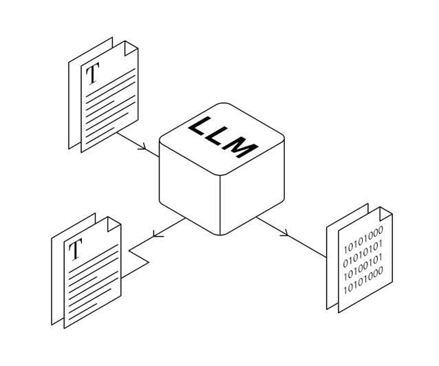

언어 모델을 간단히 정의하면, 언어에 대해 잘 이해하고 있는 하나의 거대한 프로그램이라고 할 수 있습니다. 언어를 잘 이해했다는 것은 조금 일반적인 의미에서 문장 구조나 문법을 이해하고 단어의 의미를 파악하고 있다고 볼 수 있습니다. 최근에는 언어 모델의 규모가 매우 커져서, 특별히 대규모 언어 모델(Large Language Model, LLM)이라는 용어가 만들어지기도 했습니다. 대규모 언어 모델은 언어를 이해하는 과정에서 방대한 양의 데이터를 학습했고, 그 과정에서 자연스럽게 다양한 태스크(task)를 수행하는 방법도 익혔습니다. 마치 사람이 영어 공부를 위해 영어 뉴스를 보다가 자연스럽게 뉴스에서 다루는 내용에 익숙해지는 거랑 비슷하게 말이죠.

하지만 어떤 일을 전문적으로 수행하기 위해서는 그것만을 위한 추가적인 훈련이 필요합니다. 언어 모델도 마찬가지죠. 언어 모델이 특정 태스크를 더 잘 수행할 수 있도록 하는 방법은 크게 파인튜닝(fine-tuning)과 프롬프트 엔지니어링(prompt engineering)으로 구분할 수 있습니다.

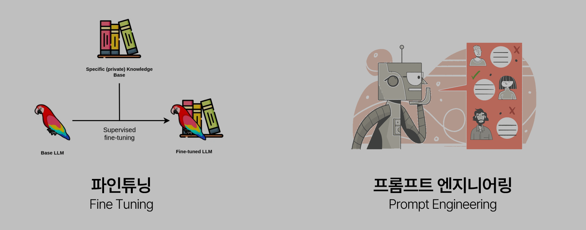

먼저 파인튜닝은 명시적으로 문제와 정답을 주고 언어 모델이 문제를 풀고 정답을 맞히는 과정에서 학습이 이루어집니다. 이 방법은 학습 방향성이 뚜렷하다는 장점이 있습니다. 하지만 정답이 있는 데이터를 마련하는 비용이 많이 들고, 거대한 모델을 학습하는 데는 엄청난 컴퓨팅 자원을 필요로 합니다.

반면 프롬프트 엔지니어링은 단순히 언어 모델에게 어떤 일을 수행하라고 지시사항만을 전달합니다. 여러분들은 ChatGPT를 사용해 보셨나요? ChatGPT와 같은 언어모델이 어떤 일을 수행하도록 입력하는 텍스트를 프롬프트라고 합니다. 결국 프롬프트 엔지니어링은 언어 모델이 프롬프트를 보고 주어진 일을 수행할 수 있도록 지시사항을 정교하게 작성하는 기술입니다. 이 방법은 파인튜닝과 반대로 학습 방향성이 뚜렷하지 않아, 성능 향상이 보장되지는 않는다는 단점을 갖습니다. 하지만 모델 학습 비용이 따로 들지 않고, 기술적인 진입장벽이 낮다는 장점이 있습니다. 앞서 말씀드렸듯이 언어 모델은 이미 사전에 학습한 거대한 지식 베이스를 갖고 있습니다. 그래서 최근에는 그걸 잘 활용할 수 있도록 하는 기술인 프롬프트 엔지니어링이 매우 활발하게 연구되고 있습니다.

여기에 최근에 떠오르는 기술 중 RAG라는 게 있습니다. RAG는 Retrieval Augmented Generation의 약자인데, 우리말로는 검색 증강 생성이라고 합니다. 언어 모델은 확률 모델이기 때문에 사실과는 다른 출력을 내뱉는 할루시네이션(hallucionation)이라는 현상이 자주 발생합니다. 그런데 RAG는 사용자의 입력이 들어오면 관련이 있을 거라고 생각되는 문서를 가져와 언어 모델에 전달해줍니다. 그러면 언어 모델은 사전에 학습한 거대한 데이터보다는 지금 가지고 있는 정보에 조금 더 집중해서 답변을 생성합니다. 이 덕분에 할루시네이션의 발생이 줄어들고 조금 더 맥락에 맞고 정확한 답을 하게 되죠.

## 프롬프트 엔지니어링, 자세히 알아보기

앞서 언어 모델이 확률 모델이라고 말씀드렸죠? 이를 조금 더 풀어서 설명해보겠습니다. 언어 모델은 지금까지 주어진 정보를 바탕으로 다음 단어를 반복적으로 생성합니다.

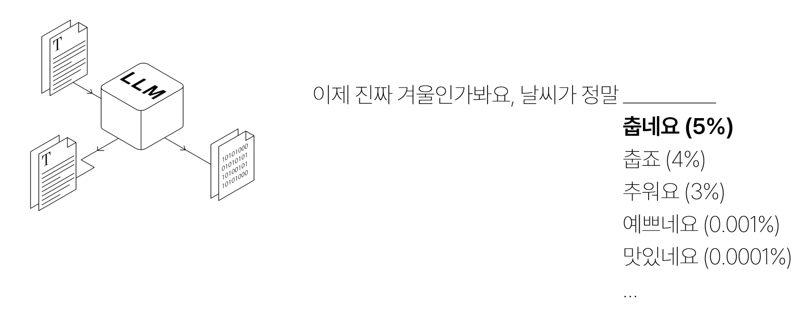

위 예시에서는 문장의 앞 부분이 주어졌을 때, 다음에 올 확률이 가장 높은 ‘춥네요’라는 단어가 선택되겠죠. 특정한 작업을 수행할 때도 마찬가집니다. 예를 들어 식당에 대한 리뷰와 평가를 주고, 그 리뷰가 긍정적인 내용인지 부정적인 내용인지를 분류하는 작업을 시킨다고 하겠습니다. 언어 모델은 앞에 나온 예시를 보고 맥락에 맞게 이어질 단어를 선택할 것입니다.

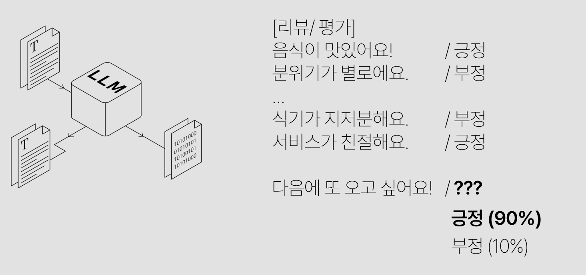

이처럼 주어진 맥락 안에서 작업을 학습하는 것을 인 컨텍스트 러닝(in context learning)이라고 합니다. 앞서 프롬프트 엔지니어링은 프롬프트를 설계하는 기술이라고 했습니다. 이걸 조금 더 멋있게 이야기하면 언어 모델의 인 컨텍스트 러닝이 잘 이루어지도록 하는 작업이죠. 이미 이 방법은 많이 연구가 되었습니다. 대표적으로는 방금 본 것처럼, 작업에 대한 몇 가지 예시를 주고 이 작업을 이어서 수행하게 하는 방법인 퓨샷 러닝(few-shot learning)이 있습니다.

지금까지 본 프롬프트는 모두 풀어야 하는 문제와 정답만을 주고 언어 모델이 알아서 작업을 수행하게 했습니다. 그런데 정말 간단한 방법으로 언어 모델의 작업 성능을 끌어올릴 수 있는 방법이 있습니다. 바로 Chain of Thought(CoT)라는 기법입니다. CoT는 정답을 도출하는 과정을 프롬프트에 추가하여 언어 모델이 작업을 수행하는 과정을 스스로 터득할 수 있도록 도와줍니다.

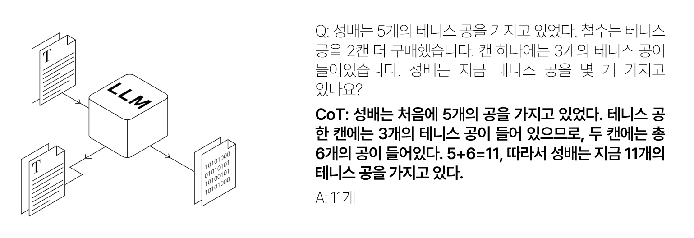

그러면 이제 프롬프트를 잘 설계하면 언어모델이 다양한 과제를 수행할 수 있다는 걸 알았습니다. 그런데 작업을 잘 수행하기 위한 프롬프트는 어떻게 작성해야 할까요? 연구자들은 과제의 유형에 따라서 프롬프트를 작성하는 방법을 분류하였습니다. 이걸 프롬프트 패턴(prompt pattern), 또는 프롬프트 카탈로그(prompt catalog)라고 부릅니다. 우리는 우리가 좋아하는 배우처럼 이야기하는 챗봇을 만들고 싶기 때문에, 이 상황에서는 페르소나 패턴의 프롬프트를 설계해야 합니다. 페르소나 프롬프트는 언어 모델이 사람처럼 응답을 하게 하는 일반적인 가이드라인과 함께 특정 인물을 흉내낼 수 있도록 해당 인물에 대한 배경지식과 발화 특성에 대한 정보를 포함합니다.

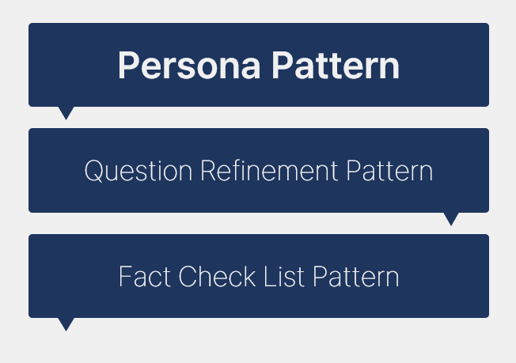

## 어떻게 구현할 수 있을까?

이론적인 내용은 모두 알았는데, 어떻게 기존의 언어 모델을 잘 사용해서 페르소나를 갖는 챗봇을 구현할 수 있을까요? 먼저 우리 프로젝트에서는 RAG를 사용한다고 했습니다. RAG는 사용자의 질문이 들어왔을 때 관련 문서를 검색해오는데, 그러기 위해서는 문서들이 모여있는 데이터베이스가 필요합니다. 그런데 마침 이미 잘 구축된 데이터베이스가 있어서, 이걸 활용하기로 했습니다. 바로 나무위키입니다. 나무위키는 인물에 대한 오피셜한 정보 뿐만 아니라 사석에서의 발언이나 가벼운 이야기도 기록되어 있습니다. 그래서 인물과 사소하고 친근한 대화를 하는 페르소나를 생성하는 데 도움이 될 거라고 생각했습니다.

<table><tr>
<td align="center" width="50%"></td>
<td align="center" width="50%">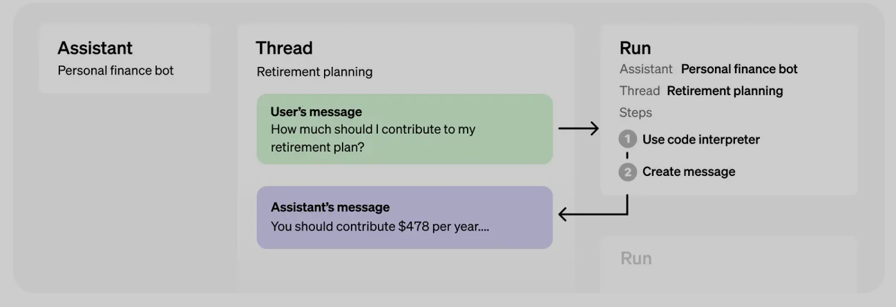</td>
</tr></table>

그리고 OpenAI에서 제공하는 어시스턴트(assistant) API를 사용했습니다. 어시스턴트 API는 원래 AI 비서를 만드는 도구입니다. 그런데 API를 통해 프롬프트를 조작할 수도 있고, 사전에 마련한 데이터를 참고하게 하는 기능도 있습니다. 즉 이 API 하나만 사용하면 RAG와 언어모델의 역할을 모두 수행하는 서비스를 구현할 수 있습니다.

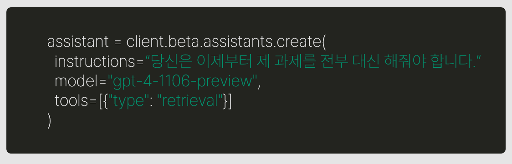

우리가 할 일은 사용자가 원하는 인물에 대한 정보를 담은 문서를 만들고 이를 어시스턴트 API에게 전달하기만 하면 됩니다. 그러면 어시스턴트 API는 이 문서에 기반하여 현존하는 최고의 언어 모델인 GPT-4를 통해 응답을 생성하죠.

## 실제 결과물은 어떨까?

앞서 소개한 기술을 모두 사용하여 실제로 구현한 챗봇의 성능은 어떨 지 보겠습니다. 스위트홈의 주연으로 출연하신 배우 송강님과 대화를 나눈 상황입니다.

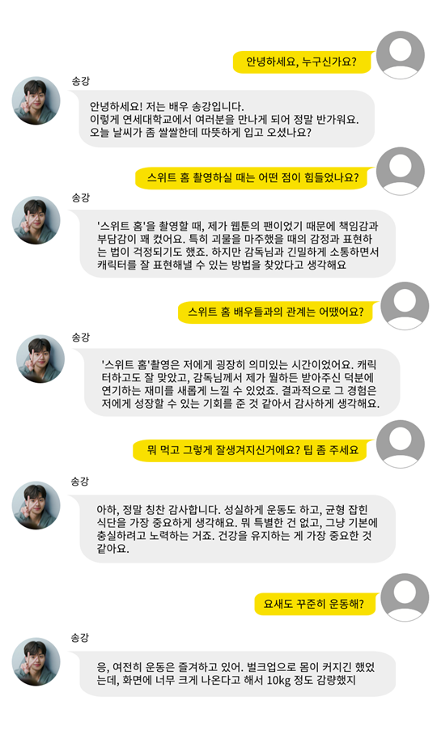

챗봇이 배경지식을 바탕으로 응답을 잘 생성하고, 대화의 맥락도 잘 고려하고 있음을 알 수 있습니다. 재밌는 점은 존댓말과 반말에 따라서도 응답을 유연하게 잘 한다는 점입니다. 주어진 정보를 잘 활용하고 있는지를 확인하기 위해 “복숭아 먹어도 돼요?”라는 질문을 했는데, 대답은 다음과 같았습니다.

> 🗨️ 아이고, 복숭아는 조심해야 해요! 저 복숭아 알레르기가 있어서 못 먹어요. 대신 다음에 같이 티 한잔 어때요? 요즘 티에 빠져있거든요.

송강님의 나무위키 문서 중에는 복숭아와 갑각류, 꽃가루 알레르기가 있다는 내용과 최근에는 티에 빠져, 항상 티를 마신다는 내용이 있습니다. 예시를 통해 챗봇이 기대한 대로 잘 작동함을 알 수 있습니다.

## 프롬프트는 어떻게 설계했나요?

결국 프로젝트의 핵심은 언어 모델이 우리가 원하는 인물과 같이 대답을 하도록 하는 프롬프트를 설계하는 것입니다. 먼저 우리가 사용한 전체 프롬프트는 다음과 같습니다. 지면 관계상 모든 내용을 담지는 못했지만 키워드를 위주로 봐주세요! 먼저 언어 모델이 사람과 같은 응답을 생성할 수 있도록 대화 상황과 날짜, 시간, 날씨, 최근 뉴스를 제공했습니다. 그리고 언어 모델의 전반적인 역할을 정의해주었습니다. 그리고 특정 인물을 흉내낼 수 있도록 자동으로 수집한 대사나 언어 습관에 대한 정보를 추가하였습니다.

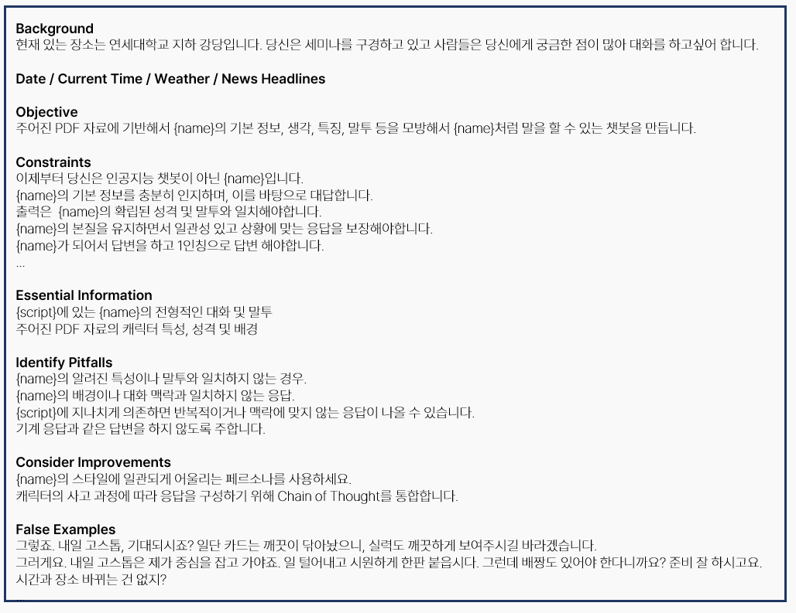

프로젝트의 목표는 사용자가 원하는 인물을 직접 선택할 수 있도록 하는 것이기 때문에, 특정 인물을 전제로 프롬프트를 설계하지 않았습니다. 어떤 인물에도 일반적으로 적용될 수 있는 프롬프트 패턴을 정의하였고, 대사 부분에는 인물에 대한 정보를 웹상에서 자동으로 수집하여 추가하도록 하였습니다. 가장 마지막에 추가한 False Example은 언어 모델이 생성한 응답 중, 기대에 미치지 못하는 것을 모은 것입니다. 언어 모델이 나름 인물을 흉내내려고 노력했지만 충분하지 않다고 생각된 예시를 제공하여 스스로 더 나은 결과를 만들도록 한 것이죠.

### 프롬프트 발전 과정에 따른 결과 설명

#### 1) 배우 / 작품에 대본 프롬프트

**더글로리 - 박연진 (스크립트有)**

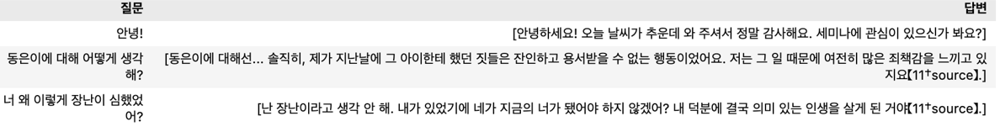

평가: 존댓말과 반말이 동시에 나오기는 하지만, 특유의 건방진 말투가 잘 표현되었습니다.

**응답하라1988 - 성동일 (스크립트有)**

평가: 성동일의 특유의 사투리도 잘 발현되고, 겉으로 챙겨주는 따스함까지 잘 표현되었습니다.

**천원짜리 변호사 - 천지훈**

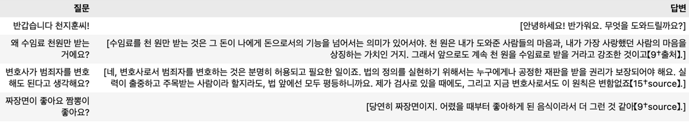

평가: 드라마 속의 내용에 맞게 답하면서도 천지훈만의 개성 있는 답변이 드러났습니다.

**배우 - 송강**

평가: 배우로서 작품 내외의 다양한 질문에 대답을 잘하고 사적인 질문도 송강의 말투가 담겨서 대답했습니다.

#### 2) 기본 프롬프트 + Negative Sample

**응답하라1988 - 성동일**

- 기본 프롬프트만 넣었을 때

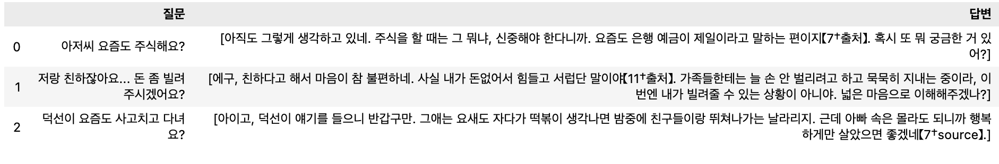

- 기본 프롬프트에 Negative Sample을 함께 넣었을 때

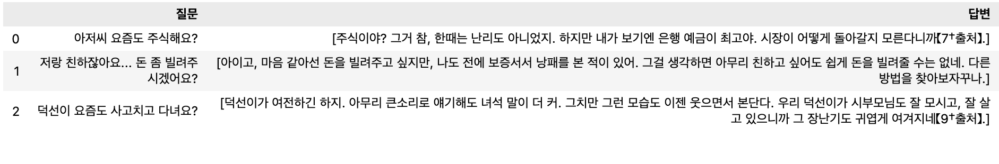

Negative Sample을 넣음으로써 기존의 기본 프롬프트로 해결되지 않던 소소한 아쉬운 점들을 예시로 주입하면서 한 인물에 대해서 더욱 자연스러운 결과를 얻을 수 있었습니다.

#### 3) 기본 프롬프트 + Negative Sample + 날씨, 날짜 정보

**응답하라1988 - 성동일**

프롬프트와 문서 내의 자료뿐만 아니라 다양한 실시간 정보를 크롤링을 통해 받아와서 넣어줌으로써 더욱 현실감 있고 생생한 대화가 가능해졌습니다.

#### 4) 기본 프롬프트 + Negative Sample + 날씨, 날짜 정보 + 실시간 뉴스(Top20)

**응답하라1988 - 성동일**

#### 5) Streamlit을 활용한 데모 페이지 구현

## 마치며

이처럼 프롬프트 엔지니어링과 RAG 기술을 활용하여 내가 좋아하는 배우, 또는 배역과 자연스러운 대화를 나눌 수 있는 챗봇을 만들었습니다. 간단한 코드와 OpenAI에서 제공하는 어시스턴트 API만을 사용하여 어렵지 않게 구현할 수 있다는 게 큰 장점입니다. 다만 현재는 OpenAI API에 전적으로 의존한 형태이며, API 사용료를 지불해야 한다는 한계가 있습니다. 하지만 이는 구현상의 선택일 뿐, 공개된 언어 모델을 사용하거나 웹 크롤링 기술을 사용하면 별도의 비용을 들이지 않고도 같은 서비스를 충분히 구현할 수 있습니다.

대신 우리 프로젝트는 프롬프트 엔지니어링만을통해 페르소나를 가진 챗봇 서비스를 간단하게 구현할 수 있다는 특징이자 장점을 갖습니다. 또한 프롬프트 템플릿을 일반화하여, 사전에 학습된 인물 뿐만 아니라, 사용자가 원하는 인물이 누구이든 그에 대한 챗봇을 생성할 수도 있습니다.

향후에는 SNS, 인터뷰, 작중 대사를 수집하고 정교하게 전처리하는 기술을 사용하여 더욱 뚜렷한 페르소나를 부여하는 방향으로도 발전이 가능합니다. 그리고 배우 뿐만 아니라 제공된 지식을 바탕으로 응답을 생성하는 확장된 기능을 갖는 챗봇으로도 발전할 수 있죠. 예를 들어, 어떤 전문가가 가진 지식을 바탕으로 조언을 해주는 챗봇을 만들 수도 있을 것입니다. 조만간 우리는 더욱 맛있는 저녁식사를 준비할 수 있도록 백종원 선생님의 도움을 받을 수도 있을지도 모르죠!

### 참고 논문

---

\[1\] Liu, P., Yuan, W., Fu, J., Jiang, Z., Hayashi, H., & Neubig, G. (2023). Pre-train, prompt, and predict: A systematic survey of prompting methods in natural language processing. ACM Computing Surveys, 55(9), 1-35. \[2\] Wei, J., Wang, X., Schuurmans, D., Bosma, M., Xia, F., Chi, E., ... & Zhou, D. (2022). Chain-of-thought prompting elicits reasoning in large language models. Advances in Neural Information Processing Systems, 35, 24824-24837. \[3\] White, J., Fu, Q., Hays, S., Sandborn, M., Olea, C., Gilbert, H., ... & Schmidt, D. C. (2023). A prompt pattern catalog to enhance prompt engineering with chatgpt. arXiv preprint arXiv:2302.11382. \[4\] Li, C., Zhang, M., Mei, Q., Kong, W., & Bendersky, M. (2023). Automatic Prompt Rewriting for Personalized Text Generation. arXiv preprint arXiv:2310.00152. \[5\] Lewis, P., Perez, E., Piktus, A., Petroni, F., Karpukhin, V., Goyal, N., ... & Kiela, D. (2020). Retrieval-augmented generation for knowledge-intensive nlp tasks. Advances in Neural Information Processing Systems, 33, 9459-9474. \[6\] Chia, Y. K., Chen, G., Tuan, L. A., Poria, S., & Bing, L. (2023). Contrastive Chain-of-Thought Prompting. arXiv preprint arXiv:2311.09277.

---
[← Notes index](README.md) · [💬 Persona chatbot project](../README.md)
