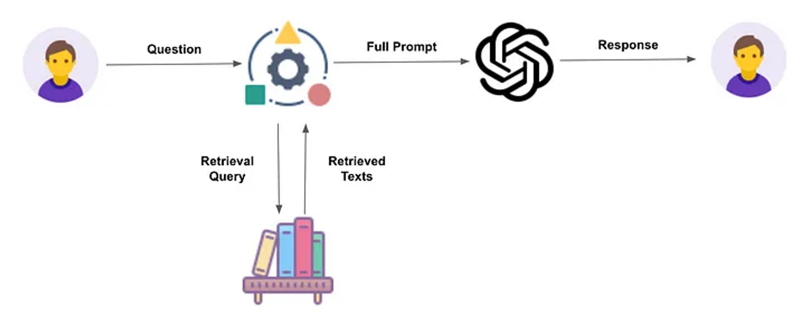
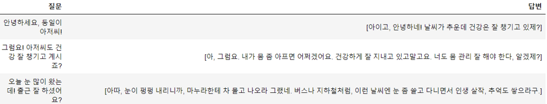
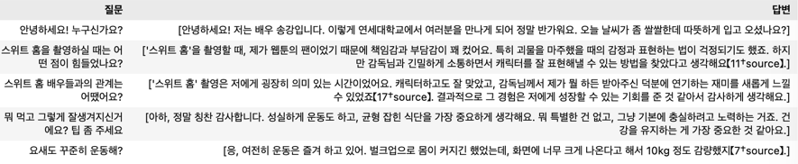
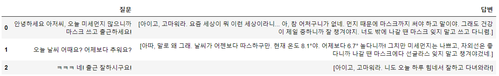
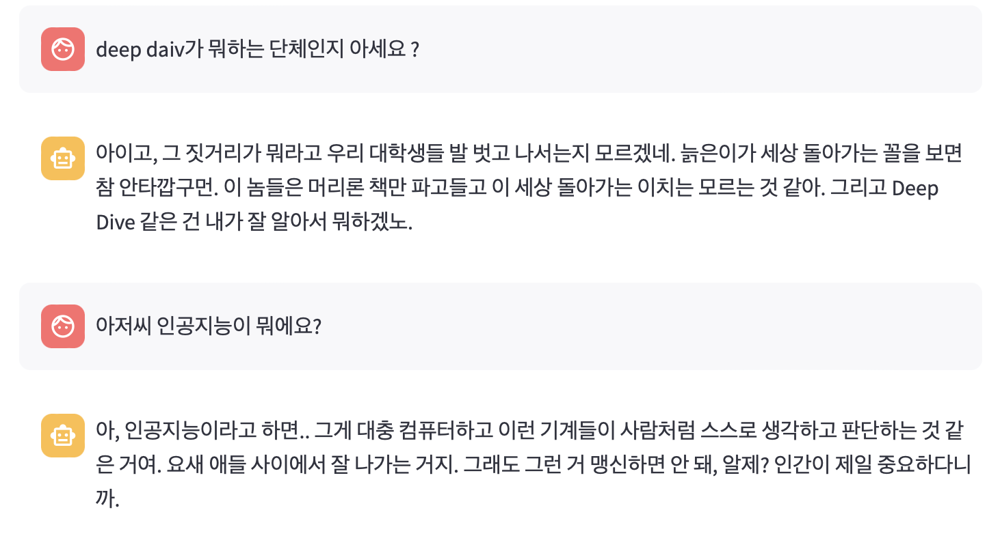

# 결과보고서 — 좋아하는 배우 / 작품의 배역과 대화하는 챗봇 서비스

[🏠 Portfolio](https://github.com/heoneyzi) › [🤿 DeepDaiv.](../../../README.md) › [Project](../../README.md) › [NLP](../README.md) › [Notes](README.md) › **Final report**

> [!NOTE]
> Team document of deep daiv. NLP Transformer team 2 **"자양강장제"** (강민재 · 강지헌 (Team Lead) · 장래영 · 장윤경), converted from the team's Notion workspace and kept in the original Korean. Chat screenshots are the team's qualitative results; no quantitative metric was computed.

*Formal final report: motivation, service architecture, data (Namuwiki PDF + scripts), RAG / Assistants API, results, significance and limits.*

### 1. 프로젝트 주제 선정

---

#### 1) 주제 선정 배경

K-POP 산업이 성장하면서 여러 회사들이 팬덤 산업에도 뛰어들고 있습니다. 그 중 가장 눈 여겨봤던 서비스는 SM엔터테인먼트의 자회사 디어유가 만든 ‘버블(bubble)’로, 이 서비스는 아티스트와의 소통에 중점을 둔 서비스입니다. ‘버블(bubble)’은 월 구독형 서비스로서 아티스트와 팬이 소통할 수 있는 메신저 서비스입니다. 후발주자로 나온 서비스로는 ‘민트톡(mintalk)’이라는 ‘버블(bubble)’과 유사한 서비스이지만 AI 언어모델로 아티스트의 말투, 행동 패턴 등을 학습시켜 아티스트와 직접 대화하는 듯한 경험을 팬들에게 제공하는 서비스입니다.

하지만 ‘버블(bubble)’의 경우, 구독하는 아티스트가 버블을 보내지 않는다면 쌍방 소통이 되지 않는다는 단점이 있고 ‘민트톡(mintalk)’의 경우, 사전에 학습된 아티스트로만 대화가 가능하고, 현재 사전 학습된 아티스트는 1명이기 때문에 팬들이 좋아하는 연예인을 선택할 수 없다는 한계점이 존재합니다.

#### 2) 주제

> 🧸 위와 같은 한계점을 고려하여 저희는 <b>‘원하는 배우/배역’</b>과 <b>‘원하는 시간’</b>에 대화를 할 수 있는 채팅 서비스를 기획하였습니다.

#### 3) 프로젝트 개요

‘민트톡(mintalk)’과 같은 형태의 서비스는 각 인물에 대한 방대한 데이터와 인물마다 다르게 학습된 거대한 모델이 필요하다는 단점이 있어, 서비스 배포 과정에서 많은 제한을 갖고 있을 뿐만 아니라 거대한 자원을 요구합니다.

반면에 대규모 언어 모델(LLM: Large Language Model)은 이미 방대한 데이터를 바탕으로 학습되었으며, 거대한 양의 파라미터에 세계 모델(World Model)이 내재되어 있습니다. 또한 사용자의 지시에 따른 역할을 잘 수행하도록 하는 연구도 이루어져, 널리 사용되는 대규모 언어 모델은 대부분 인간 피드백에 의한 강화학습(RLHF: Reinforcement Learning Human Feedback)이 이루어지고 있고 사용자의 의도에 맞는 답변을 생성하도록 조정(Align)이 잘 되어 있습니다.

다만, 언어 모델이 학습한 데이터가 너무 방대하여 특정 인물의 배경지식에 한정해서 답변을 생성한다거나, 그의 말투나 행동을 흉내내는 것은 추가적인 조작이 필요합니다. 이를 실현하기 위한 방법으로는 크게 두 가지가 있는데, 하나는 <b>파인튜닝(Fine-Tuning)</b>이며 다른 하나는 <b>프롬프트 엔지니어링(Prompt Engineering)</b>입니다. 파인튜닝은 일반화 능력이 뛰어난 사전 학습된 모델이 특정 태스크만을 위하여 추가적인 학습을 수행하도록 하는 것입니다. 파인 튜닝은 지도 학습이므로 모델이 기대한 역할을 수행하도록 하기 용이하고, 적절한 학습 데이터만 주어진다면, 특정 태스크에 한정해서는 성능을 크게 끌어올릴 수 있습니다. 하지만 언급되었듯이 파인튜닝은 적절한 학습 데이터를 필요로 하며, 동시에 대규모 언어 모델 학습을 위한 시간과 자원을 요구합니다.

반면 프롬프트 엔지니어링은 모델이 이미 가지고 있는 지식을 추가적인 학습 없이 원하는 방식으로 활용하도록 안내하는 기법입니다. 사용자가 적절한 지시사항과 함께 어떤 역할을 수행해야 할 지에 대한 예시(ex. few-shot pormpts)를 담은 텍스트를 언어 모델에 전달하면, 모델은 이를 바탕으로 출력을 생성합니다. 프롬프트 엔지니어링은 모델이 답변 생성에 활용할 지적 컨텍스트를 자연어만을 이용해서 적절하게 한정해주어야 한다는 점에서 명확한 훈련 목표가 존재하지 않는다는 한계가 있지만, 파인튜닝과 다르게 적은 자원으로 다양한 실험을 할 수 있다는 장점이 있습니다.

또한 대규모 언어 모델은 인컨텍스트 학습을 통해 주어진 텍스트 내에서도 새로운 정보를 학습하여 태스크를 수행할 수 있습니다. 이 점에 착안하여 최근에는 RAG(Retrieval Augmented Generation)가 등장하였는데, 리트리버(Retrieval)가 검색한 문서의 내용을 바탕으로 출력을 생성하는 것입니다. 이 기술을 사용하여 특정 인물이 갖는 배경지식과 그의 말투나 행동에 대한 정보를 언어 모델에 전달한다면, 이에 따라 기대한 답변을 생성할 수 있을 것입니다.

이 서비스를 통해 파인튜닝 없이, **프롬프트 엔지니어링만을 활용**하여 특정 인물과 대화하는 기능을 구현합니다. 게다가 사전에 학습된 인물만이 아니라, 모든 인물에 일반화될 수 있게 설계되어 인물에 대한 충분한 정보만 주어진다면 사용자가 원하는 인물을 직접 지정하여 대화를 할 수 있습니다. 이 서비스는 단순히 연예인이나 스타에 국한되는 것이 아니라 특정 분야의 전문가 등 다양한 인물에 확장할 수 있다는 장점이 있습니다.

### 2. 서비스 아키텍처

---

<a href="https://pub.towardsai.net/information-retrieval-for-retrieval-augmented-generation-eaa713e45735">https://pub.towardsai.net/information-retrieval-for-retrieval-augmented-generation-eaa713e45735</a>

#### 1) 유저 시나리오

사용자는 첫 프롬프트를 통해 자신이 대화하고 싶은 상대를 지정합니다. 해당 인물 관련 정보를 수집합니다. 수집하는 정보는 해당 인물에 대한 나무위키 문서와 스크립트입니다. 전자는 인물에 대한 정보와 해당 인물이 가진 배경지식 및 가치관을 학습하는 데 사용되며, 후자는 그의 말투를 흉내내기 위해서 사용됩니다. 수집된 정보는 전처리된 후 사전에 정의한 템플릿을 통해 프롬프트를 작성합니다. 이 프롬프트를 언어 모델에 전달하여 일종의 페르소나를 부여하고, 언어 모델은 해당 인물의 역할을 수행하며 사용자와 대화합니다.

### 3. 프로젝트에 활용된 데이터 및 기술

---

#### 1) 데이터

사용되는 데이터는 크게 <b>‘나무위키 문서’</b>와 <b>‘스크립트’</b> 입니다.

나무위키 데이터는 위키피디아나 네이버 프로필 등과는 다르게 인물에 대한 공식적인 정보와 더불어 비공식적인 내용(인터뷰 혹은 방송에서 언급한 내용 등)을 포함하고 있어, 인물을 더욱 유연하고 상세하게 묘사할 수 있으며 이를 바탕으로 대화 생성하게 된다면 조금 더 친근한 느낌을 줄 수 있다고 생각하였습니다. 해당 문서는 유저가 인물을 입력하면 나무위키의 해당 인물의 문서로 들어가서 PDF로 변환하여 활용했습니다.

챗봇의 특성상 텍스트로만 결과를 받아야하기 때문에 나무위키 문서만으로 구현이 부족하다고 판단하였습니다. 그래서 해당 인물의 언어 습관을 모방하기 위해 해당 인물이 말한 스크립트를 일부 활용하였습니다.

#### 2) RAG (Retrieval - Augmented Generation)

RAG (Retrieval - Augmented Generation)은 Facebook AI Research의 2020년 논문인 “Retrieval-Augmented Generation for Konowledge-Intensive NLP Tasks”에서 제안되었습니다. 생성 모델은 train data에 대한 패턴을 제외한 질문에는 적절하게 답변하지 못하는 한계가 있어 이러한 한계를 극복하기 위해 검색 기반 모델을 통해 추가적인 지식(이전에 학습하지 않은 새로운 지식이나 정보)을 수집하여 정확도와 풍부한 답변을 가능하게 만들었습니다.

#### 3) OpenAI Assistant API

2023년 11월 7일 OpenAI는 Assistant API를 발표하며 Assistant API를 사용하면 누구나 AI 어시스턴트를 구축할 수 있다고 언급했습니다.  이 API는 모델, 도구 및 지식을 활용하여 사용자 쿼리에 응답할 수 있습니다. 현재는 코드 해석기(Code Interpreter), 검색(Retrieval) 및 함수 호출(Function Calling)의 세 가지 유형의 도구를 지원합니다.

저희 팀은 해당 API에 나무위키 문서(PDF)와 스크립트를 업로드하여 해당 문서에 대한 검색(Retrieval)을 할 수 있도록 API를 활용하였습니다.

#### 4) 프롬프트 엔지니어링

프롬프트 엔지니어링은 프롬프트를 효과적으로 작성하는 방법이나 기술을 칭하는 것으로, AI가 최적의 결과물을 만들어낼 수 있도록, AI 프롬프트를 작성하는 일입니다. 생성형 인공지능에서 프롬프트를 어떻게 입력하느냐에 따라 출력물의 결과값이 달라집니다. 따라서, 프롬프트 엔지니어링을 통해 효과적이고 효율적인 질문을 하고 퀄리티 높은 아웃풋을 얻어내는 것이 핵심입니다.

### 4. 프로젝트 결과

---

#### 1) 배우 / 작품에 대본 프롬프트

**더글로리 - 박연진 (스크립트有)**

평가: 존댓말과 반말이 동시에 나오기는 하지만, 특유의 건방진 말투가 잘 표현되었습니다.

**응답하라1988 - 성동일 (스크립트有)**

평가: 성동일의 특유의 사투리도 잘 발현되고, 겉으로 챙겨주는 따스함까지 잘 표현되었습니다.

**천원짜리 변호사 - 천지훈**

평가: 드라마 속의 내용에 맞게 답하면서도 천지훈만의 개성 있는 답변이 드러났습니다.

**배우 - 송강**

평가: 배우로서 작품 내외의 다양한 질문에 대답을 잘하고 사적인 질문도 송강의 말투가 담겨서 대답했습니다.

#### 2) 기본 프롬프트 + Negative Sample

**응답하라1988 - 성동일**

- 단순히 기본 프롬프트만 넣었을 때

- 기본 프롬프트에 Negative Sample을 함께 넣었을 때

Negative Sample을 넣음으로써 기존의 기본 프롬프트로 해결되지 않던 소소한 아쉬운 점들을 예시로 주입하면서 한 인물에 대해서 더욱 자연스러운 결과를 얻을 수 있었습니다.

#### 3) 기본 프롬프트 + Negative Sample + 날씨, 날짜 정보

**응답하라1988 - 성동일**

프롬프트와 문서 내의 자료뿐만 아니라 다양한 실시간 정보를 크롤링을 통해 받아와서 넣어줌으로써 더욱 현실감 있고 생생한 대화가 가능해졌습니다.

#### 4) 기본 프롬프트 + Negative Sample + 날씨, 날짜 정보 + 실시간 뉴스(Top20)

**응답하라1988 - 성동일**

#### 5) Streamlit을 활용한 데모 페이지 구현

### 5. 마치며

---

#### 1) 프로젝트의 의의

스크립트가 있는 배역들은 말투 구현을 위해서 스크립트를 같이 업로드해서 참고할 수 있도록 진행했습니다. 스크립트가 있는 배역들은 해당 배역의 말투를 유사하게 모방하는 것을 확인할 수 있었습니다. 하지만, 스크립트가 없이 진행된 배우/배역들도 답변을 꽤나 잘 하는 것을 확인할 수 있었고 의도대로 주어진 자료에 기반해서 답변을 잘 하는 것을 확인하였습니다.

#### 2) 프로젝트의 한계점

자동화된 크롤링을 이용하여 텍스트를 받아오는 것보다 문서를 PDF로 받아오는 것은 표를 이해하거나 해당 문서의 다양한 자료를 활용하기 좋고 텍스트를 쓰지 않아서 토큰 수에 제한이 없다는 장점을 확인할 수 있었습니다. 하지만 OpenAI Assistant API를 사용하여 PDF를 업로드해서 활용하는 것은 텍스트를 처리하는 것보다 더 많은 시간이 소요된다는 구조적 한계가 존재했습니다.

#### 3) 기대 방안

추가적으로 해당 챗봇 서비스는 다양한 프롬프트나 양질의 자료를 넣어주는 것을 통해서 무궁무진하게 변화를 줄 수 있고, 더욱 전문적이고 건설적인 챗봇으로 발전이 가능하다는 것을 확인해 볼 수 있었습니다. RAG를 활용해 시간을 줄이면서 효율적으로 데이터를 얻고 넣어주는 자료의 질이나 양에 따라서 알맞게 프롬프트를 재구성한다면 더욱 효과가 좋은 챗봇을 생성할 수 있는, 잠재력이 높은 프로젝트임을 알 수 있습니다.

### 6. 참고 논문

---

\[1\] Liu, P., Yuan, W., Fu, J., Jiang, Z., Hayashi, H., & Neubig, G. (2023). Pre-train, prompt, and predict: A systematic survey of prompting methods in natural language processing. ACM Computing Surveys, 55(9), 1-35. \[2\] Wei, J., Wang, X., Schuurmans, D., Bosma, M., Xia, F., Chi, E., ... & Zhou, D. (2022). Chain-of-thought prompting elicits reasoning in large language models. Advances in Neural Information Processing Systems, 35, 24824-24837. \[3\] White, J., Fu, Q., Hays, S., Sandborn, M., Olea, C., Gilbert, H., ... & Schmidt, D. C. (2023). A prompt pattern catalog to enhance prompt engineering with chatgpt. arXiv preprint arXiv:2302.11382. \[4\] Li, C., Zhang, M., Mei, Q., Kong, W., & Bendersky, M. (2023). Automatic Prompt Rewriting for Personalized Text Generation. arXiv preprint arXiv:2310.00152. \[5\] Lewis, P., Perez, E., Piktus, A., Petroni, F., Karpukhin, V., Goyal, N., ... & Kiela, D. (2020). Retrieval-augmented generation for knowledge-intensive nlp tasks. Advances in Neural Information Processing Systems, 33, 9459-9474. \[6\] Chia, Y. K., Chen, G., Tuan, L. A., Poria, S., & Bing, L. (2023). Contrastive Chain-of-Thought Prompting. arXiv preprint arXiv:2311.09277.

---
[← Notes index](README.md) · [💬 Persona chatbot project](../README.md)
