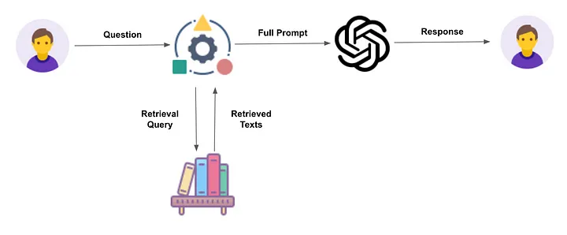

# 팀 세미나 보고서 — 전반기 논문 리뷰 & 후반기 프로젝트 계획

[🏠 Portfolio](https://github.com/heoneyzi) › [🤿 DeepDaiv.](../../../README.md) › [Project](../../README.md) › [NLP](../README.md) › [Notes](README.md) › **Mid-term seminar report**

> [!NOTE]
> Team document of deep daiv. NLP Transformer team 2 **"자양강장제"** (강민재 · 강지헌 (Team Lead) · 장래영 · 장윤경), converted from the team's Notion workspace and kept in the original Korean.

*Mid-term seminar report: first-half paper study (InstructGPT, GPT-4, LoRA, QLoRA, CoT, ReAct) and the project plan.*

---

> 💡 **반드시 포함되어야 하는 내용**
>
> 1. 지난 4-5주 간의 활동 요약
> 2. 후반기에 진행할 프로젝트 주제
> 3. 후반기 주차별 계획

## 1. 지난 활동

### Transformer NLP 활동 목적

1. 논문 리뷰를 통한 LLM 기초지식 학습
2. 프로젝트 아이디어 선정 및 기획
3. 프로젝트 모델 구현

### 논문 리뷰

후반기에 진행할 프로젝트에 사용될 개념을 미리 학습하기 위해서, 관련 논문을 읽고 정리하였습니다. Transformer NLP팀의 프로젝트 방향성은 크게 언어 모델 파인튜닝과 프롬프트 엔지니어링으로 구분할 수 있습니다. 먼저 현재 인공지능 트렌드인 대규모 언어 모델의 이해를 위해 GPT 관련 논문을 리뷰하였습니다. 이후 LLM의 효율적인 파인튜닝에 대한 논문을 읽었고, 마지막으로 LLM이 학습한 사전 지식을 추가적인 학습 없이 효과적으로 사용할 수 있는 방법인 프롬프트 엔지니어링을 공부하였습니다.

### 학습한 내용

#### InstructGPT / GPT-4

<b>InstructGPT</b>

LLM은 편향된 텍스트를 생성하거나 잘못된 지식을 생성, 그리고 사용자의 지시를 따르지 않는 현상이 있었다. 따라서 모델이 사용자의 의도에 따라 행동하도록 훈련함으로써 이러한 한계를 극복하고자 하였다. 언어학습을 Fine-tuning 방식에서 모델에게 질문하는 방식으로 인간 피드백의 강화학습을 사용한 GPT-3의 새로운 버전이 InstructGPT이다.

결과 3가지 :

1) **Labelers significantly prefer InstructGPT outputs over outputs from GPT-3.**

라벨러들은 GPT-3의 결과보다 InstructGPT를 더 선호했다.

2) **InstructGPT models show improvements in truthfulness over GPT-3. **

InstructGPT 모델이 GPT-3보다 정직성의 향상을 보여준다.

3) **InstructGPT shows small improvements in toxicity over GPT-3, but not bias. **

Instruct GPT 모델이 GPT-3에 비해 유해성이 약간 개선된 것을 보여주지만, 편향에서는 개선되지 않았다.

한계점 : InstructGPT는 여전히 편향에서 오류가 존재한다.

<b>GPT-4</b>

GPT-4는 거대한 멀티모달 모델로써, 텍스트 뿐만 아니라 이미지를 처리하는 능력도 갖추었다. 이 모델이 자연어를 이해하고 생성하는 능력을 평가하는 데는 원래 인간의 역량을 평가하기 위해 고안된 실험을 사용하였다.

한계점 : 기존의 GPT 모델들과 마찬가지로 할루시네이션 문제, 컨텍스트 윈도우의 크기가 제한, 경험을 통해 학습하지 못한다는 한계를 보여준다.

#### LoRA / Q-LoRA

<b>LoRA</b>

LoRA는 fine-tuning을 진행할 때, 아주 약간의 parameter만 업데이트된다는 것을 이용해서 pertained model의 모든 parameter을 fine-tuning 하지 않는다. 대신 모두 weight를 freeze시켜서 고정을 시키고, 일부의 matric을 추가하는 방법으로 대체하여 효율적으로 진행되게 만들었다. Downstream task를 진행하기 위해서 훈련이 가능한 rank decomposition matric을 추가한다.

한계점 : 추가 추론 대기시간을 제거하기 위해 A와 B를 W로 흡수하기로 선택한 경우 단일 단방향에서 A와 B가 다른 여러 작ㅇ겁에 대한 입력을 배치 처리하는 것은 간단하지 않다. 가중치를 병합하지 않고 대기 시간이 중요하지 않은 시나리오의 경우 배치에서 샘플에 사용할 LoRA 모델을 동적으로 선택할 수 있다.

<b>Q-LoRA</b>

Q-LoRA는 fine-tuning 접근 방식을 제안하였다. 즉, 메모리 사용량을 감소시켜 65B 파라미터 모델을 48GB GPT에서 fine-tuning할 수 있게 하면서 전체 16비트 fine-tuning 성능을 유지했다.

성능 저하 없이 메모리를 절약할 수 있는 방법으로 3가지인 4-bit NormalFloat(NF4), Double Quantization, Page Optimizers를 소개하였다.

결과 : QLoLA는 작은 고품질 데이터셋에 대한 fine-tuning에서 최고의 결과를 보여주었다.

한계점 : Instruction fine-tuning 모델들의 평가에서의 한계, 다양한 비트에서의 precision을 평가하지 않는다. 또한 다양한 어댑터 방법에 대한 평가를 하지 않는다.

#### Chain of Thought / ReAct

<b>Chain of Thought(CoT)</b>

CoT는 LLM이 복잡한 추론 작업을 할 때, 중간 추론 단계를 생성하여 모델의 추론 능력을 향상 시키는 방법이다. 세가지 언어모델에서 CoT prompting이 산술, 상식, 기호적 추론 작업에서 성능을 향상시켰다.

장점으로는 답을 찾아낼 때, 답의 추론 과정을 보여주기 때문에 틀린 부분을 확인할 수 있다. 또한, 모델의 스케일(파라미터 수)이 커질수록 CoT의 성능이 잘 나타난다.

한계점 : 쉬운 task를 해결할 때는 Standard prompting과 비교했을 때 성능이 감소하거나 적게 향상된다.

<b>ReAct</b>

언어적 추론과 의사 결정 문제를 해결하기 위해 Reasoning과 acting을 동시에 언어 모델에 결합하는 일반적인 패러다임으로, ReAct prompt는 LLM이 언어적 추론 과정과 작업 행동을 함께 생성하여 모델이 높은 수준의 행동 계획을 마련하는 동시에 Wikipedia와 같은 외부 환경과 상호 작용할 수 있게 한다.

ReAct는 사실에 근거한 답변을 내놓지만 그만큼 유연성을 잃고, 적절한 문서를 검색하지 못했을 경우에는 답변에 실패하는 경우가 많았다. 결국 ReAct는 성공적으로 관련 문서를 검색하는 것이 매우 중요하다. ReAct는 매우 간단한 기법이지만, 많은 설명이 필요한 복잡한 task를 주어진 문맥 안에서 학습하기에는 어려움이 있을 수 있다. 따라서, ReAct를 활용하여 모델을 직접 fine-tuning하거나 multi task 학습과 강화 학습을 사용한다면 LLM의 능력을 한층 더 향상시킬 수 있을 것이다.

---

## 2. 프로젝트

### 배경 및 목적

민트톡(mintalk)은 자신이 좋아하는 스타와 1:1 채팅방에서 메시지를 송수신하는 월구독형 서비스입니다. 우리 팀은 이 서비스에서 영감을 받아 원하는 인물과 대화를 주고받을 수 있는 챗봇 서비스를 기획하였습니다. 기존의 서비스는 사전에 학습된 인물만 대화 상대로 지정할 수 있다는 단점이 있습니다. 또한 이런 형태의 서비스는 각 인물에 대한 방대한 데이터와, 인물마다 다르게 학습된 거대한 모델이 필요하다는 단점이 있어, 서비스 배포 과정에서 많은 제한을 갖고 있을 뿐만 아니라 거대한 자원을 요구합니다.

반면에 대규모 언어 모델은 이미 방대한 데이터를 바탕으로 학습되었으며, 거대한 양의 파라미터에 세계 모델(world model)이 내재되어 있습니다. 또한 사용자의 지시에 따른 역할을 잘 수행하도록 하는 연구도 이루어져, 널리 사용되는 LLM은 대부분 인간 피드백에 의한 강화학습(RLHF)이 이루어져, 사용자의 의도에 맞는 답변을 생성하도록 align이 잘 되어 있습니다.

다만, 언어 모델이 학습한 데이터가 너무 방대하여 특정 인물의 배경지식에 한정해서 답변을 생성한다거나, 그의 말투나 행동을 흉내내는 것은 추가적인 조작이 필요합니다. 이를 실현하기 위한 방법으로는 크게 두 가지가 있는데, 하나는 파인튜닝이며 다른 하나는 프롬프트 엔지니어링입니다. 파인 튜닝은 일반화 능력이 뛰어난 사전 학습된 모델이 특정 태스크만을 위하여 추가적인 학습을 수행하도록 하는 것입니다. 파인 튜닝은 지도 학습이므로 모델이 기대한 역할을 수행하도록 하기 용이하고, 적절한 학습 데이터만 주어진다면, 특정 태스크에 한정해서는 성능을 크게 끌어올릴 수 있습니다. 하지만 언급되었듯이 파인튜닝은 적절한 학습 데이터를 필요로 하며, 동시에 대규모 언어 모델 학습을 위한 시간과 자원을 요구합니다.

반면 프롬프트 엔지니어링은 모델이 이미 가지고 있는 지식을 추가적인 학습 없이 원하는 방식으로 활용하도록 안내하는 기법입니다. 사용자가 적절한 지시사항과 함께 어떤 역할을 수행해야 할 지에 대한 예시(ex. few-shot pormpts)를 담은 텍스트를 언어 모델에 전달하면, 모델은 이를 바탕으로 출력을 생성합니다. 프롬프트 엔지니어링은 모델이 답변 생성에 활용할 지적 컨텍스트를 자연어만을 이용해서 적절하게 한정해주어야 한다는 점에서 명확한 훈련 목표가 존재하지 않는다는 한계가 있지만, 파인튜닝과 다르게 적은 자원으로 다양한 실험을 할 수 있다는 장점이 있습니다.

또한 LLM은 인컨텍스트 학습을 통해 주어진 텍스트 내에서도 새로운 정보를 학습하여 태스크를 수행할 수 있습니다. 이 점에 착안하여 최근에는 RAG(Retrieval Augmented Generation)이 등장하였는데, 리트리버가 검색한 문서의 내용을 바탕으로 출력을 생성하는 것입니다. 이 기술을 사용하여, 특정 인물이 갖는 배경지식과 그의 말투나 행동에 대한 정보를 언어 모델에 전달한다면, 이에 따라 기대한 답변을 생성할 수 있을 것입니다.

이 서비스를 통해 파인튜닝 없이, 프롬프트 엔지니어링만을 활용하여 특정 인물과 대화하는 기능을 구현합니다. 게다가 사전에 학습된 인물만이 아니라, 모든 인물에 일반화될 수 있게 설계되어 인물에 대한 충분한 정보만 주어진다면 사용자가 원하는 인물을 직접 지정하여 대화를 할 수 있습니다. 이 서비스는 단순히 연예인이나 스타에 국한될 뿐만 아니라 특정 분야의 전문가 등 다양한 인물에 확장할 수 있다는 장점이 있습니다.

### 서비스 아키텍처

<a href="https://pub.towardsai.net/information-retrieval-for-retrieval-augmented-generation-eaa713e45735">https://pub.towardsai.net/information-retrieval-for-retrieval-augmented-generation-eaa713e45735</a>

#### 유저 시나리오

사용자는 첫 프롬프트를 통해 자신이 대화하고 싶은 상대를 지정합니다. 분류 모델, 또는 규칙 기반 프로그램을 통하여 사용자가 지정한 인물을 결정하고, 관련 정보를 수집합니다. 수집하는 정보는 해당 인물에 대한 나무위키 문서와 SNS 텍스트입니다. 전자는 인물에 대한 정보와 해당 인물이 가진 배경지식 및 가치관을 학습하는 데 사용되며, 후자는 그의 말투나 행동을 흉내내기 위해서 사용됩니다. 수집된 정보는 전처리된 후 사전에 정의한 템플릿을 통해 프롬프트를 작성합니다. 이 프롬프트를 언어 모델에 전달하여 일종의 페르소나를 부여하고, 언어 모델은 해당 인물의 역할을 수행하며 사용자와 대화합니다.

### 핵심 기술

#### 데이터

사용되는 데이터는 크게 <ins>1) 나무위키 문서</ins>와 <ins>2) SNS 텍스트</ins>입니다. SNS에 접근하는 방식도 일차적으로는 나무위키 문서를 통합니다.

나무위키 데이터는 위키피디아나 네이버 프로필 등과 다르게 인물에 대한 공식적인 정보와 더불어 비공식적인 내용을 포함하고 있어, 인물을 더욱 유연하게 묘사할 수 있으며 이를 바탕으로 대화 생성시 친근한 느낌을 줄 수 있다고 생각하였습니다.

SNS 텍스트는 인스타그램, X등의 소셜 미디어에 인물이 게시한 글을 수집하여 인물의 언어 습관이나 가치관 등에 대한 정보를 활용할 수 있다고 생각하였습니다.

#### RAG “생성 모델 + 검색 기반 모델”

RAG (Retrieval - Augmented Generation)은 Facebook AI Research의 2020년 논문인 “Retrieval-Augmented Generation for Konowledge-Intensive NLP Tasks”에서 제안되었습니다. 생성 모델은 train data에 대한 패턴을 제외한 질문에는 적절하게 답변하지 못하는 한계가 있어 이러한 한계를 극복하기 위해 검색 기반 모델을 통해 추가적인 지식(이전에 학습하지 않은 새로운 지식이나 정보)을 수집하여 정확도와 풍부한 답변을 가능하게 만들었습니다.

검색 기반 모델 프로세스

1. 미리 수집한 대규모의 외부 지식 그래프 이용
2. 입력 문장과 연관성 있는 정보 추출
3. 추출한 정보를 생성 모델의 입력으로 사용하여 적절한 응답 생성

RAG 응용 방향

1. 의료 : RAG로부터 찾아낸 건강 정보를 바탕으로, 건강에 관한 자세한 설명을 제공하거나, 해당 문제와 관련된 질문에 대한 응답 생성.
2. OpenAI : GPT-3와 함께 RAG 모델을 사용하여 벤치마크 작업에서 좋은 성능을 보임.

#### 프롬프트 엔지니어링

프롬프트 엔지니어링은 프롬프트를 효과적으로 작성하는 방법이나 기술을 칭하는 것으로, [AI](https://namu.wiki/w/AI)가 최적의 결과물을 만들어낼 수 있도록, AI [프롬프트](https://namu.wiki/w/%ED%94%84%EB%A1%AC%ED%94%84%ED%8A%B8)를 작성하는 일입니다. 생성형 인공지능에서 프롬프트를 어떻게 입력하느냐에 따라 출력물의 결과값이 달라집니다. 따라서, 프롬프트 엔지니어링을 통해 효과적이고 효율적인 질문을 하고 퀄리티 높은 아웃풋을 얻어내는 것이 핵심입니다.

프롬프트 엔지니어의 주요 역할은 4가지로 다음과 같습니다.

- 프롬프트 설계 및 개발(프롬프트 엔지니어링): 인공지능 모델이 이해하고 반응할 수 있는 효과적인 프롬프트를 개발하고 최적화한다.
- 시스템 통합: 자연어 처리(NLP) 알고리즘과 기존 시스템 및 인터페이스와의 통합을 관리한다.
- 테스트 및 평가: 프롬프트의 성능을 평가하고 개선하며, 사용자 경험 및 비즈니스 요구 사항을 충족시키는지 확인한다.
- 보안 프롬프트 설계: 별다른 보안조치를 하지 않는다면 프롬프트 인젝션이나 리킹과 같은 문제가 발생할 수 있으므로, 프롬프트 보안에 대한 대비가 필요하다.

---

## 주차별 계획

#### 5주차 (\~12.08)

PoC

- ChatGPT를 활용하여 프로젝트 실현 가능성 검증

데이터 명세

- 나무위키 데이터
- SNS 데이터

데이터 전처리 방법 정의

- 나무위키 문서 중 어떤 부분을 사용할 것인지
    - 어떤 문서의 참조 문서를 함께 사용할 것인지 (배경 지식 증강)
    - 동명이인 처리 방법
- SNS 데이터 중 필요한 것을 어떻게 필터링할 것인지

크롤링 코드 구현

- 나무위키 크롤링
- 인스타그램, X 크롤링

#### 6주차 (\~12.15)

RAG 파이프라인 구축

- 수집한 데이터를 정제한 데이터를 언어 모델에 전달하는 코드 구현
- LangChain의 Web-based retriever를 참고하기

프롬프트 엔지니어링 연구

- 어떤 프롬프트를 사용해야 지시를 잘 따르게 될 지
- 일반화된 프롬프트를 자동으로 설계할 수 있는 방법

#### 7주차 (\~12.22)

프롬프트 엔지니어링 심화

- 프롬프트 설계에 대한 연구
- End tn end 파이프라인 구축

#### 8주차 (\~12.29)

모델 성능 향상

- 프롬프트 엔지니어링
- 데이터 전처리 개선

End to end 파이프라인 마무리

#### 9주차 (\~01.05)

미정

- 가능할 경우, Gradio, Streamlit등을 활용하여 간단한 웹 데모 만들기

---
[← Notes index](README.md) · [💬 Persona chatbot project](../README.md)
