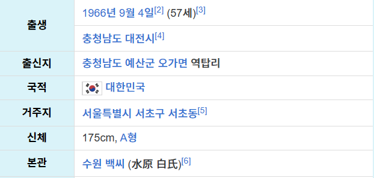
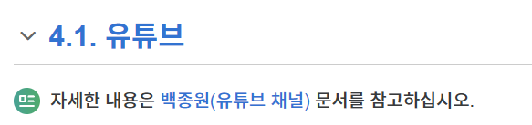

# 2023.12.05 회의 — 나무위키 목차 문제와 프롬프트 길이

[🏠 Portfolio](https://github.com/heoneyzi) › [🤿 DeepDaiv.](../../../../README.md) › [Project](../../../README.md) › [NLP](../../README.md) › [Notes](../README.md) › [Meetings](README.md) › **2023-12-05**

> [!NOTE]
> Team meeting note (NLP Transformer team 2), converted from Notion and kept in the original Korean.

- 나무위키의 목차가 사람마다 다른데 이를 어떻게 해결할 것인지
- 프롬프트가 긴 문서의 양을 어느정도 소화할 수 있는지
    - @강민재 가 gpt 프롬프트에 정보 입력했을 때 질문&답변 내용을 봤을 때, 긴 문서를 집어넣었더니 일부는 의도와 다른 답변을 함
- 나무위키의 목차 중 가져올 부분과 생략할 부분
    - 논란/사건사고 필요
        →  예민한 문제이기 때문에 학습 시키고 답변을 회피하는 방향으로…?
    - 표에 있는 개인 정보 필요

    

- 나무위키를 보면, 어떤 목차에는 다른 문서를 참고 하라고 나오면서, 해당 문서의 링크가 표시되어 있는데, 이 링크를 몇 번 타고 들어갈 건지
    

---

추후 논의할 것

- 코드 짤 때 협업 어떻게 해야할지

---
[← Meetings](README.md) · [Notes index](../README.md) · [💬 Persona chatbot project](../../README.md)
