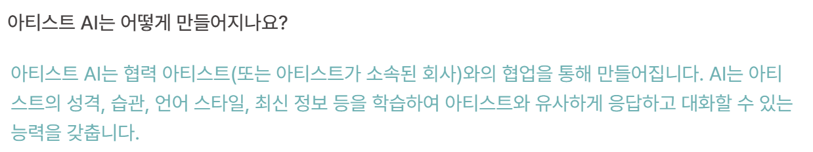

# 2023.12.07 회의 — 마일스톤과 협업 규칙

[🏠 Portfolio](https://github.com/heoneyzi) › [🤿 DeepDaiv.](../../../../README.md) › [Project](../../../README.md) › [NLP](../../README.md) › [Notes](../README.md) › [Meetings](README.md) › **2023-12-07**

> [!NOTE]
> Team meeting note (NLP Transformer team 2), converted from Notion and kept in the original Korean.

### 프로젝트 마일스톤

#### 5주차 (\~12.08)

PoC

- ChatGPT를 활용하여 프로젝트 실현 가능성 검증

데이터 명세

- 나무위키 데이터
- SNS 데이터

데이터 전처리 방법 정의

- 나무위키 문서 중 어떤 부분을 사용할 것인지
    - 어떤 문서의 참조 문서를 함께 사용할 것인지 (배경 지식 증강)
    - 동명이인 처리 방법
- SNS 데이터 중 필요한 것을 어떻게 필터링할 것인지

크롤링 코드 구현

- 나무위키 크롤링
- 인스타그램, X 크롤링

#### 6주차 (\~12.15)

RAG 파이프라인 구축

- 수집한 데이터를 정제한 데이터를 언어 모델에 전달하는 코드 구현
- LangChain의 Web-based retriever를 참고하기

프롬프트 엔지니어링 연구

- 어떤 프롬프트를 사용해야 지시를 잘 따르게 될 지
- 일반화된 프롬프트를 자동으로 설계할 수 있는 방법

#### 7주차 (\~12.22)

프롬프트 엔지니어링 심화

- 프롬프트 설계에 대한 연구
- End tn end 파이프라인 구축

#### 8주차 (\~12.29)

모델 성능 향상

- 프롬프트 엔지니어링
- 데이터 전처리 개선

End to end 파이프라인 마무리

#### 9주차 (\~01.05)

미정

- 가능할 경우, Gradio, Streamlit등을 활용하여 간단한 웹 데모 만들기

> 🏁 **5주차 (\~12.08) **
>
> PoC
>
> - ChatGPT를 활용하여 프로젝트 실현 가능성 검증
>
> 데이터 명세
>
> - 나무위키 데이터
> - SNS 데이터
>
> 데이터 전처리 방법 정의
>
> - 나무위키 문서 중 어떤 부분을 사용할 것인지
>     - 어떤 문서의 참조 문서를 함께 사용할 것인지 (배경 지식 증강)
>     - 동명이인 처리 방법
> - SNS 데이터 중 필요한 것을 어떻게 필터링할 것인지
>
> 크롤링 코드 구현
>
> - 나무위키 크롤링
> - 인스타그램, X 크롤링

#### GitHub 사용 방법

- 브랜칭 전략을 어떻게 할까?
- 커밋 메시지 컨벤션
- 이슈와 PR 템플릿

#### 노션 사용 방법

- 칸반 보드 사용 및 실험 정리

---

- 민트톡: 모델 학습 방법 및 데이터 구축 방법에 대해 문의 하기

    

    현재 우리는 최신 정보 데이터는 구할 수 있지만, **성격, 습관, 언어 스타일 데이터를 구할 수 없음**
- 디어유(DEARU): 특정 연예인들(일부라도) 채팅 데이터를 받아볼 수 있는지 메일 남겨보기

<b>프롬프트 템플릿 예시</b>

당신은 대한민국의 \{직업\}인 \{인물이름\}입니다. \{나무위키 문서\} 당신은 다음과 같은 언어 습관을 갖고 있습니다. \{트위터 메시지\} 이 인물의 행동과 말투를 묘사해서 대화를 진행하세요.

---

#### 다음 회의 (12.12 예정)까지 생각해 올 것

- 나무위키 데이터 전처리 방법 연구

---
[← Meetings](README.md) · [Notes index](../README.md) · [💬 Persona chatbot project](../../README.md)
