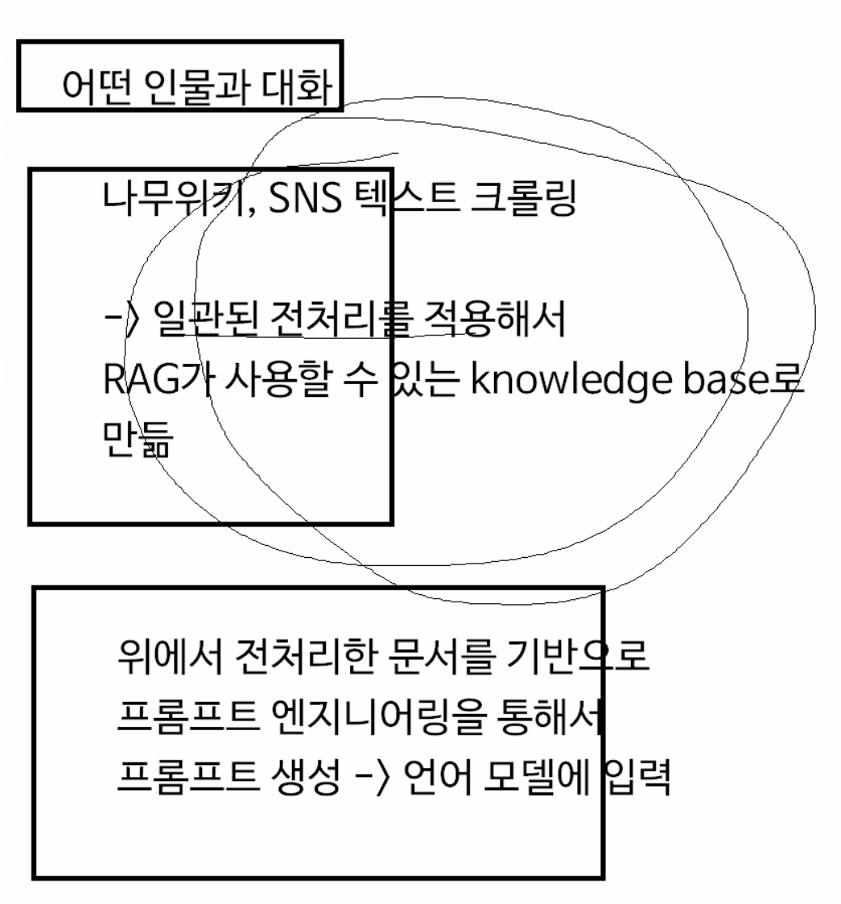

# 2023.12.15 회의 — 목차 선별과 유저 시나리오

[🏠 Portfolio](https://github.com/heoneyzi) › [🤿 DeepDaiv.](../../../../README.md) › [Project](../../../README.md) › [NLP](../../README.md) › [Notes](../README.md) › [Meetings](README.md) › **2023-12-15**

> [!NOTE]
> Team meeting note (NLP Transformer team 2), converted from Notion and kept in the original Korean.

다음 회의: 12월 18일(월)

#### 데이터 전처리

나무위키 문서 크롤링하는 코드는 완성되어 있는 상태

문제는 ToC에서 어떤 항목을 선별해서 프롬프트에 포함시켜야 할 지

→ 나무위키는 누구나 편집할 수 있는 사이트라서 목차, 제목 등이 일관되지가 않음, 전처리하는 방법을 잘 고안해야 함

 1. 목차가 중요도 순으로 정렬되어있다고 전제하면 전체 항목 중 상위 k개만 뽑아서 사용하는 방법이 있음

1. 가장 중요해 보이는 일부 항목만을 선정한 다음 최초 프롬프트로 사용
    → 이후 ReAct 논문처럼 매 질문마다 관련 항목을 검색하여 해당 내용을 바탕으로 답변을 생성하는 방법도 있을 수 있음

    예를 들어서, 백종원 문서 기준으로 최초 프롬프트는 인물 정보가 요약된 테이블, 개요, 생애를 바탕으로 생성된 템플릿을 사용, 이후 사용자가 유튜브 방송에 대한 질문을 던졌다면 4.1 유튜브 항목을 사용하여 답변 생성

    유저 시나리오

    U: 유저, C: 챗봇,

    U: 백종원씨와 이야기를 나누고 싶어.

    → 나무위키(+SNS) ‘백종원’ 문서 접근하여 개요, 생애 항목의 텍스트와 인물 정보가 요약된 표를 바탕으로 프롬프트 생성 (프롬프트 템플릿을 사용하여 모든 입력에 대해 일관된 프롬프트 생성)

    프롬프트 엔지니어링을 바탕으로 생성한 프롬프트 템플릿 + 인물을 흉내내라는 지시를 전달

    C: (백종원씨의 말투를 사용한 자기소개)

    U: 어떻게 슈가보이라는 별명을 가지게 되었나요?

    C: (나무위키 7. 별명 항목 접근 → 요리할 때 설탕을 많이 사용하고 설탕을 사랑한다는 의미에서 이런 별명이 생겼음을 답변)

한계: 사용자 입력에서 적절한 제목을 추출하여 적절한 항목에 접근해야 함

→ 사전에 사용 가능한 항목을 안내하는 방법이 있지만 챗봇의 자연스러운 형태에서 조금 거리가 멀어지게 됨.

프로젝트 주제 align이 필요한 상황

- 우리가 필요한 기술은 RAG, 프롬프트 엔지니어링
- 모델 튜닝은 아예 포함되지 않음

---
[← Meetings](README.md) · [Notes index](../README.md) · [💬 Persona chatbot project](../../README.md)
