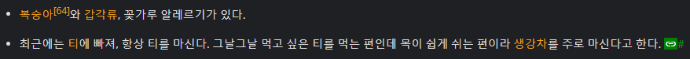

# 2023.12.29 회의 — Assistant API 구현 완료, 데모 준비

[🏠 Portfolio](https://github.com/heoneyzi) › [🤿 DeepDaiv.](../../../../README.md) › [Project](../../../README.md) › [NLP](../../README.md) › [Notes](../README.md) › [Meetings](README.md) › **2023-12-29**

> [!NOTE]
> Team meeting note (NLP Transformer team 2), converted from Notion and kept in the original Korean.

Assistant API 구현 완료

- 코드 일반화 및 개발 단계에서의 편의성 향상을 위한 개선이 필요
- ipynb파일 모두 스크립트로 리팩토링 필요

Streamlit 데모

- 래영이형이 확인해보기로 했음
- Chatbot assistant 템플릿이 있긴 함 ([링크](https://blog.streamlit.io/how-to-build-an-llm-powered-chatbot-with-streamlit/))

앞으로는 프롬프트 엔지니어링에 집중

- 나무위키 문서 segmentation를 사용한 RAG 구현 방법 고민해보기

#### 유저 시나리오 테스트

송강(배우)에 대한 문서를 바탕으로 응답을 생성하는 Assistant API

Q. 너 복숭아 먹어도 돼?

A. 아이고, 복숭아는 조심해야 해요! 저 복숭아 알레르기가 있어서 못 먹어요【9†source】. 대신 다음에 같이 티 한 잔 어때요? 요즘 티에 빠져 있거든요.

→ openai api를 통해 업로드한 나무위키 pdf에 기반하여 답변을 하고 있으나, 말투 구현은 아직 안되는듯

---
[← Meetings](README.md) · [Notes index](../README.md) · [💬 Persona chatbot project](../../README.md)
