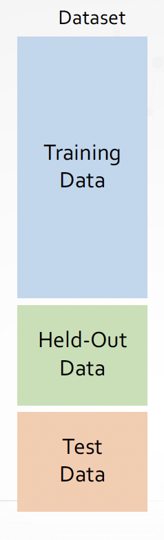
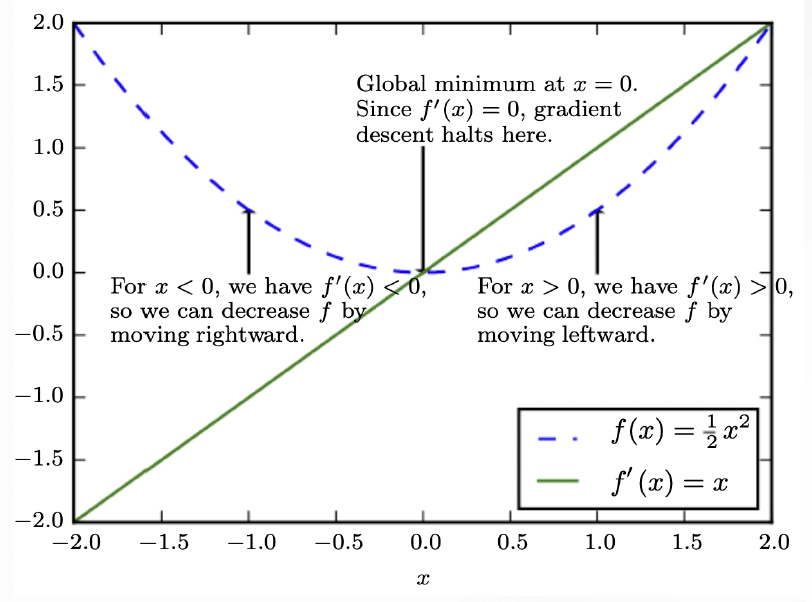
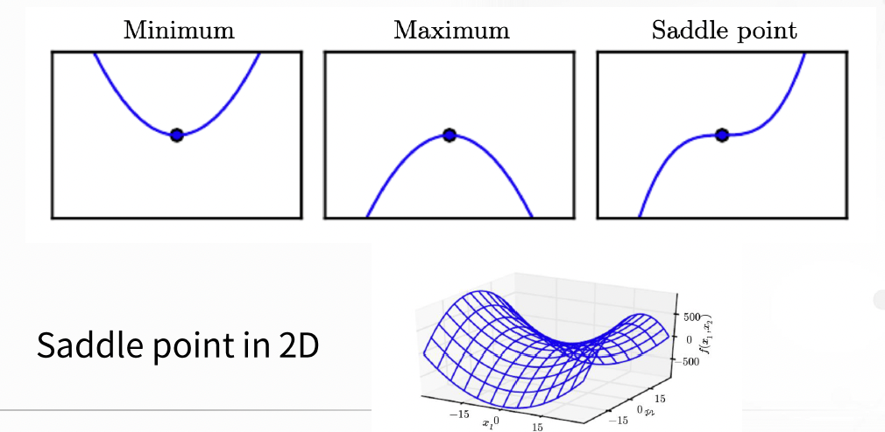
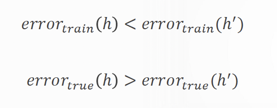
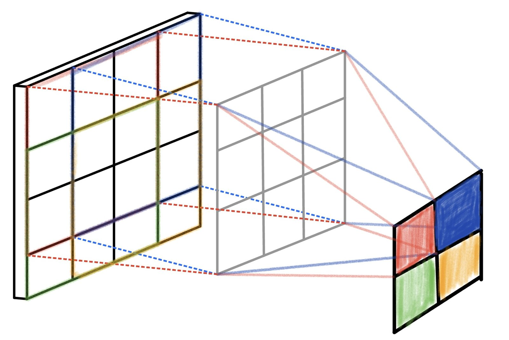
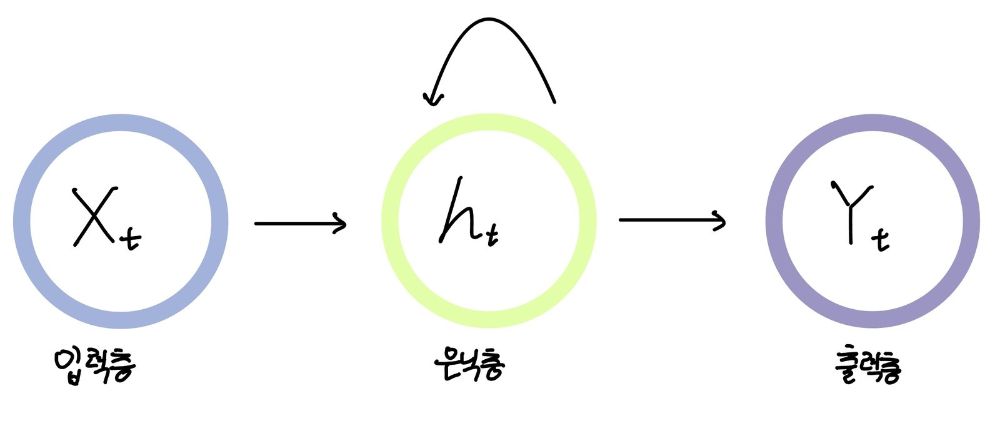

# AI에 사용되는 단어 간단 정리

[🏠 Portfolio](https://github.com/heoneyzi) › [🤿 DeepDaiv.](../../../../README.md) › [Project](../../../README.md) › [NLP](../../README.md) › [Notes](../README.md) › [WIL](README.md) › **AI glossary**

> [!NOTE]
> Jiheon's personal study note (deep daiv. WIL — *What I Learned*) from the NLP period, kept in the original Korean.

deep.daiv의 모토를 본받아 나만의 인공지능에 대한 개념을 정리해보고자 한다. 나도 잘 헷갈려서 다시 용어 정리를 하는 시간을 가져보았다. 워낙 옆에 친구들이 궁금해 해서 간단하게 정리해서 보여주면 좋을 것 같다는 생각도 들었다.

AI와 관련된 다양한 용어와 기본적 과정을 먼저 정리해보겠다.

Artificial Intelligence(인공지능) 인공지능이란, 말 그대로 인공적으로 인간의 지능과 능력을 구현하기 위해 만들어진 컴퓨터과학 분야를 의미한다. 매우 광범위한 개념임을 말로 들어도 알 수 있다. 인간의 능력은 복합적이고 체계적인만큼 AI의 범주도 점차 다양해지고 세분화되고 있는 추세이다. Image Analysis, NLP, Robotics, Social media Analysis 등등 다양하게 사용된다.

Machine Learning 인간도 학습을 통해 지식을 얻는 것처럼, 컴퓨터도 다른 방법으로 학습이 있어야 인공지능을 만들 수 있을 것이다. 이렇게 기계를 학습하는 다양한 방법을 Machine Learning이라고 부른다.

Data, Algorithm 우리가 흔히 하는 프로그래밍과 Machine Learning의 차이를 보자면, 프로그래밍은 input을 넣으면 프로그램을 만들면 output이 나오게 되는 과정이다. 그러나 Machine Learning은 input과 output을 통해 중간의 프로그램이 나오게 되는 것이다. 이 때 data과 algorithm을 넣어 과정을 얻어낼 수 있다.

data는 하나의 종류로만 구성이 되는 것이 아니라 학습을 위한 데이터와 test를 위한 데이터도 존재한다는 것을 알 수 있다.

Machine Learning 과정 Machine Learning의 기본적인 과정은 어떤 data와 Algorithm을 이용해 문제를 해결할지 고르고, 데이터를 처리하고 이 데이터를 알고리즘에 넣어 '학습'을 하게 된다. 학습을 하고 오류를 분석하고 다시 피드백을 하는 과정을 반복하게 된다. 이때 과하게 넣은 data에 overfitting이 되지는 않았는지도 유의해줘야 한다. 여기서 데이터를 처리하는 과정 중에 labeling하는 과정이 있는데, 이는 레이블을 입력함으로써 컴퓨터가 할 과제를 지정해주는 것이다. 이러한 데이터의 label을 이용하는 지에 따라 Machine Learning의 다양한 방법이 존재한다.

Deep Learning 그리고 Deep Learning은 Machine Learning중에서도 신경망을 이용한 학습을 일컫는 말이다. 신경망은 생물의 신경세포와 비슷해 사용되는 용어이다. 우리가 여러 함수에 대입하는 합성함수의 느낌으로 deep하게 다양한 층을 쌓아서 만드는 인공신경망을 이용하는 학습법을 Deep Learning이라 부르는 것이다.

Optimizer

딥러닝 학습시 최대한 틀리지 않는 방향으로 학습해야 한다, 얼마나 틀리는지(loss)를 알게 하는 함수가 loss function이다. loss function 의 최솟값을 찾는 것을 학습 목표로 한다. 최소값을 찾아가는 것 최적화하는 과정이 Optimization이다. 이를 하는 함수를 optimizer이라고 부른다. 이를 이용하는 방법에는 크게 gradient descent와 critical point가 있다.

<table><tr>
<td align="center" width="50%"></td>
<td align="center" width="50%"></td>
</tr></table>

Overfitting

그러다가 데이터를 넣고 학습을 진행 시에 생기는 문제인데, 쉽게 말하면 과도하게 일반화가 되었다는 것이다. 학습시에 에러보다 실제 테스트의 에러가 더 적게 나온다면 이는 과하게 overfitting된 경우일 수도 있다. 이를 위해서라도 test용 데이터가 필요한 것이다.

Artificial Neural Network(인공신경망) 신경계는 뉴런을 통해 연속적으로 신호를 주고 받듯이, 인공신경망 역시 비슷한 구조를 가지고 있다. 뉴런과 뉴런을 지나가는 신경계처럼, ANN은 layer(층) 사이를 이동하게 된다.

ANN의 종류 인공신경망은 다양한 종류가 있지만, 크게 3가지도 존재한다.

DNN(Deep Neural Network) 입력층과 출력층의 중간에 있는 은닉층을 여러 개 만들어 학습 결과를 향상시키는 신경망이다.

CNN(Convolution Neural Network) convolution(합성곱) layer을 통해서 만들어지는 신경망으로 음성이나 사진을 인식할 때 유용하게 된다. 많은 layer가 필요로 하기는 하지만 간편화하기에는 유용하다.

RNN(Reccurent Neural Network) reccurent(회귀)를 이용하는 신경망으로 순환적 구조를 가지고 있기에 받은 데이터와 가지고 있던 데이터를 동시에 생각할 수 있다는 장점이 있다. 하나의 메모리로 이용할 수 있다. 그렇기에 시변적 데이터에 우수하다.

NLP(Natural Language Processing) NLP란, 인공지능의 한 분야로써 자연어 처리를 의미한다. 여기서 자연어는 우리 사람이 일상적으로 사용하는 언어이다.

---
[← WIL index](README.md) · [Notes index](../README.md) · [💬 Persona chatbot project](../../README.md)
