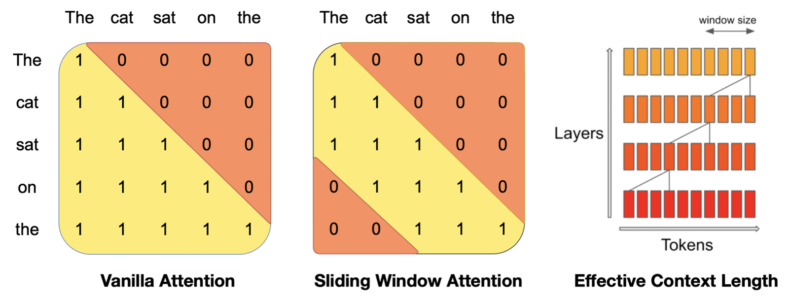
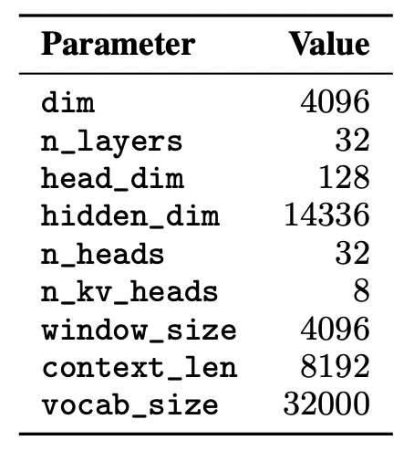
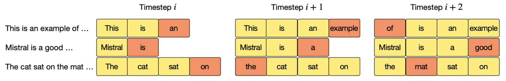
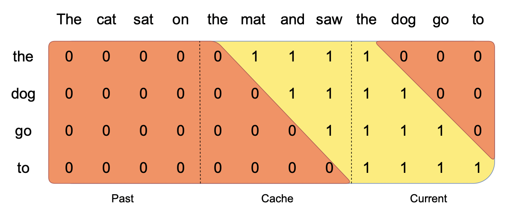
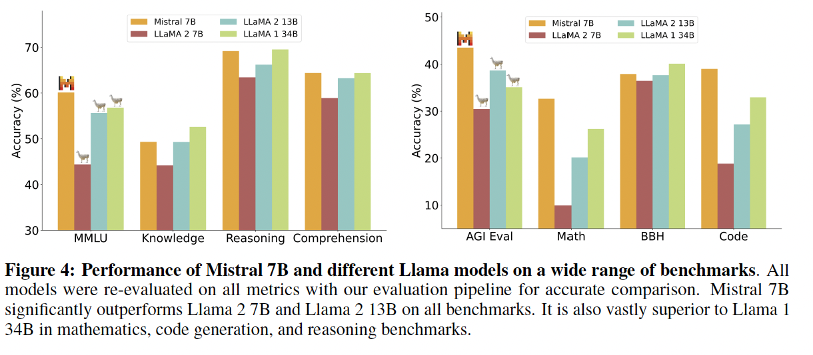
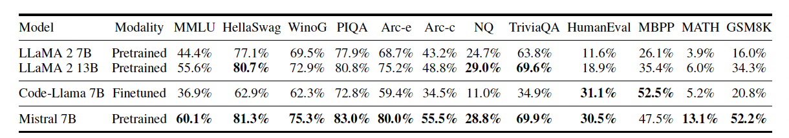

# Mistral 7B — 논문 리뷰

[🏠 Portfolio](https://github.com/heoneyzi) › [🤿 DeepDaiv.](../../../../README.md) › [Project](../../../README.md) › [NLP](../../README.md) › [Notes](../README.md) › [WIL](README.md) › **Mistral 7B**

> [!NOTE]
> Jiheon's personal study note (deep daiv. WIL — *What I Learned*) from the NLP period, kept in the original Korean.

#### Abstract

Mistral 7B은 7B의 개수의 parameter만을 이용해서 만들어진 language model로 Llama2-13B보다 benchmark에서 모든 평가가 좋았고, Llama1-34B보다 reasoning, mathmatics, code generation 부분에서 더 좋은 성능을 보여주었다. 더 적은 parameter 수를 이용했음에도 불구하고 말이다. Mistral 7B는 grouped-query attention(GQA)를 이용해 시간을 줄였고,  sliding window attention(SWA)를 이용해 시퀀스를 효과적으로 처리하였고 이를 통해 비용을 줄였다.

#### Introduction

Mistral은 효율적인 추론을 유지하면서도 높은 성능을 보여주면서, grouped-query attention(GQA)와 sliding window attention(SWA)를 동시에 이용하는 모델이다. GQA는 추론 속도를 높이고, 디코딩을 할 때 필요한 메모리를 줄여 실시간 어플리케이션에 더 큰 배치와 높은 처리량을 가능하게 함. SWA는 더 긴 시퀀스를 효과적으로 처리하도록 설계되어 LLM의 기본적으로 가지던 한계를 어느정도 줄여줄 수 있었다.

#### Architectural details

Vanila attention의 그림을 보면 시퀀스 길이에 따라 연산은 제곱으로 증가하며, 메모리는 토큰의 수에 linear하게 증가한다는 것을 알 수 있다. 이는 추론 시에는 지연 시간이 길어지게 만들고 자연스럽게 처리할 수 있는 양이 감소하게 된다. 이 문제를 해결하기 위해 SWA을 사용하였다. 그림과 같이 각 토큰은 이전 레이어에서 최대 W개의 토큰에만 attention을 진행하였다. 이 그림에서는 W=3일 때의 모습이다. 슬라이딩 윈도우 외부 토큰은 여전히 다음 단어 예측에 영향을 미치긴 한다. 각 attention layer에서 정보는 W 토큰만큼 앞으로 이동할 수 있기 때문에, k개의 attention layer 이후의 정보는 최대 k\*W 토큰만큼만 이동할 수 있다는 결론이 나오게 된다.

Mistral 7B은 parameter에 대한 요약한 표이다. Llama와 비교해보면 몇 가지 변화가 있었다.  Sliding Window Attention SWA는 transformer의 쌓인 레이어를 활용하여 window size W를 초과하는 정보에 attention이 이루어진다. layer k의 i번째에 있는 hidden states h_i는 이전 레이어에서 위치 i-W와 i사이에 있는 모든 hidden stats에 attention을 준다. h_i는 최대 W \* k 토큰까지 액세스를 할 수 있다고 위에서 말했고, 이는 마지막 레이어에서 W = 4096 크기의 window size를 사용하면 이론적으로 약 131K 토큰까지 attention이 가능하다는 말이 된다. 시퀀스 길이가 16K이고 W = 4096인 경우, Vanila attention 대비 2배의 속도 향상이 이루어진다고 한다.

#### Rolling Buffer Cache

위 그림에서 cache는 W=4를 갖는다. 위치 i에 대한 key, value는 cache의 위치 i를 W로 나눈 나머지 칸에 저장이 된다. 위치 i가 W보다 클 때, cache 내의 과거 값들은 덮어쓰기 된다. 가장 최근에 생성된 토큰에 해당하는 hidden state가 주황색으로 표시된다.

시퀀스 길이가 32K 토큰일 경우 모델 품질에 영향을 주지 않으면서 캐시 메모리 사용량을 8배까지 줄일 수 있다고 한다.

#### Pre-fill and Chunking

시퀀스가 길어지면서 메모리 사용량을 줄이기 위해서 cache를 채우는 동안에 chunk가 이루어진다. 위 그림의 경우 3개의 부분으로 나눠지는 것을 확인 할 수 있다. 현재의 the dog to go에 대해서 어떻게 진행되고 있는지를 보여준다. 또한 각각의 chunk마다 어떤 식으로 mask가 일어나는지 확인을 해보면, current 부분은 causal mask를 사용하고, cache 부분은 sliding window를 이용한다는 것을 알 수 있다.

시퀀스를 생성할 때 각 토큰은 이전 토큰에 따라 조건이 달라지기 때문에 토큰을 하나씩 예측해야 함 그러나 프롬프트는 미리 알고있으므로 cache에 프롬프트를 미리 채울 수 있다. 프롬프트가 크다면 작은 조각으로 나누고 각 조각으로 캐시를 미리 채울 수 있고, 이를 위해 window size를 청크 크기로 선택할 수 있다. 그러므로 각 chunk에 대해 attention를 계산해야 하고, 위 그림은 어떻게 attention mask가 이루어졌는지를 보여준다.

#### Result

위의 요약에서 말한 것처럼 LlaMA 13B에 대해서는 모두 우수한 성능을 보여준다는 것을 알 수 있다.

---
[← WIL index](README.md) · [Notes index](../README.md) · [💬 Persona chatbot project](../../README.md)
