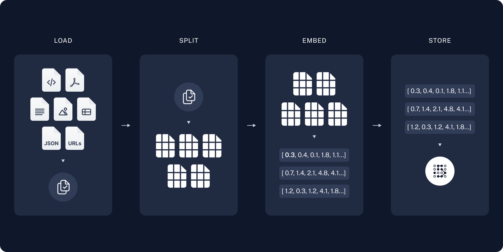
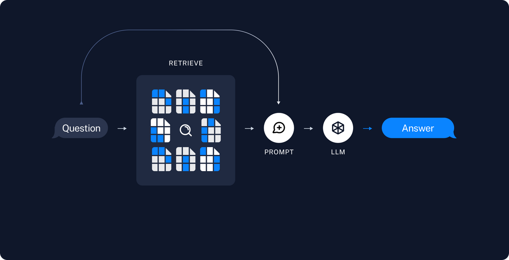
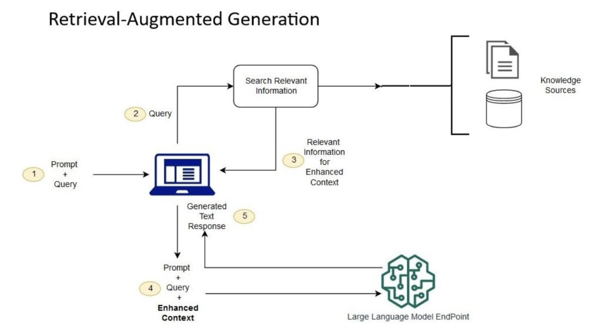

# RAG 간단 요약 및 이해

[🏠 Portfolio](https://github.com/heoneyzi) › [🤿 DeepDaiv.](../../../../README.md) › [Project](../../../README.md) › [NLP](../../README.md) › [Notes](../README.md) › [WIL](README.md) › **RAG**

> [!NOTE]
> Jiheon's personal study note (deep daiv. WIL — *What I Learned*) from the NLP period, kept in the original Korean.

RAG (Retrieval-Augmented Generation)은 NLP 분야에서 언어 모델의 기능을 향상시키기 위해 검색 시스템과 결합하는 방법인데, 이 접근법은 광범위한 외부 정보 소스에 의해 정보를 제공받아 응답이나 콘텐츠를 생성하는 데 특히 유용하다. 이 기술은 대규모의 정보 검색 데이터베이스로부터 정보를 검색하고, 이를 생성 모델에 통합하여 보다 정확하고 의미 있는 콘텐츠를 생성한다.

기본적으로 RAG는  대량의 외부 데이터 소스로부터 정보를 검색하는 검색 모듈과 생성 모델을 이용하여검색된 정보를 활용하여 새로운 콘텐츠를 생성하는 부분이다.

검색 모듈은 대규모의 데이터베이스나 웹 문서에서 검색된 정보를 가져온다. 이때 검색은 일반적으로 쿼리(질문)에 기반하여 진행되며, 이를 통해 정보 검색이 이뤄진다. 이 과정에서 검색된 정보는 보다 광범위하고 정확한 데이터베이스로부터 수집된다.

생성 모델은 검색된 정보를 활용하여 새로운 콘텐츠를 생성한다. 이 생성은 보강(Augmentation)과정과 함께 이루어진다. 검색된 정보가 생성 모델에 주입되어 이를 기반으로 풍부하고 의미 있는 내용이 생성되며, 이는 일반적으로 텍스트, 이미지, 또는 다른 형태의 미디어일 수 있다.

RAG는 다음과 같은 방법으로 이루어진다.

문서를 가지고 오고, 이를 분할하고 Parsing한다. 그 이후에 Dense Vector 형태의 Embedding을 진행하고, 나중에 Retrieval 단계에서 빠르게 검색해서 사용할 수 있도록 저장한다.

프로세스는 입력 query 또는 prompt를 받고, RAG를 활성화한다. 그리고 문서를 검색하는데, 검색 리스트를 활성화하고, query를 처리한 다음에 문서를 가져오는 방법으로 문서를 검색하여 retrieval할 수 있다.

문서를 가지고 왔으면 이를 통해 Information Augmentation을 해게 된다. 입력 query를 증강하기 위해서 Context Integration이 이루어지기도 한다. 이를 통해 Context Integration이 진행되는데, 이는 원래의 입력과 문서에 얻은 정보와 맥락을 합하는 과정을 말한다.

그리고 Language Model Generation이 이루어진다. 이는 언어 모델에서 답변이 만들어지는 과정이고, 이는 seq2seq의 모델에 공급이 됨으로써 응답이 만들어진다. 그리고 출력이 만들어지는데, 이는 프롬프트에 따라서 정제가 되거나 형식이 맞춰질 수 있고, 이를 output에 전달하는 과정을 거치게 되는 것이다.

RAG의 장점

이 기술은 주로 대화형 시스템, 자연어 생성 모델, 정보 요약 및 질의응답 시스템에서 활용된다. 사용자의 요청에 대한 정확하고 다양한 정보를 생성하는 데에 특히 유용하며, 이를 통해 정보의 품질과 다양성을 향상시키고 보다 효과적인 결과물을 제공할 수 있다는 장점이 있다.

RAG의 구현은 주로 검색 엔진 기술과 인공지능 생성 모델을 융합하는 방식으로 이루어진다. 검색 모듈은 검색 알고리즘을 사용하여 대량의 데이터 소스에서 정보를 검색하고, 생성 모델은 특정한 아키텍처와 학습 기술을 이용하여 검색된 정보를 활용하여 새로운 콘텐츠를 생성한다. 이러한 구현은 학습 데이터, 모델의 아키텍처, 및 검색 알고리즘 등을 효과적으로 조화시키는 것에 관한 연구와 개발이 진행되고 있다.

---
[← WIL index](README.md) · [Notes index](../README.md) · [💬 Persona chatbot project](../../README.md)
