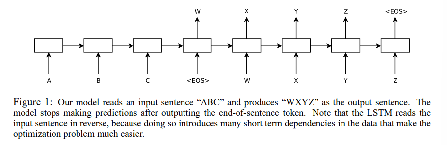
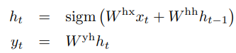
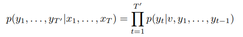
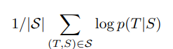
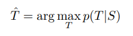
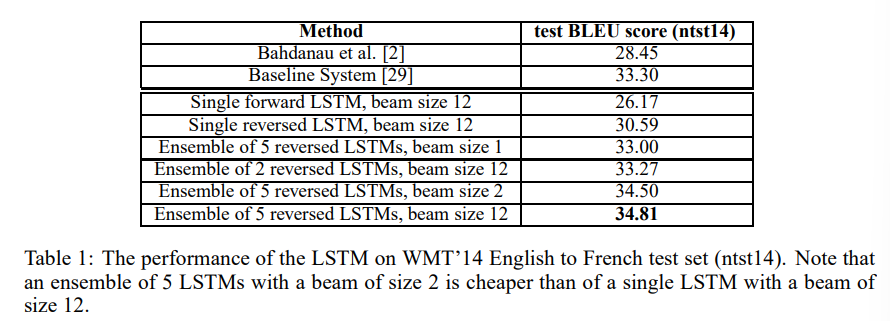
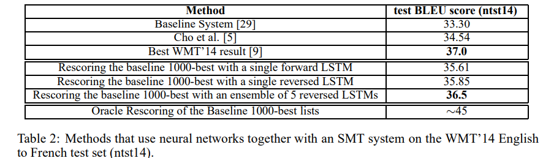
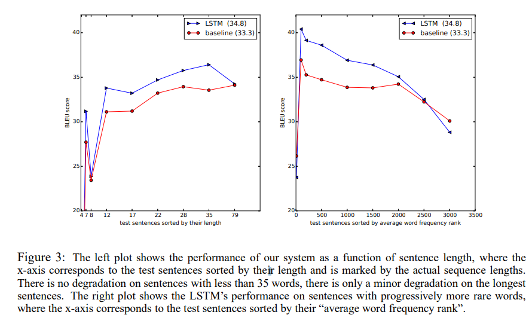
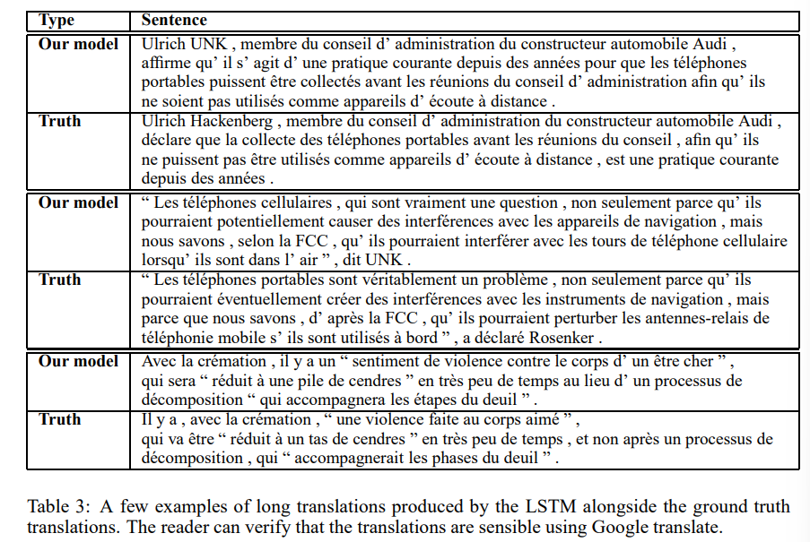
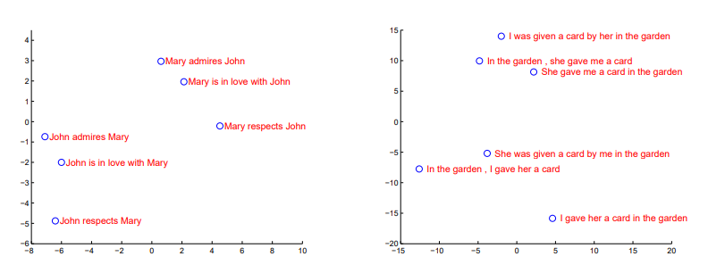

# Seq2seq — Sequence to Sequence Learning with Neural Networks 리뷰

[🏠 Portfolio](https://github.com/heoneyzi) › [🤿 DeepDaiv.](../../../../README.md) › [Project](../../../README.md) › [NLP](../../README.md) › [Notes](../README.md) › [WIL](README.md) › **Seq2seq**

> [!NOTE]
> Paper-review note kept under *WIL › NLP 논문* in Jiheon's deep daiv. workspace (NLP period); the page does not record its author. Kept in the original Korean.

### Abstract

DNN : 어려운 task들을 성취한 강력한 모델들임

multi layer LSTM 사용

- 인코더 : 인풋 ⇒ 고정된 벡터
- 디코더 : 고정된 벡터 ⇒ target sentence

사용 데이터셋 = WMT’14 Dataset

- 결과 : BLEU score = 34.8
- LSTM : 긴 문장에서 어려움 없었음 (점수 비슷했다고 보면 될듯)

↔ 구 단위로 토큰화한 SMT : BLEU score = 33.3

- SMT에 대해 LSTM rescore : BLEU score = 36.5
    = 이 task에서의 최상의 결과와 근접
- LSTM : 어순이 자연스러운 문장 익히게 됨
- source sentence 어순 바꿔서 넣으면 LSTM 성능 높아짐
    ⇒ 이렇게 함으로써 source와 target 사이의 많은 short term dependency가 도입되어 최적화 문제를 더 쉽게 할 수 있음

### 1. Introduction

#### DNN의 한계

- input과 target의 벡터가 고정되어 있어야만 사용 가능하다
- 이는 심각한 문제 : 보통 많은 문제들은 임의의 길이를 가지고 있음
    ⇒ 따라서 sequence끼리 연결하는 domain-independent한 방법이 필요

#### LSTM 두 개 사용 : 보편적인 seq2seq 문제 해결 가능

- 첫 번째 LSTM (encoder) : input sequence를 읽어서 하나의 vector 얻어내기
- 두 번째 LSTM (decoder) : vector로부터 output sequence 얻어내기

상당한 time lag가 존재하는 LSTM 특성상 long term dependency를 가진 dataset에 강한 모습을 가지기 때문에 위의 과정에 잘 어울린다.

<b>neural network에서 general sequence에 관한 문제를 정의하기 위한 여러 시도</b>

- Kalchbrenner와 Blunson : 전체 input sentence를 벡터로 환산하는 방법
- Graves : 새로운 attention mechanism : neural network들이 input의 다른 부분에 집중할 수 있도록 하는 메커니즘,
    ⇒ 이 아이디어의 다른 변이가 Bahdanau의 machine translation에 성공적으로 적용되었었음
- Connectionist Sequence Classification : neural network들의 seq2seq를 매핑하는 다른 유명한 기술
    → 근데 이건 input과 output 사이의 monotonic alignment에서 차이가 크게 없음

    \*monotonic alignment = n번째의 input에 대해 몇 번째의 output을 주목해야 하는지 계산하는 방식

#### 결과

- WMT’14 Eng → French 번역
    - LSTM 기반 BLEU score = 34.81
        ↔ SMT 기반 점수 = 33.30

        ⇒ 상대적으로 최적화되지 않은 small vocabulary neural network 아키텍처는 성능 개선을 위한 room이 더 많아 phrase를 기반으로 한 SMT 시스템에서 성능이 더 좋다
    - 같은 task에 대해 LSTM로 SMT를 rescore
        BLEU score = 36.5

        ⇒ 기존 최고 결과와 근접함 (37.0)

        ↔ 기존 점수 = 33.3
- LSTM은 기존의 관련 아키텍처에 비해 아주 긴 문장에서 큰 어려움이 없었음
    ⇒ <ins>**source sentences의 단어 순서들을 바꾸고, target sentence는 그대로 놔두었기 때문**</ins>

    ⇒ 최적화 문제를 만든 많은 short term dependency들을 도입 가능하게 됨

    ⇒ <b>이는 이 논문의 주요 기술 contribution 항목 중 하나임</b> 
- LSTM의 유용한 특성
    - 임의의 길이를 가진 input sentence를 고정된 길이의 vector로 mapping할 수 있음
        ⇒ translation들이 source sentence의 요약본이라는 점을 감안할 때, translation objective들은 LSTM이 문장 요약들의 의미를 가지도록 함

        ⇒ quality 평가가 이 주장을 지원 : 우리 모델이 단어 순서를 고려하고, 공평하게 active, passive한 voice들에 대해 불변함을 보여줌

### 2. The model

표준 RNN은 input sequence를 가지고 다음의 공식을 반복하며 output sequence 계산

RNN은 임의의 input, output의 alignment에 대해 쉽게 sequence끼리 mapping할 수 있음

⇒ 그런데 sequence 길이가 다르고 복잡하거나 단조롭지 않은 관계를 가지고 있다면 RNN 적용이 어려움

#### 해결

⇒ 한계점

> 💡 input sequence 하나를 하나의 RNN을 사용함으로써 하나의 고정된 vector로 mapping → 다른 RNN을 이용해 해당 vector를 target sequence로 mapping

⇒ 이론적으로는 RNN에 필요한 관련 있는 모든 정보가 있기 때문에 작동 가능

↔ long - term dependency 때문에 RNN을 훈련시키는 것이 어려울 수 있음

#### 원리 설명

- input sentence 길이 = T / 토큰 : x1, …., xT
- output sentence 길이 = T’ / 토큰 : y1, …, yT’

> ✅ input sequence (LSTM)
>
> ⇒ input last hidden state  == v (fixed probability) == output initial hidden state
>
> ⇒ output sequence (LSTM-LM)

⇒ \<EOS\> : 문장의 끝을 나타내기 위해 필요함

(문장의 길이가 일정하지 않기 때문에 끝을 나타내는 상징이 필요함)

#### actual model 과 위 설명과의 차이점

1. 두 개의 서로 다른 LSTM 사용
    ⇒ input을 위한 LSTM과 output을 위한 LSTM

    - number model parameter들을 적은 비용으로 증가시킬 수 있음
    - LSTM 훈련 시 여러 언어쌍을 동시에 사용 가능
2. 성능 면에서 깊은 LSTM이 얕은 LSTM을 가볍게 추월함
    ⇒ 4개의 layer를 가진 LSTM 사용
3. **input sentence의 순서를 바꾸는 것이 아주 가치있음을 발견**
    **⇒ a, b, c : ㄱ, ㄴ, ㄷ가 아닌**

    **c, b, a : ㄱ, ㄴ, ㄷ로 mapping**

    **⇒ 이 방법으로 a는 ㄱ에 / b는 ㄴ에 / c는 ㄷ에 제일 근접**

    <b>⇒ SGD가 input과 output 사이의 소통을 만들 수 있음</b> 

### 3. Experiments

WMT’14 Eng → French task에 논문의 method를 **두 가지 방식**으로 적용함

1.  input sentence를 참조 SMT system 사용하지 않고 직접 translate하도록 사용
2. SMT baseline의 n-best list rescore에 사용

(Intro에서 SMT와 비교한 LSTM 적용과 관련해 간략히 설명했던 내용 )

⇒ 두 가지 translate method의

- 정확성
- 샘플 translation
- sentence representation 결과를 시각화한 결과

소개할 예정

#### 3.1 Dataset Details

- 12M sentence로 model 훈련
    : “selected” 348M French + 304M English
- 데이터 선정 이유
    ⇒ baseline SMT에서의 training + test set 중 1000-best list 중 public availability를 고려

    보통 neural language는 각 단어의 벡터를 고려하는 반면, 논문에서는 양측 언어의 고정 vocabulary를 사용

    ⇒ source language의 사용 빈도가 높은 160,000개의 단어 + target language의 사용 빈도가 높은 80,000개의 단어를 사용

    ⇒ out-of vocab 모두는 특별한 “UNK” 토큰으로 대체되어 사용됨

#### 3.2 Decoding and Rescoring

**핵심은 크고 깊은 LSTM을 여러 문장쌍에 적용하는 것**

- training
    ⇒ source sentence S를 받았을 때 정확한 translation T의 log 확률을 극대화함으로써 훈련

- translate
    ⇒ LSTM에 기반해 가장 그럴듯한 translation을 찾음

    

    left-to-right beam search decoder를 사용함으로써 가장 자연스러운 translation을 제공

     각 timestep에서 각각의 부분적인 가설들을 beam에서 확장

    ⇒ 모델의 로그 확률에 따라 가장 가능성이 높은 가설인 B만 남긴 채로 모두 버릴 수 있음

    \<EOS\>가 가설에 추가되는 순간 beam에서 제거되고 완성 가설 set에 추가됨

    ⇒ 이 decoder가 approximate하지만, implement하기도 쉬움

    ⇒ 신기하게 해당 시스템은 1 사이즈의 beam에서도 잘 작동함

    ⇒ 2사이즈의 beam은 beam search의 대부분의 이점을 제공

**LSTM을 1000개의 best list들을 rescore하기 위해서도 사용함**

n-best list를 rescore하기 위해서

- 로그 가능성의 모든 가설들을 LSTM으로 계산해야 함
- 그들의 점수와 LSTM 점수의 even average를 택함

#### 3.3 Reversing the Source Sentences

LSTM이 long term dependency를 가진 문제 해결에 용이하지만

**LSTM은 source sentence의 순서가 바뀌었을 때 훨씬 성능이 좋다는 것을 발견**

⇒ LSTM의 test perplexity 감소 : 5.8 -\> 4.7

⇒ BLEU score 증가 : 25.9 -\> 30.6

이 현상에 대해 완벽한 설명을 할 수는 없지만,

**데이터셋에 대한 many short term dependency 때문에 유발되었다고 생각 가능**

보통 source sentence에 target sentence를 이을 때,

source sentence의 각 단어는 target sentence에서의 상응하는 단어와 매우 다름

⇒ 문제 발생 : 큰 "minimal time lag" 발생

⇒ 해결 :

- **source sentence의 어순을 바꿈으로써** source와 target language의 상응하는 단어들 사이의 평균 거리는 당연히 바뀌지 않음
- 하지만 source language의 첫번째 몇 개의 단어들은 target language의 첫 번째 몇 개의 단어들과 매우 근접해짐
    ⇒ 문제점이었던 minimal time lag는 아주 크게 감소됨

⇒ backpropagation은 source와 target 사이에서 “establishing communication” 하는 것이 쉬워짐

⇒ 전체적인 성능 개선

input sentence 순서를 바꾸는 것이 다음의 결과를 유도할 것이라고 예측

- target sentence의 초기 파트에서의 예측 결과에 대한 확신
- 후기 파트에서의 예측 결과 하락

⇒ 하지만 순서가 바뀐 source sentence를 학습한 LSTM들은 그렇지 않은 모델보다 긴 문장에서 훨씬 성능이 좋았음

⇒ 전자가 메모리 사용에 있어서 훨씬 낫다는 것을 알 수 있었음

#### 3.4 Training Details :

LSTM이 상당히 훈련하기 쉽다는 것을 알 수 있었음

- 4개의 layer를 가진 깊은 LSTM을 사용
    : (각 층 당 1000개의 cell +1000개의 word embedding ) + input vocab 160,000개 + output vocab 80,000개

    ⇒ 따라서 깊은 신경망의 LSTM은 문장 표현을 위해 8,000개의 실수를 사용
- 깊은 LSTM이 얕은 LSTM을 현저히 압도 : 각 추가적인 layer들은 perplexity를 10%에 임박하게 감소함 (더 큰 hidden state 때문일 것으로 추정)
- naive(??)한 softmax를 사용
    : 각 output에 대해 80,000개가 넘는 단어를 사용

    ⇒ 결과적으로 LSTM은 384M parameter를 가짐

    (여기서 64M은 단순히 recurrent connection (32M encoder , 32M decoder LSTM))

#### 3.5 Parallelization

하나의 GPU로 구성 깊은 LSTM에 대한 C++ implement는 대략 초당 1700개 단어 생성

⇒ 의도와 맞지 않게 너무 느림

⇒ 8-GPU machine을 사용함으로써 병렬화

- LSTM의 각 layer에는 다른 GPU가 사용됨
- 각 layer가 계산됨과 동시에 다음 GPU (layer)로 결과 이동

해당 논문에서는 4개의 LSTM layer를 이용 : 각각 다른 GPU를 사용함

4개의 GPU는 softmax를 병렬화하기 위해 사용

⇒ 각각의 GPU는 1000 x 2000 행렬로 증폭

⇒ 결과적으로 Eng, French 모두 128 사이즈의 minibatch에서 초당 6,300개의 속도, 10일 정도가 걸림

#### 3.6 Experimental Results

translation의 퀄리티 평가에 cased BLEU score 사용

⇒ BLEU score는 토큰화된 예측과 ground truth에  multi-bleu.pl을 이용

⇒ 이 방식은 33.3의 결과가 나옴

하지만 이 방법으로  WMT'14 시스템 평가 시 37.0의 결과를 얻을 수 있음

⇒ 예측 사이트에서 보고된 수치인 35.8보다 높음

**결과**

최고의 결과는 랜덤한 초기화, minibatch의 랜덤한 순서가 다른 LSTM의 앙상블을 통해 얻을 수 있음

- LSTM 앙상블이 WMT’14 시스템의 최고 성능 (37.0)을 능가하진 않음
- neural translation system이 phrase를 기반으로 한 SMT baseline을 큰 스케일의 MT task에서 능가하는 것은 처음임
    (out-of vocab를 다룰 수 없다는 결점을 고려했을 때)

 baseline system의 1000-best list를 rescore하는 데에 사용되었을 때

SOTA 모델과 0.5점 이내의 차이를 가짐 

#### 3.7 Performance on long sentences

LSTM이 긴 문장에서 성과가 좋았음

- 왼쪽 그래프 : 문장 길이의 함수로 시스템의 성능을 보여줌
    - x축 : 길이별로 정렬된 테스트 문장, 실제 sequence 길이로 표시됨
    - 35단어 미만의 문장에서는 성능저하가 없음
    - 가장 긴 문장에서 약간의 성능 저하 존재
- 오른쪽 그래프 : 희귀한 단어가 포함된 문장에서의 LSTM의 성능
    - x축 : 평균 단어 빈도 순위로 정렬된 test sentence

**예시 (긴 문장 ⇒ translation)**

#### 3.8 Model Analysis

모델의 또 다른 하나의 매력적인 특성은 단어 sequence들을 하나의 벡터로 전환할 수 있다는 점

⇒ figure2는 우리가 획득한 것들을 시각화함

⇒

- 단어 순서에 매우 민감함
- active voice (능동태)가 passive voice (수동태)를 대체하는 것에 대해서는 민감하지 않음

### 4. Related work

### 5. Conclusion

- input sentence를 뒤집어서 학습할 때 성능이 높아짐
- 긴 문장에서도 잘 학습됨을 확인할 수 있었음

---
[← WIL index](README.md) · [Notes index](../README.md) · [💬 Persona chatbot project](../../README.md)
