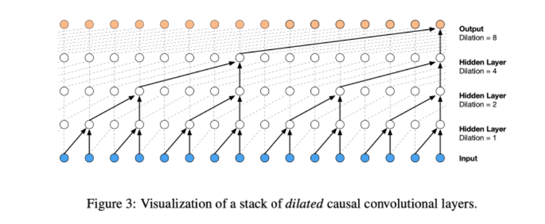
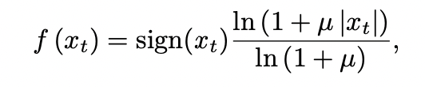
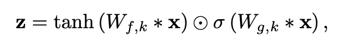
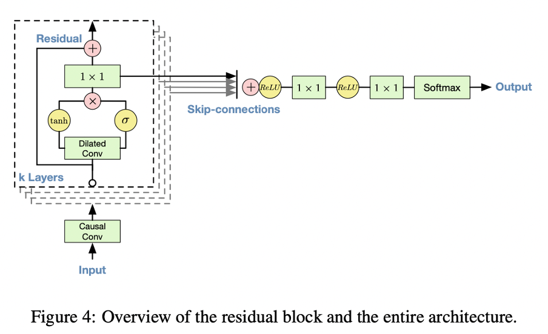
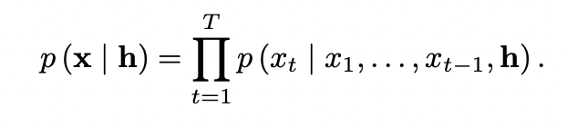
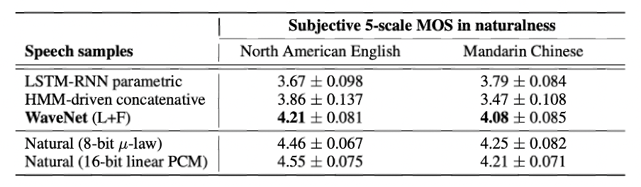

# WaveNet 간단 리뷰

[🏠 Portfolio](https://github.com/heoneyzi) › [🤿 DeepDaiv.](../../../../README.md) › [Project](../../../README.md) › [NLP](../../README.md) › [Notes](../README.md) › [WIL](README.md) › **WaveNet**

> [!NOTE]
> Jiheon's personal study note (deep daiv. WIL — *What I Learned*) from the NLP period, kept in the original Korean.

WaveNet은 음성신호를 잘 예측하고, 이를 통해 높은 수준의 목소리를 생성하게 해준 모델이다. 음성파일을 통해 목소리를 생성하는 원리는 계속 확대를 하여 주파수와 같은 이미지를 잘 샘플로 추출해서 만들 수 있다. 논문에서는 1초의 소리 속에서 16000개의 샘플을 만들었다고 한다.

모든 데이터를 다 layer에 넣어 진행하기는 너무나 많은 data가 있으므로 convolution을 이용해야 하는데, 미래의 데이터는 보지 못하도록 masked convolution을 이용하는데, casual convolution을 이용하였다. 이는 너무 많은 샘플이 있기에 중간중간 layer마다 스킵을 해서 만드는 형태이다. 이를 통해 더욱 효율적인 convolution이 가능해진 것이다.

Softmax Distribution

위는 논문에서 사용한 softmax distribution이다. 오디오 샘플을 나누기 위해서 사용되었다. 이는 본래 사용하는 gausian 방법보다 더 좋은 결과를 보여주었다고 한다. 16bit의 오디오가 크기 때문에 8비트로 줄여 사용하였다. 이는 그냥 단순한 linear quantization보다 좋은 결과를 가지고 왔다고 한다.

Gated Activation Unit

보통 활성화 함수를 RELU를 이용하는데, 이는 tanh에 sigmoid 함수를 곱함으로 RELU보다 더 좋은 성능을 보였다고 알려준다.

Parameterized Skip Connection

네트워크는 다음의 그림과 같다. Residual을 이용해 성능을 높였고, 또한 parameterized skip connection을 이용함으로써 수렴속도도 빨라지고, 모델의 깊이까지 더했다.

 Conditional WaveNets

웨이브넷에도 additional input를 넣어서 컨디션을 걸 수 있는데, 새로운 입력에 대해 global conditioning과 local conditioning인 2가지 방법으로 모델에 변화를 주기도 하였다. 먼저 global conditioning은 모든 타임스텝에 하나의 h을 사용할 수 있다는 것이다. 또한 local conditioning 은 타임스텝별로 h를 변경할 수도 있다는 것이다.

같이 비교한 모델은 LSTM-RNN을 사용한 parametric 모델\[Zen16\]과 HMM을 사용한 concatenative 모델\[Gonzalvo16\]이다. 구글의 TTS 스피치 데이터베이스를 이용하여 확인하였다. TTS이기에 linguistic features가 필요하고 F_0도 이용하여 훈련하였고, receptive filed size는 240ms이다. HMM과 LSTM-RNN모델을 만들어서 비교하였고, 퀄리티 테스트는 subjective paired comparison tests와 mean opinion score을 이용하였는데, 결과는 다음과 같이 더욱 우수하게 측정이 되었다.

---
[← WIL index](README.md) · [Notes index](../README.md) · [💬 Persona chatbot project](../../README.md)
