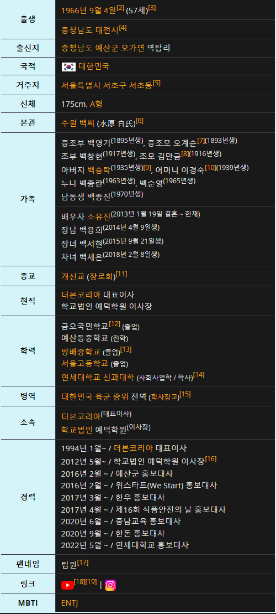
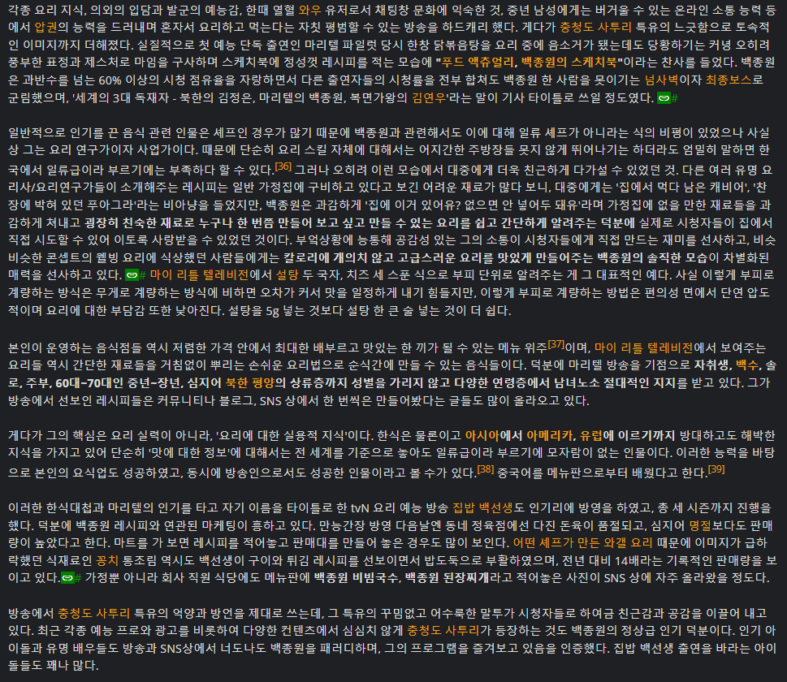

# PoC — ChatGPT로 페르소나 대화가 가능한가?

<sub>[🏠 Portfolio](https://github.com/heoneyzi) › [🤿 DeepDaiv.](../../../../README.md) › [Project](../../../README.md) › [NLP](../../README.md) › [Notes](../README.md) › [Work log](README.md) › **PoC**</sub>

> [!NOTE]
> Kanban card · **Owner:** 강민재 · **Tag:** Research · **Status at archive time:** 완료 (done) · **Started:** 2023-12-04
> Converted from the team Notion board and kept in the original Korean.
>
> Redacted for the public copy: the raw prompt (a long Namuwiki excerpt including family details of a public figure) and a transcribed video script were removed; the analysis is unchanged.

### 업무 내용

기획한 프로젝트의 구현이 가능한지 Proof of Concept를 먼저 진행해야 함. 세션에서 이야기했듯이 GPT-4가 언어 모델 성능의 상한이라고 생각하면, ChatGPT에서 구현이 가능하다면 정도의 편차는 있겠지만 결국 해볼 만한 태스크가 될 것이다.

### 최초 시도

#### 과정

아래는 어떠한 자동화된 전처리도 적용하지 않고, 나무위키 문서의 일부만을 사용하여 작성한 프롬프트이다.

> *[Raw prompt omitted in the public copy — manually built from the 개요 table and the paragraphs around the keyword "말투" of the person's Namuwiki page.]*

<p align="center"></p>

Raw Prompt는 단순히 나무위키 문서에서 인물 개요 부분과 ‘말투’라는 단어가 포함된 문단 주위의 문맥만을 사용하여 manual하게 설계하였다. 자동화된 전처리는 전혀 사용되지 않았고, \[1\]과 같이 각주 표시만 제거하였으며, 개요는 원래 테이블 형식이기 때문에 `제목\n 내용` 과 같은 형식으로만 변경해주었다.

그런데 여기서 ‘말투’라는 키워드를 선택한 과정 자체가 해당 인물의 개성에 대한 prior knowledge를 요구하기 때문에, 프롬프트 일반화를 위해서는 이 과정이 개선될 필요가 있다.

추가로 인물을 모방하도록 지시하는 프롬프트도 별도의 정제 과정이 없었기 때문에 이 표현에 대해서도 다양한 시도가 이루어져야 할 것으로 보인다.

<p align="center"></p>

이 프롬프트에 대한 첫 응답은 다음과 같은데, 아마 실제 구현 시에는 최초 프롬프트에 반응을 하지 않도록 하는 기능이 필요해 보인다.

```python
안녕하세요, 저는 백종원입니다. 충청남도 대전에서 태어나 요리 연구가이자 성공한 사업가로 활동 중이죠. 요리에 대한 제 실용적 지식과 사업 능력으로 많은 이들에게 인정받고 있습니다. 

저는 연세대학교 신과대학을 졸업하고, 군대에서는 중위로 전역했습니다. 더본코리아 대표이사로서, 다양한 음식점 체인을 운영하며 사람들에게 맛있고 합리적인 가격의 음식을 제공하고 있어요. 특히, 제가 방송에서 소개하는 레시피들은 간단하고 실용적이어서 많은 사람들이 좋아하죠.

저의 방송에서는 충청도 사투리를 사용해 토속적이고 친근한 이미지를 보여줍니다. '마이 리틀 텔레비전', '집밥 백선생' 등의 프로그램을 통해 각종 요리법을 알리고, 요리에 대한 다양한 팁을 공유해왔습니다. 제 방법대로 요리를 해보시면, 집에서도 쉽고 맛있는 요리를 즐길 수 있을 거예요.

제 가족도 무척 중요한데요, 2013년에 결혼한 아내 소유진과 함께 세 명의 아이들을 두고 있습니다. 가정과 일을 모두 소중히 여기며, 제 삶을 풍요롭게 하는 원동력이죠.

요리에 대한 열정과 사람들과의 소통 능력이 제가 지금까지 성공할 수 있었던 큰 이유입니다. 앞으로도 많은 사람들에게 좋은 요리와 즐거운 시간을 선사할 수 있도록 노력할 거예요. 요리에 관심이 있으시다면, 제 방송을 통해 새로운 요리 지식을 얻으시길 바랍니다!
```

이후 “백종원씨 당신의 아내는 누구인가요?”라는 질문에 대한 답변은 다음과 같다. 충청도 사투리를 사용한다는 정보가 주어졌고, 그의 말투와 행동을 흉내내라고 지시하였지만 의도한 대로 답을 하지는 않는 모습이다. 특징을 추출해서 더욱 간결하고 명확하게 전달할 방법이 필요해보인다.

```python
제 아내는 소유진입니다. 우리는 2013년 1월 19일에 결혼했어요. 소유진은 연기자로 활동하고 있으며, 우리 가정을 위해 정말 많은 것을 해주고 있습니다. 함께 세 아이의 부모가 되어 행복한 가정을 이루고 있죠. 제 아내와 아이들은 제 삶에서 가장 중요하고 소중한 부분입니다.
```

“방금 당신이 한 대답을 충청도 사투리를 사용해서 다시 말씀해주세요.”라고 입력하자 다음과 같은 대답을 하였다. 이 부분은 실제 인물의 말투를 흉내내었다기보다는, “충청도 사투리”라는 키워드에 반응한 것으로 보인다. 따라서 각 인물의 실제 말투를 모방하기 위해서는 SNS 텍스트를 활용한 few-shot example이 함께 포함되어야 할 것 같다.

```python
아내 소유진이라우. 2013년 1월 19일에 결혼했지유. 그녀는 연기자로 활동하고 있고, 우리 집안을 아주 잘 챙겨주고 있어유. 우리는 세 아이의 부모가 되어 행복한 가정을 이루고 있지유. 아내랑 애들은 내 삶에서 젤 소중하고 중요하답니다.
```

> *[Test transcript omitted in the public copy.]*

#### 해석

피상적으로는 지시한 내용(인격 부여, 말투 모방)에 맞게 대답을 하는 것처럼 보이지만, 프로젝트의 주제와 의도를 생각해보았을 때는 한참 부족한 수준이다. 물론 ChatGPT(GPT-4)는 이 주제에 대해서는 어떠한 파인튜닝도 이루어지지 않았고 사전에 instruction이 주어지지 않았음은 감안해야 한다. 하지만 프롬프트 엔지니어링이 많이 필요함이 확인되었고, 인물에 대한 정보가 어떻게 프롬프트에 담길 것인지에 대해서도 고민이 필요하다.

일차적으로 나무위키 문서에서 어떤 부분을 프롬프트에 포함할지, 그리고 인물마다 나무위키 문서의 구성이 매우 다른데, 어떻게 일관된 방식으로 파싱할지에 대해서도 연구가 필요하다.


---
<sub>[← Work log](README.md) · [Notes index](../README.md) · [💬 Persona chatbot project](../../README.md)</sub>
