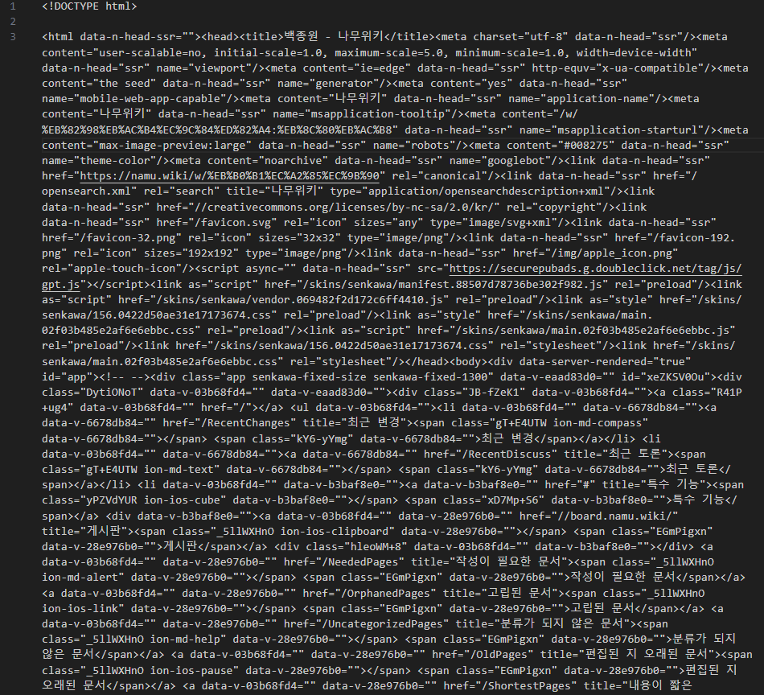

# 나무위키 크롤링 — 동적 vs 정적 크롤링

<sub>[🏠 Portfolio](https://github.com/heoneyzi) › [🤿 DeepDaiv.](../../../../README.md) › [Project](../../../README.md) › [NLP](../../README.md) › [Notes](../README.md) › [Work log](README.md) › **Namuwiki crawling**</sub>

> [!NOTE]
> Kanban card · **Owner:** 강민재 · **Tag:** Data · **Status at archive time:** 개발 중 (superseded by the PDF-upload approach) · **Started:** 2023-12-03
> Converted from the team Notion board and kept in the original Korean.

### 업무 내용

인물에 대한 정보를 프롬프트에 담기 위해서는 어떤 데이터에 접근한 후 의도한 방식으로 전처리를 수행해야 한다. 이 과정은 항상 일관적으로 수행되어야 하고, 사용할 데이터 소스는 나무위키와 SNS 텍스트(인스타그램, 트위터)로 결정하였다.

이 중 먼저 나무위키 문서를 크롤링하는 기능을 구현한다.

#### 동적 크롤링

`selenium`을 사용한 동적 크롤링은 웹 페이지에서 원하는 부분만 크롤링하거나 interactive하게 크롤링을 할 수 있다는 장점이 있다.

그런데 서치를 해본 결과 나무위키는 2010년대 후반부터 dump파일을 허깅페이스를 통해 제공해왔고, 동적 크롤링이 어렵도록 의도적으로 복잡하게 태그를 구성했다고 한다. (이 부분에 대해서는 조금 더 검증이 필요함) 나무위키의 장점은 빠른 업데이트라고 생각하는데, 고정된 데이터셋의 경우 어떤 인물에 대한 묘사를 다이나믹하게 수행해내지 못할 것이라는 생각이 들어, 크롤링이 필요할 거라고 생각했다.

실제로 `table` 태그에 사용된 클래스 id 등이 문서마다 달라서 일관된 방법으로 동적 크롤링을 하는 게 쉽지 않다고 느껴졌다. 정규식을 사용하면 구현이 가능하긴 할텐데, 이 부분은 반드시 동적 크롤링이 필요하다고 생각될 경우 추가로 연구해봐야 할 것 같다.

#### 정적 크롤링

`urllib`와 `BeautifulSuop`를 사용하는 방법이다. 이 방식은 동적 크롤링에 비해 속도가 빠르고 간편하지만, 먼저 웹 페이지의 html 소스를 전부 다 가져온 후 필요에 따라 추가적인 전처리가 조금 복잡하게 수행되어야 한다. (bs에 대해 자세히는 몰라서 selenium처럼 사전에 지정된 부분만 가져올 수 있는지 확인 필요, 그런데 태그를 통해 구분한다면 그 복잡도 면에서는 차이가 없을 거 같음)

단순히 requests 모듈이나 urlopen만을 사용하면 액세스가 거부되는 문제가 있어 임의로 reqeust header를 추가해주었다. 예상되는 예외 상황은 존재하지 않는 문서에 접근하는 상황 뿐이지만, 크롤링은 변수가 정말 많기 때문에 일단 일반적인 예외를 처리할 수 있도록 해주었다.

```python
import os
import urllib.parse
from urllib.request import Request, urlopen
from urllib.error import HTTPError

from bs4 import BeautifulSoup

base_url = "https://namu.wiki/w/"
test_entity = ""
test_url = os.path.join(base_url, urllib.parse.quote(test_entity))
req = Request(test_url, headers={
    "User-Agent": "Mozilla/5.0 (Windows NT 10.0; Win64; x64) AppleWebKit/537.36 (KHTML, like Gecko) Chrome/58.0.3029.110 Safari/537.3"
})

try:
    html = urlopen(req)
    bsObject = BeautifulSoup(html, "html.parser")

    with open("output.txt", "w", encoding="utf-8") as file:
        file.write(str(bsObject))
except HTTPError as e:
    if e.code == 404:
        print("Error 404: Not Found")
    else:
        print("HTTP Error:", e)
except Exception as e:
    print(e)
```

html 문서가 너무 길어서 주피터 커널에 출력하면 렉이 걸려서 텍스트 파일로 저장한 후 확인하였다.

```python
with open("output.txt", "w", encoding="utf-8") as file:
    file.write(str(bsObject))
```

<p align="center"></p>

#### TODO

**html 문서 전체를 가져오는 것은 쉽게 가능하지만, 여기서 필요한 정보를 어떻게 추출하고 전처리할 지에 대해서는 추가적인 논의가 필요!**


---
<sub>[← Work log](README.md) · [Notes index](../README.md) · [💬 Persona chatbot project](../../README.md)</sub>
