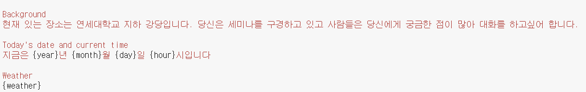
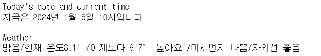
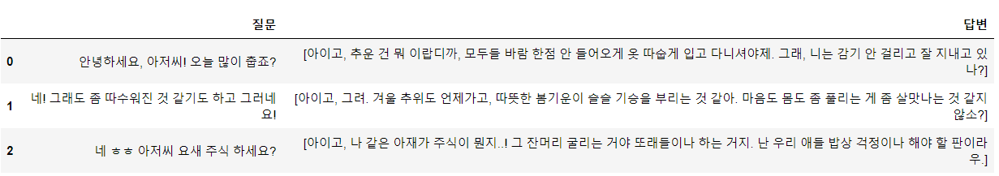
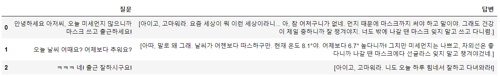
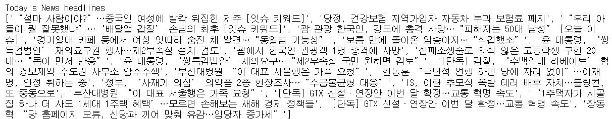
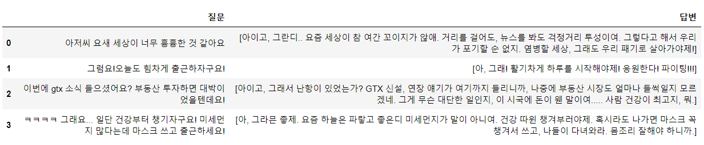

# 날짜 · 날씨 · 뉴스 정보 입력 — 실시간 맥락 주입

[🏠 Portfolio](https://github.com/heoneyzi) › [🤿 DeepDaiv.](../../../../README.md) › [Project](../../../README.md) › [NLP](../../README.md) › [Notes](../README.md) › [Work log](README.md) › **Date/weather/news context**

> [!NOTE]
> Kanban card · **Owner:** 장윤경 · **Tag:** Prompt Engineering · **Status at archive time:** 완료 (done)
> Converted from the team Notion board and kept in the original Korean.

#### 날짜, 날씨 정보 입력

> 🧸 날씨 정보를 입력했더니 날씨에 대한 정보를 잘 출력함

#### 날짜, 날씨, KBS 뉴스 헤드라인(Top20) 입력

---
[← Work log](README.md) · [Notes index](../README.md) · [💬 Persona chatbot project](../../README.md)
