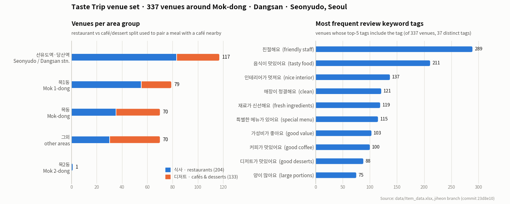
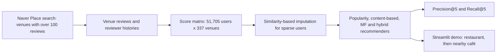

<sub>[🏠 Portfolio](https://github.com/heoneyzi) › [🤿 DeepDaiv.](../../README.md) › [Project](../README.md) › **R.S · Taste Trip**</sub>

<div align="center">

# 🍜 Taste Trip — a restaurant → café route recommender

**From a handful of ratings, which local restaurant should a visitor try — and which café nearby should come next?**

   

[💻 Code (GitHub)](https://github.com/heoneyzi/Taste_Trip_Recommender-System) · [🗂️ Code snapshot](code/README.md) · [📓 Crawling & paper notes (KR)](notes/README.md) · [📰 Newsletter #96 on recommenders](https://stib.ee/ny5I)

</div>

> [!TIP]
> **TL;DR** — The team crawled Naver Place reviews for **337 venues** around Mok-dong and Dangsan/Seonyudo in Seoul (204 restaurants, 133 cafés/dessert shops) plus the review histories of their most active reviewers, built a **51,705-user × 337-venue** score matrix, filled sparse users by similarity-based imputation, and implemented popularity, content-based (word2vec tag/category vectors), matrix-factorization and hybrid recommenders scored with Precision@5 / Recall@5. A Korean Streamlit prototype takes six quick ratings, then walks the user from a recommended restaurant to a café in the same area. The historical scores were not archived and have not been reproduced, so no accuracy is claimed.

<details>
<summary><b>🇰🇷 한국어 요약</b></summary>

목동·당산·선유도 일대에서 "밥 먹고 어느 카페를 갈까?"까지 한 번에 골라 주는 지역 맛집·카페 추천 시스템을 만든 deep daiv. 추천시스템 트랙 프로젝트입니다. 네이버 플레이스에서 리뷰가 많은 가게 337곳(식사 204곳, 디저트 133곳)과 그 가게 리뷰어들의 다른 리뷰 이력을 Selenium으로 수집해, 51,705명 × 337곳의 사용자-가게 점수 행렬을 만들었습니다. 리뷰가 1~4개뿐인 사용자는 비슷한 가게의 점수를 채워 넣는 방식(유사도 기반 대치)으로 희소성을 줄였고, 인기도 기반·콘텐츠 기반(리뷰 키워드/카테고리 word2vec 벡터)·행렬 분해(MF)·하이브리드 추천을 Precision@5/Recall@5로 평가하도록 구현했습니다. 비유하자면 "나와 입맛이 비슷한 단골들이 자주 간 집"(협업 필터링)과 "내가 좋아한 가게와 분위기·메뉴가 닮은 집"(콘텐츠 기반)을 함께 보는 셈입니다. 저는 팀장으로서 3단계 크롤러(가게 → 리뷰 → 리뷰어 이력)를 만들고 태그 수집 방식을 바꿔 실행 시간을 9분 20초에서 약 4분 20초로 줄였으며, 코드를 GitHub에 정리해 공개했습니다. 당시의 평가 점수는 남아 있지 않아 성능 수치는 주장하지 않습니다.

</details>

| | |
|---|---|
| **Period** | Summer 2024 (crawling notes include photos dated 12 Aug 2024) · code published to GitHub Apr 2025 · restored with provenance docs Sep 2026 |
| **Team** | deep daiv. recommender-systems team — **Jiheon Kang (Team Lead)**; the other members are not named in the archived sources |
| **My role** | **Team Lead** — *Local restaurant recommendation system development (Recommendation Systems, Data Preprocessing)*. Built and documented the Naver Place crawler; published and maintains the code archive |
| **Stack** | Python · Selenium · pandas / openpyxl · PyTorch · scikit-learn · SciPy · word2vec tag/category vectors · Streamlit · Altair |
| **Status** | ✅ Completed — research archive (no trained checkpoint, no reproduced benchmark) |

<p align="center"><picture>
  <source media="(prefers-color-scheme: dark)" srcset="assets/dataset_overview_dark.png">
  
</picture></p>
<p align="center"><sub>Figure: the venue set — venues per area group (the restaurant/café split drives the "meal → café nearby" pairing) and the most frequent Naver review keyword tags. Computed from <code>data/Item_data.xlsx</code> in the public <code>jiheon</code> branch with <a href="assets/make_dataset_overview.py">assets/make_dataset_overview.py</a>.</sub></p>

## 🧭 Why it matters

Map apps rank places one at a time, but a day out is usually a *pair* — a meal and then a café nearby. Taste Trip treats that pairing as the product: recommend a restaurant, then a café in the same area.

Two classic recommender ideas are combined. **Collaborative filtering** learns from other people ("users who liked what you liked also went to…"), here via **matrix factorization**, which compresses the sparse user–venue table into small taste vectors. **Content-based filtering** compares the venues themselves — their review keyword tags ("음식이 맛있어요", "인테리어가 멋져요") and categories — so it still works for a brand-new user after a few ratings. With 1.6% of the matrix filled, sparsity is the central problem.

## 🛠️ Approach



- **Crawling (Selenium):** search results → venue URLs (kept if the listing shows more than 100 reviews) → each venue's visitor reviews (nickname, text, date, revisit count, keyword tags, reviewer's review count) → the full review history of reviewers with more than 200 reviews, so the matrix links venues through shared people ([notes](notes/02_crawling_pipeline.md)).
- **Venue features:** top-5 review keyword tags (37 distinct) and one of 66 categories per venue, embedded as precomputed 100-dimensional word2vec vectors.
- **Imputation:** users with 1–4 scored venues receive scores for the most similar venues (4 / 2 / 1 neighbours per scored venue); the imputed score is *r·sim* when the original score *r* ≥ 2.5 and *5 − (5 − r)·sim* otherwise.
- **Demo:** three buttons (별로예요 2.0 · 괜찮아요 3.5 · 꼭 가고 싶어요 5.0) for six seed venues → four restaurant picks → four cafés whose area group matches the chosen restaurant → both venues with address and link.

## 🔬 Experiments & results

| # | Question | Setup | Result | Code |
|---|---|---|---|---|
| 1 | What does a no-personalisation baseline give? | Popularity: sum of scores per venue, the same top-5 for everyone | Precision@5 / Recall@5 printed at run time — not archived | [`PopRec.py`](code/model/PopRec.py) |
| 2 | Can tags and categories describe a person's taste? | User vector = Σ (rating − 2.5) × tag / category vectors of six rated venues; rank by 0.5·cos(tags) + 0.5·cos(category) | Interactive ranking; script has an undefined-name bug (see code README) | [`Contents_Based_flitering.py`](code/model/Contents_Based_flitering.py) |
| 3 | Do latent factors capture shared taste? | MF: 10-d user/venue embeddings, MSE, Adam (lr 0.01), 10 epochs; per-user 80/20 split | Precision@5 / Recall@5 printed at run time — not archived | [`Matrix_Factorization.py`](code/model/Matrix_Factorization.py) |
| 4 | Do hybrids beat either side? | model1: CBF shortlists → MF ranks · model2: MF shortlists → CBF re-ranks · model3: weighted MF + CBF scores (per commit messages) | Evaluation path scores the MF recommender only (see scope notes) | [`model1–3.py`](code/model/) |
| 5 | Can sparse users be densified? | Similarity-based imputation over a 337 × 337 venue-similarity matrix | Produces the `*_with_imputation` matrix used downstream | [`imputation.py`](code/preprocess/imputation.py) |

**Dataset figures** (aggregate counts, public `jiheon` branch, commit `23d8e10`): `Item_data.xlsx` — 337 venues (204 식사 / 133 디저트), 66 categories, 37 distinct top-5 tags, 5 area groups · `final_user_item_matrix_with_imputation.csv` — 51,705 users with at least one score (+ the `DEMO_USER` row), 275,275 non-zero scores (1.58% dense), median 5 per user · `final_train_data.csv` / `final_test_data.csv` — 228,731 / 55,561 rows.

## 🙋 My contribution

- **Led the team** (CV: Team Lead — local restaurant recommendation system; recommendation systems, data preprocessing).
- **Built the three-stage Naver Place crawler** and wrote it up ([study note](notes/01_web_crawling_study.md), [pipeline note](notes/02_crawling_pipeline.md)): merged the venue → review → reviewer-history scripts through Excel hand-offs and replaced a per-review `try/except` tag-expansion click with a check for the "+" marker, cutting his test run from **9 min 20 s to about 4 min 20 s** (1 min 40 s without tag expansion at all).
- **Studied the recommender literature** — [Wide & Deep](notes/03_wide_and_deep.md) (memorization vs generalization, joint training).
- **Published and maintains the code archive** — all 18 commits of the public repository are his (Apr 2025 upload "initial code from daiv project"; Sep 2026 restoration with portable paths and provenance notes). The upstream README states that repository ownership does not imply sole authorship of every file.
- Later wrote newsletter [#96 "스마트폰은 당신보다 당신을 더 잘 알고 있다"](https://stib.ee/ny5I) (Jun 2025) explaining recommender systems to a general audience.

## 🗂️ Repository map

```text
R.S/
├── README.md                ← you are here
├── assets/                  ← dataset figure (light/dark) + the script that draws it
├── code/                    ← snapshot of Taste_Trip_Recommender-System main (models, preprocessing, demo) + README
│   ├── model/               ← PopRec, content-based, MF, hybrid model1–3
│   ├── preprocess/          ← imputation, similarity histogram fragment
│   ├── demo/                ← Streamlit prototype (untrained MF, labelled as such)
│   └── taste_trip/          ← path helpers + prerequisite checker
└── notes/                   ← Jiheon's study notes in Korean: crawling ×2, Wide & Deep
```

## ♻️ Reproduce

```bash
cd 04_Deep_Daiv/Project/R.S/code
python -m pip install -r requirements.txt
python -m taste_trip.check_data --workflow demo     # lists the missing local inputs
python -m streamlit run demo/demo.py
```

Data is **not included**: the crawled reviews contain reviewer nicknames, and the word2vec vector pickles, top-5-tag sheet, venue-address sheet and similarity matrix are not in the public repository. Every workflow's required files are listed by `check_data.py` and in the [upstream README](https://github.com/heoneyzi/Taste_Trip_Recommender-System#local-input-configuration).

> [!IMPORTANT]
> **Scope notes** — Exploratory student project, not a deployed service. The Streamlit demo initialises an **untrained** MF model, so its rankings illustrate the interface only. Precision/Recall values were printed at run time and never saved; nothing was re-run here. In `model1–3.py` the CBF/hybrid helpers are defined but the evaluation calls the MF recommender only, so those scripts do not yet measure the hybrids as described. The MF script splits the already-imputed matrix, so imputed neighbours of test venues can leak into training (the upstream README also asks for a leakage review), how the 0–5 scores were derived from the crawled reviews is not documented, and 170 matrix entries exceed 5 (max 13.5).

## 🔗 Links

- Upstream code: [heoneyzi/Taste_Trip_Recommender-System](https://github.com/heoneyzi/Taste_Trip_Recommender-System) (`main` = restored archive; `jiheon` / `initial_repo` = original branches)
- Notes index: [notes/README.md](notes/README.md) · Code snapshot: [code/README.md](code/README.md)
- Related writing: [newsletter index](../../Contents/NewsLetter/README.md) (#96 recommender systems)

---
<sub>[← Prev: NLP · Persona chatbot](../NLP/README.md) · [🏠 Portfolio](https://github.com/heoneyzi) · [Next: Multimodal · VTG →](../Multimodal/README.md)</sub>
