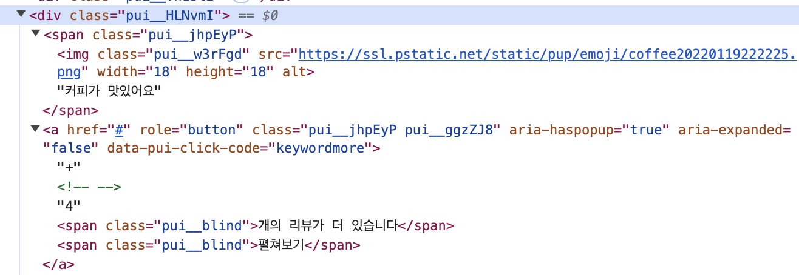
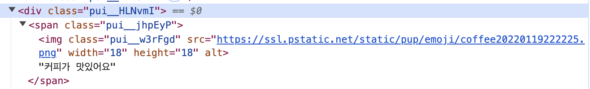

# 웹 크롤링 공부 — Selenium으로 네이버 플레이스 리뷰 수집

<sub>[🏠 Portfolio](https://github.com/heoneyzi) › [🤿 DeepDaiv.](../../../README.md) › [Project](../../README.md) › [R.S](../README.md) › [Notes](README.md) › **Web crawling study**</sub>

> [!NOTE]
> Jiheon's personal study note (deep daiv. WIL) written during the Taste Trip recommender project, kept in the original Korean.

웹 크롤링 알아보기

사용하는  라이브러리

requests : HTTP 요청을 위해 사용하는 파이썬 라이브러리

BeautifulSoup : 웹 사이트에서 데이터를 추출하는 웹 스크래핑 라이브러리

time : 시간 데이터 처리 모듈

csv : CSV형식의 데이터를 읽고 쓰는 모듈

Selenium VS BeautifulSoup

- Selenium: 웹 브라우저를 자동으로 조작하여 웹 페이지의 동적인 요소를 처리 가능. 자바스크립트로 생성된 콘텐츠를 포함한 웹 페이지에서 데이터를 추출할 때 유용함. 실제 웹 브라우저를 실행하여 사용자가 수행하는 것과 같은 방식으로 클릭, 입력 등의 작업을 수행.
- BeautifulSoup: HTML이나 XML 문서를 파싱하고, 데이터를 쉽게 추출할 수 있도록 도와주는 라이브러리. 웹 페이지를 직접 렌더링하지 않기 때문에 더 빠르고 간단

Headers: 웹 요청시 포함되는 메타데이터, HTTP 요청과 응답으로 사용되며 클라이언트와 서버 간의 정보 교환에서 역할을 함.

WebDriver: Selenium에서 제공하는 API로 실제 웹 브라우저를 자동으로 제어할 수 있게 해주는 도구.

참고 블로그

[\[Python\] 네이버 플레이스(naver place) 리뷰 크롤링](https://jinooh.tistory.com/89)

<table><tr>
<td align="center" width="50%"></td>
<td align="center" width="50%"></td>
</tr></table>

```python
        try:
            tag_button = r.find_element(By.CSS_SELECTOR, 'a.pui__jhpEyP.pui__ggzZJ8')
            driver.execute_script("arguments[0].click();", tag_button)
            time.sleep(1)
        except Exception as e:
            print("No more tag buttons:", e)
```

본래 위의 코드는 태그 버튼에서 개수가 여러개라면 +a라는 것을 클릭하는 형태였다. 그러나 이를 try를 이용하게 되니 효율성이 크게 떨어졌다.

실제로 저 코드를 빼면 1분40초가 나오고 저 코드를 넣으면 9분 20초가 된다는 것을 알 수 있었다.

그래서 위의 크롤링 코드를 try문을 쓰지 않고 해보자고 판단.

```python
        i_tags = [tag.text.strip() for tag in r.find_elements(By.CSS_SELECTOR, 'div.pui__HLNvmI')]
        i_tags = str(i_tags)
        if "+" not in i_tags:
            i_tag = [tag.text.strip() for tag in r.find_elements(By.CSS_SELECTOR, 'div.pui__HLNvmI')]
        else:
            tag_button = r.find_element(By.CSS_SELECTOR, 'a.pui__jhpEyP.pui__ggzZJ8')
            driver.execute_script("arguments[0].click();", tag_button)
            time.sleep(1)
            i_tag = [tag.text.strip() for tag in r.find_elements(By.CSS_SELECTOR, 'div.pui__HLNvmI span.pui__jhpEyP')]

        # 중복 없이 리뷰 데이터 저장
        list_sheet.append([nickname, content, date, revisit, ", ".join(i_tag)])
```

if문으로 +기호가 있는지 없는지를 확인하고 없으면 그대로 출력하고, 있으면 클릭을 하도록 만들어서 최소한으로 클릭 횟수를 줄여서 효율적으로 만들려고 노력함.

4분 20초정도로 크게 줄었음!!

---
<sub>[← Notes index](README.md) · [🍜 Taste Trip project](../README.md)</sub>
