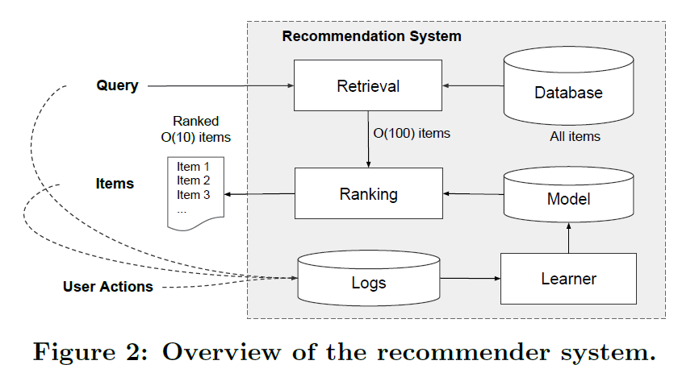
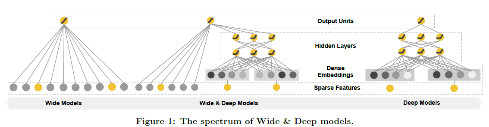
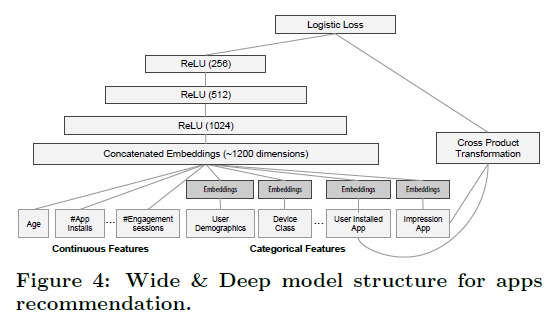
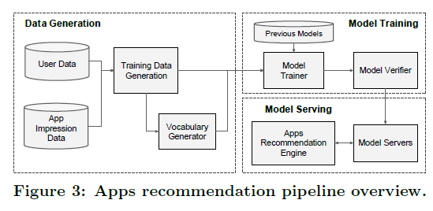
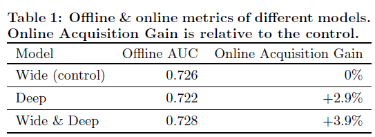
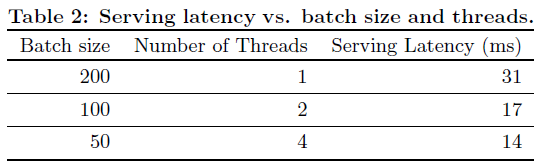

# Wide & Deep Learning for Recommender Systems — 논문 리뷰

[🏠 Portfolio](https://github.com/heoneyzi) › [🤿 DeepDaiv.](../../../README.md) › [Project](../../README.md) › [R.S](../README.md) › [Notes](README.md) › **Wide & Deep**

> [!NOTE]
> Jiheon's personal study note (deep daiv. WIL) written during the Taste Trip recommender project, kept in the original Korean.

## Abstract

- **Wide : Memorization**
    - **`+`** feature 간 cross-product → 데이터의 특징을 Memorization하는 데 효과적
    - **`-`** 하지만 Generalization를 위해 엔지니어링 과정을 필요로 함
- **Deep : Generalization**
    - **`+`** 임베딩을 활용한 NN 모델은 엔지니어링에 공수가 덜 듦
    - **`+`** unseen feature 간의 조합을 일반화하는 데 효과적
    - **`-`** 하지만 과도한 Generalization로 인해 데이터의 특징을 자세히 기억하지 못함
- <b>Wide & Deep</b> 
    - Wide (linear) model : memorization에 특화
    - Deep (non-linear) model : generalization에 특화
    - 이 두 모델을 결합한 모델

## 1. Introduction

- Wide model
    - 설치한 앱, 열람한 앱 간의 cross-product를 통해 interaction 표현
    - cross-product가 1이 되는 모든 경우를 학습
        - **`+`**  memorization에 강함
        - **`+`**  user의 특이 취향이 반영된 niche combination을 학습하기 탁월함
        - **`-`** 하지만 0이 되는 경우는 학습할 수 없음 (unseen data)
        - **`-`** overfitting이 발생할 수 있음
- Deep model
    - 모든 앱을 동일한 임베딩 공간에 표현
        - **`+`**  pair가 없는 관계(unseen data)도 학습 가능 → 예측 가능
    - matrix가 희소하고 순위가 높은 경우(특정 선호도를 가진 사용자나 좁은 매력을 가진 항목),  저차원 특징을 효과적으로 학습하기 어려움
        - 대부분의 쿼리 항목 쌍 사이에 interaction 없어야 하는데 dense embedding은 non-zero prediction으로 이어짐 → **`-`** 지나친 일반화 (전혀 관계없는 아이템 추천될 수 있음)

## 2. Recommender System Overview

1. 쿼리 수신
2. DB로부터 해당 쿼리에 적합한 후보 앱을 검색함
3. 랭킹 알고리즘 → 후보 앱 점수 매겨 정렬함
    - 점수 = $`p(y|x)`$ = user 정보 $`x`$가 주어졌을 때, $`y`$앱에 action할 확률

## 3. Wide & Deep Learning

### 3.1 The Wide Component

- $`y=\mathbf{w}^T\mathbf{x}+b`$
    - 선형 모델 구조
    - $`\mathbf{x}`$: 두 feature를 cross-product한 결과
    - $`\mathbf{w}`$: 모델 파라미터
    - $`b`$: bias
    - $`y`$: prediction (유저의 행동 여부)
- **cross-product transformation**
    $`\phi_k(\mathbf{x}) = \prod_{i=1}^d x_i^{c_{ki}},`$   $`c_{ki} \in \{0, 1\}`$

    - $`\phi_k`$는 피처 간의 co-occurence를 binary로 표현한 것
    - cross-product feature의 k번째 요소
    - raw feature의 i번째 요소가 true인지 여부
    - feature interaction 반영
    - 모델에 non-linearity 적용
        - e.g. feature가 (gender, language)로 구성되어 있고, cross-product transformation (feature)의 k번째가 AND (female, en)일 때, 모두 만족하면 1 아니면 0

### 3.2 The Deep Component

- feed-forward NN → Generalization
- 저차원으로 임베딩된 categorical feature를 continuous feature에 concat → $`a`$ (input)
- $`a^{l+1} = f(W^la^{(l)}+b^{(l)})`$
    - $`l`$: layer의 개수
    - $`f`$: activation function (ReLU)
    - $`W^l`$, $`a^{(l)}`$, $`b^{(l)}`$:  l번째 가중치, activation, 편향

### 3.3 Joint Training of Wide & Deep Model

- 앙상블(여러 개의 모델을 결합)과 달리, output의 gradient를 wide와 deep 모델에 동시에 backpropagation해서 학습
- 로그 확률의 가중합을 사용하여 결합
- 각각 다른 optimizer를 사용해서 최적화
    - wide: FTRL
    - deep: AdaGrad
- 최종 pred
    $`p(Y=1|x)=σ(\mathbf{w}^T_{wide}[\mathbf{x},\phi(\mathbf{x})]+\mathbf{w}^T_{deep}a^{(l_f)}+b)`$

    - $`p(Y=1)`$: 특정 앱을 다운로드 받을 확률
    - 각 가중치를 곱해 모델에서 나온 ouput을 더해 sigmoid 함수를 통과시킨 결과

## 4. System Implementation

1단계) Data Generation

2단계) Model Training

3단계)Model Serving

### 4.1 Data Generation

- 학습 데이터: 일정 기간 동안 사용자 및 앱 노출 데이터를 사용하여 생성
- 노출된 앱 설치 = 1, 미설치 = 0
- categorical feature를 정수 ID로 매핑
- continuous feature를 누적 분포 함수에 매핑하여 \[0,1\]로 정규화

### 4.2 Model Training

- wide \[cross-product 변환\] + deep \[각 categorical feature를 32차원 임베딩 벡터 학습 → 1200차원 밀집 벡터로 연결\]
- 5000억 개 이상의 예제들로 학습
- 새로운 학습 데이터셋 생길 때마다 다시 모델을 학습시켜야 함
    - 기존 임베딩과 가중치를 활용해 새 모델을 초기화하는 warm-starting system 구현

### 4.3 Model Serving

- app candidates 순위 매김 → 이 순서에 따라 유저에게 보여줌
    - 점수 = wide & deep model에 대한 forward inference pass 계산한 결과

## 5. Experiment Results

논문에서 모델 성능 검증을 위해 실제 구글 플레이 스토어 데이터를 사용

> 📌 **App Acquisition Gain 평가**
>
> 

>
> - 온라인 A/B 테스트 진행
>     - 단일 모델에 비해 높은 앱 다운로드 증가율을 보임
> - 오프라인 테스트
>     - 상대적으로 제일 높은 AUC, 그러나 온라인에 비해서는 작은 영향을 미침
>         - 실제 상황에서는 label이 고정되어 있지 않고, 훨씬 더 다양한 경우가 존재하기 때문에 Memorization과 Generalization을 함께 고려하는 Wide & deep 구조가 더 유효한 성능을 보이기 때문

> 📌 **Service Time 비교**
>
> 

>
> - 멀티 스레드 환경에서 더 잘 작동(31초 → 14초)
>     - 실제 상황에 적용하기 적합함
> - 초당 1000만개 이상의 앱에 대한 점수 매기기 가능

## 6. Conclusion

- memorization에 특화된 wide 모델 + generalization에 특화된 deep 모델
- Linear model과 embedding-based model의 장점을 잘 조합

---
[← Notes index](README.md) · [🍜 Taste Trip project](../README.md)
